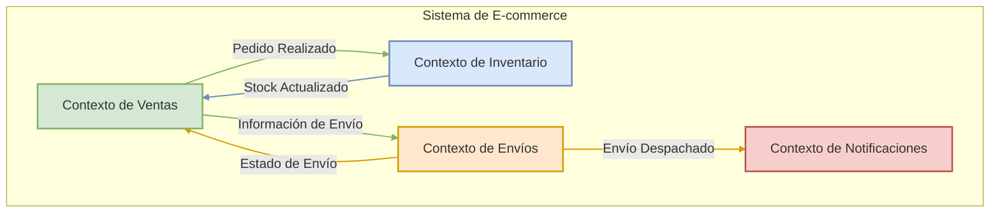
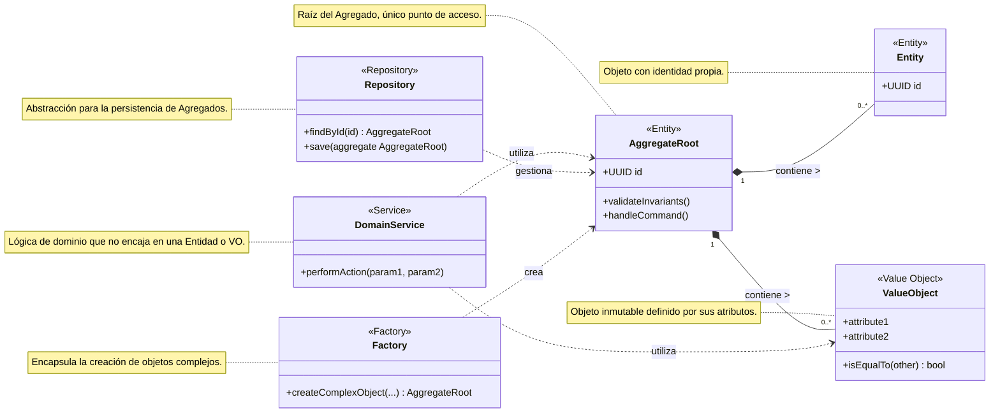
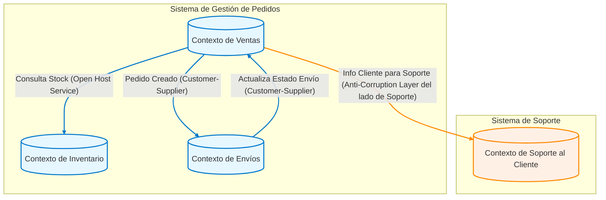
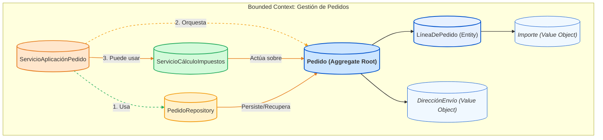
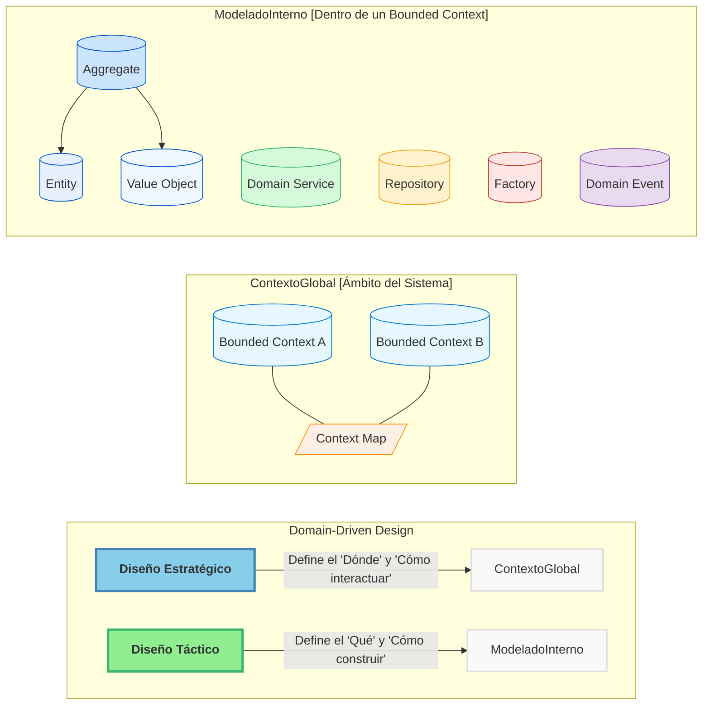

# Tema 7. INTRODUCCIÓN A DOMAIN-DRIVEN DESIGN (DDD)

## Tabla de Contenidos

- [Tema 7. INTRODUCCIÓN A DOMAIN-DRIVEN DESIGN (DDD)](#tema-7-introducción-a-domain-driven-design-ddd)
  - [Tabla de Contenidos](#tabla-de-contenidos)
  - [7. Contenidos](#7-contenidos)
    - [7.1 Bloques tácticos y estratégicos del DDD](#71-bloques-tácticos-y-estratégicos-del-ddd)
      - [**A. Diseño Estratégico (Strategic Design)**](#a-diseño-estratégico-strategic-design)
      - [**B. Diseño Táctico (Tactical Design)**](#b-diseño-táctico-tactical-design)
      - [**Relación entre Diseño Estratégico y Táctico**](#relación-entre-diseño-estratégico-y-táctico)
    - [7.2 Rol de Aggregates, Entities y Value Objects](#72-rol-de-aggregates-entities-y-value-objects)
      - [Bloques Estratégicos del DDD: La Visión General](#bloques-estratégicos-del-ddd-la-visión-general)
      - [Bloques Tácticos del DDD: Los Cimientos del Modelo](#bloques-tácticos-del-ddd-los-cimientos-del-modelo)
      - [Relación entre Bloques Estratégicos y Tácticos](#relación-entre-bloques-estratégicos-y-tácticos)
    - [7.3 Definición de Bounded Contexts y sus fronteras](#73-definición-de-bounded-contexts-y-sus-fronteras)
    - [7.4 Diseño de Domain Services](#74-diseño-de-domain-services)
    - [7.5 Repositorios como abstracción de persistencia](#75-repositorios-como-abstracción-de-persistencia)
    - [7.6 Integración de DDD con FastAPI y Pydantic](#76-integración-de-ddd-con-fastapi-y-pydantic)
    - [7.7 Creación de factories para entidades complejas](#77-creación-de-factories-para-entidades-complejas)
    - [7.8 Desarrollo de Ubiquitous Language](#78-desarrollo-de-ubiquitous-language)
    - [7.9 Capa de aplicación sobre la lógica de dominio](#79-capa-de-aplicación-sobre-la-lógica-de-dominio)
    - [7.10 Refactorización de dominio en capas desacopladas](#710-refactorización-de-dominio-en-capas-desacopladas)

## 7. Contenidos

### 7.1 Bloques tácticos y estratégicos del DDD

Domain-Driven Design (DDD) es una metodología para el desarrollo de software que se enfoca en modelar el software para que coincida con un dominio o negocio complejo. Para abordar esta complejidad, DDD se divide en dos conjuntos principales de patrones o "bloques": **Estratégicos** y **Tácticos**.

Comprender ambos es fundamental para aplicar DDD eficazmente, ya que los patrones estratégicos nos ayudan a definir el panorama general y los límites, mientras que los patrones tácticos nos guían en la construcción de los modelos dentro de esos límites.

#### **A. Diseño Estratégico (Strategic Design)**

El Diseño Estratégico se centra en la **visión macro del sistema**. Su objetivo principal es descomponer sistemas grandes y complejos en partes más manejables, definiendo límites claros y las relaciones entre ellas. Es el primer paso y el más crucial para evitar el "Big Ball of Mud" (Gran Bola de Lodo), donde todo está interconectado sin una estructura clara.

Los pilares fundamentales del Diseño Estratégico son:

1.  **Bounded Context (Contexto Delimitado):**

      * **Concepto:** Es el núcleo del diseño estratégico. Un Bounded Context define una frontera explícita (lógica o física) dentro de la cual un modelo de dominio particular es consistente y aplicable. Dentro de este contexto, cada término, concepto y regla de negocio tiene un significado único y bien definido.
      * **Importancia:** Permite que diferentes partes del sistema tengan sus propios modelos especializados sin interferencias. Por ejemplo, el concepto de "Cliente" puede tener diferentes atributos y comportamientos en un contexto de "Ventas" versus un contexto de "Soporte Técnico".
      * **Resultado:** Claridad, autonomía de los equipos y reducción de la complejidad cognitiva.

2.  **Ubiquitous Language (Lenguaje Ubicuo):**

      * **Concepto:** Un lenguaje común, riguroso y compartido desarrollado por el equipo (desarrolladores, expertos del dominio, stakeholders) *dentro de un Bounded Context específico*. Este lenguaje se utiliza en todas las comunicaciones, discusiones, documentos y, crucialmente, en el código.
      * **Importancia:** Elimina ambigüedades y malentendidos. Si el negocio habla de un "Prospecto" y el código implementa un `Lead`, hay una desconexión. El Lenguaje Ubicuo asegura que el modelo de software refleje fielmente el modelo de negocio.
      * **Resultado:** Comunicación fluida, código más expresivo y alineación entre el negocio y la tecnología.

3.  **Context Map (Mapa de Contextos):**

      * **Concepto:** Una representación visual y documental de los diferentes Bounded Contexts y las relaciones entre ellos. Muestra cómo interactúan, se integran y qué tipo de dependencias existen (por ejemplo, Cliente-Proveedor, Shared Kernel, Anticorruption Layer).
      * **Importancia:** Proporciona una visión global de la arquitectura del sistema y ayuda a tomar decisiones informadas sobre la integración y la evolución de los contextos.
      * **Resultado:** Visibilidad de las interdependencias, facilitación de la planificación estratégica y gestión de la integración.

A continuación, un diagrama Mermaid que ilustra un Mapa de Contextos simplificado:

*Este diagrama muestra cuatro Bounded Contexts (Ventas, Inventario, Envíos y Notificaciones) y las interacciones principales entre ellos, representando un Mapa de Contextos básico.*

#### **B. Diseño Táctico (Tactical Design)**

Una vez que los Bounded Contexts están definidos estratégicamente, el Diseño Táctico se enfoca en **cómo construir un modelo de dominio rico y expresivo *dentro* de cada uno de ellos**. Proporciona un conjunto de bloques de construcción (building blocks) para diseñar objetos de dominio que sean robustos, flexibles y que reflejen fielmente el Lenguaje Ubicuo.

Los elementos clave del Diseño Táctico son:

1.  **Entities (Entidades):**

      * **Concepto:** Objetos que no se definen fundamentalmente por sus atributos, sino por un hilo de continuidad e identidad. Tienen un identificador único que perdura a lo largo del tiempo, incluso si sus otros atributos cambian.
      * **Ejemplo:** Un `Usuario` (identificado por `user_id`), un `Pedido` (identificado por `order_id`).

2.  **Value Objects (Objetos de Valor):**

      * **Concepto:** Objetos que describen características de un dominio. No tienen una identidad conceptual propia; se definen por sus atributos. Son inmutables y pueden ser compartidos. Dos Value Objects son iguales si todos sus atributos son iguales.
      * **Ejemplo:** Una `Dirección` (compuesta por calle, ciudad, código postal), un `RangoDeFechas`, una `Moneda`.

3.  **Aggregates (Agregados):**

      * **Concepto:** Un clúster de Entidades y Value Objects asociados que se tratan como una única unidad para los cambios de datos. Cada Agregado tiene una raíz, conocida como **Aggregate Root**, que es una Entidad específica.
      * **Regla:** El Aggregate Root es el único punto de entrada para cualquier modificación dentro del Agregado. Las referencias externas solo pueden apuntar al Aggregate Root. Esto garantiza la consistencia de las reglas de negocio dentro del Agregado.
      * **Ejemplo:** Un `Pedido` (Aggregate Root) podría contener `LineasDePedido` (Entidades) y una `DireccionDeEnvio` (Value Object). Solo se puede acceder o modificar las `LineasDePedido` a través del `Pedido`.

4.  **Domain Services (Servicios de Dominio):**

      * **Concepto:** Operaciones o lógica de negocio significativa que no encajan naturalmente en una Entidad o Value Object. A menudo coordinan la actividad entre múltiples objetos de dominio.
      * **Importancia:** Evitan "anemizar" los objetos de dominio (es decir, convertirlos en meros contenedores de datos sin comportamiento) al extraer lógica que no es responsabilidad de un único objeto.
      * **Ejemplo:** Un servicio para transferir fondos entre dos `CuentasBancarias` (Entidades), que implica reglas de negocio complejas y coordinación.

5.  **Repositories (Repositorios):**

      * **Concepto:** Abstracciones que median entre el dominio y las capas de mapeo de datos (persistencia). Proporcionan una interfaz similar a una colección para acceder a los Aggregate Roots.
      * **Importancia:** Desacoplan el modelo de dominio de las preocupaciones de infraestructura (cómo se almacenan y recuperan los datos). Permiten que el dominio ignore los detalles de la base de datos.
      * **Ejemplo:** `PedidoRepository` con métodos como `findById(id)`, `save(pedido)`.

6.  **Factories (Fábricas):**

      * **Concepto:** Encapsulan la lógica de creación de objetos complejos (especialmente Aggregates y Entidades) cuando esta creación es en sí misma una operación significativa o cuando se quiere asegurar que el objeto se crea en un estado válido.
      * **Importancia:** Simplifican el cliente que necesita crear el objeto y centralizan la lógica de construcción, asegurando la validez e invarianza del objeto creado.
      * **Ejemplo:** Una `PedidoFactory` que toma información del cliente y productos para construir un nuevo `Pedido` asegurando que todas las reglas de negocio iniciales se cumplan.

7.  **Domain Events (Eventos de Dominio):**

      * **Concepto:** Objetos que representan algo significativo que ha ocurrido en el dominio. Son hechos pasados e inmutables.
      * **Importancia:** Permiten comunicar cambios entre diferentes partes del dominio (o incluso diferentes Bounded Contexts de forma asíncrona) de manera desacoplada. Son fundamentales para arquitecturas reactivas y CQRS.
      * **Ejemplo:** `PedidoRealizadoEvent`, `InventarioActualizadoEvent`.

A continuación, un diagrama Mermaid que ilustra las relaciones entre algunos de estos bloques tácticos dentro de un Bounded Context:

*Este diagrama de clases muestra cómo un Aggregate Root (que es una Entidad) puede contener otras Entidades y Value Objects. Los Domain Services pueden operar sobre estos objetos. Los Repositories se encargan de la persistencia de los Aggregate Roots, y las Factories ayudan en su creación.*

#### **Relación entre Diseño Estratégico y Táctico**

Es crucial entender que el Diseño Táctico se aplica *dentro* de los límites definidos por el Diseño Estratégico. No se puede empezar a modelar Entidades y Value Objects sin antes haber delimitado los Bounded Contexts y entendido el Lenguaje Ubicuo específico de cada uno.

  * El **Diseño Estratégico** define el "dónde" y el "por qué" de un modelo de dominio.
  * El **Diseño Táctico** define el "cómo" se construye ese modelo dentro de esos límites.

Al dominar ambos conjuntos de patrones, los desarrolladores pueden construir sistemas que no solo son técnicamente sólidos, sino que también están profundamente alineados con las necesidades y la lógica del negocio, lo que resulta en software más mantenible, escalable y valioso. En un entorno de microservicios, cada microservicio a menudo se alinea con un Bounded Context, y dentro de él, se aplican los patrones tácticos para construir su lógica de dominio.

-----

### 7.2 Rol de Aggregates, Entities y Value Objects

El Domain-Driven Design (DDD) es un enfoque para el desarrollo de software que se centra en modelar el software para que coincida con un dominio o negocio subyacente. Para lograr esto, DDD se divide en dos conjuntos principales de herramientas o "bloques": los **Bloques Estratégicos** y los **Bloques Tácticos**. Ambos son cruciales para construir aplicaciones complejas, como las que desarrollaréis con FastAPI, que sean mantenibles, escalables y alineadas con las necesidades del negocio.

-----

#### Bloques Estratégicos del DDD: La Visión General

Los patrones estratégicos de DDD nos ayudan a lidiar con la complejidad a gran escala. Se enfocan en definir el "espacio del problema" y cómo dividir un sistema grande en partes manejables y autónomas. Son fundamentales antes de sumergirnos en el código detallado.

Los conceptos clave del diseño estratégico son:

1.  **Ubiquitous Language (Lenguaje Ubicuo):**

      * **Concepto:** Es un lenguaje compartido y riguroso desarrollado por el equipo (desarrolladores, expertos del dominio, stakeholders) para hablar sobre el dominio del software. Este lenguaje se utiliza en todas las conversaciones, diagramas, código y documentación.
      * **Importancia:** Elimina la ambigüedad y los malentendidos. Asegura que el modelo de software refleje con precisión el modelo de negocio. Por ejemplo, si en el dominio de "envíos" un "Paquete" tiene un significado específico, ese término se usará consistentemente en todas partes.
      * **Relación con FastAPI:** Al definir vuestros modelos con Pydantic o las operaciones en FastAPI, los nombres de las clases, atributos y *path operations* deben provenir directamente del Lenguaje Ubicuo.

2.  **Bounded Context (Contexto Delimitado):**

      * **Concepto:** Define una frontera explícita (lingüística, conceptual y técnica) dentro de la cual un modelo de dominio particular es consistente y válido. Un término del Lenguaje Ubicuo puede tener diferentes significados o implicaciones en diferentes Bounded Contexts.
      * **Importancia:** Permite que los modelos sean más pequeños, cohesivos y precisos. Evita la creación de un único modelo monolítico ("gran bola de barro") que intente abarcarlo todo, lo cual es difícil de mantener y evolucionar. Un "Cliente" en el contexto de "Ventas" puede tener atributos y comportamientos diferentes a un "Cliente" en el contexto de "Soporte Técnico".
      * **Relación con Microservicios y FastAPI:** Cada microservicio idealmente se alinea con uno o varios Bounded Contexts. Vuestras aplicaciones FastAPI que exponen las capacidades de un microservicio operarán dentro de las fronteras de su Bounded Context.

3.  **Context Map (Mapa de Contextos):**

      * **Concepto:** Es una representación visual y documental de los diferentes Bounded Contexts y las relaciones entre ellos. Muestra cómo interactúan los equipos y los modelos.
      * **Importancia:** Proporciona una visión global del paisaje del sistema, clarificando las dependencias, los puntos de integración y las estrategias de colaboración entre equipos.
      * **Tipos de Relaciones Comunes (ejemplos):**
          * **Shared Kernel (Núcleo Compartido):** Dos o más contextos comparten una parte del modelo. Requiere alta coordinación.
          * **Customer-Supplier (Cliente-Proveedor):** Un contexto (proveedor) proporciona servicios a otro (cliente).
          * **Conformist (Conformista):** Un contexto se adhiere al modelo de otro sin cuestionarlo.
          * **Anti-Corruption Layer (Capa Anticorrupción):** Un contexto crea una capa de traducción para proteger su modelo de las influencias de un sistema externo o legado.
          * **Open Host Service (Servicio de Host Abierto):** Un contexto expone un conjunto de servicios bien definidos a los que otros pueden acceder.

A continuación, un diagrama Mermaid que ilustra un Mapa de Contextos simple:

Este diagrama muestra cuatro Bounded Contexts y cómo podrían interactuar. Por ejemplo, el "Contexto de Ventas" consulta el stock al "Contexto de Inventario" (que podría exponer sus servicios como un Open Host Service) y notifica al "Contexto de Envíos" cuando un pedido se crea (una relación Cliente-Proveedor).

-----

#### Bloques Tácticos del DDD: Los Cimientos del Modelo

Una vez que hemos definido los Bounded Contexts y cómo se relacionan (diseño estratégico), podemos enfocarnos en construir el modelo *dentro* de cada Bounded Context utilizando los patrones tácticos. Estos son los "ladrillos" con los que construimos nuestro dominio.

Los principales bloques tácticos son:

1.  **Entities (Entidades):**

      * **Concepto:** Objetos que tienen una identidad única que persiste a lo largo del tiempo y a través de diferentes estados. Su identidad no se define por sus atributos, sino por un ID.
      * **Ejemplo:** `Pedido` (identificado por `id_pedido`), `Usuario` (identificado por `id_usuario`).
      * **Se tratarán en detalle en 7.2.**

2.  **Value Objects (Objetos de Valor):**

      * **Concepto:** Objetos que describen características o atributos y se definen por la combinación de sus valores. Son inmutables. No tienen una identidad conceptual propia.
      * **Ejemplo:** `Dirección` (compuesta por calle, ciudad, código postal), `Dinero` (compuesto por cantidad y divisa), `RangoDeFechas`.
      * **Se tratarán en detalle en 7.2.**

3.  **Aggregates (Agregados):**

      * **Concepto:** Un clúster de Entidades y Value Objects relacionados que se tratan como una única unidad para los cambios de datos. Cada Agregado tiene una raíz (Aggregate Root), que es una Entidad específica. Es el único punto de entrada para acceder y modificar el Agregado.
      * **Importancia:** Garantizan la consistencia de las reglas de negocio (invariantes) dentro de sus límites. Las transacciones y la concurrencia se manejan a nivel de Agregado.
      * **Ejemplo:** Un Agregado `Pedido` podría incluir la Entidad `Pedido` (como Aggregate Root), una lista de Entidades `LineaDePedido` y un Value Object `DireccionEnvio`.
      * **Se tratarán en detalle en 7.2.**

4.  **Domain Services (Servicios de Dominio):**

      * **Concepto:** Operaciones o lógica de negocio que no encajan naturalmente en una Entidad o Value Object. Suelen coordinar varias Entidades o realizar cálculos que involucran múltiples objetos de dominio. Son *stateless*.
      * **Ejemplo:** Un servicio que calcula la mejor ruta de envío basándose en varios Pedidos y la disponibilidad de transportistas.
      * **Se tratarán en detalle en 7.4.**

5.  **Repositories (Repositorios):**

      * **Concepto:** Abstracciones que encapsulan la lógica de acceso y persistencia de los Agregados. Proveen una interfaz similar a una colección para recuperar y almacenar Agregados, ocultando los detalles de la base de datos.
      * **Importancia:** Desacoplan el modelo de dominio de la infraestructura de persistencia.
      * **Ejemplo:** `PedidoRepository` con métodos como `findById(id_pedido)` o `save(pedido)`.
      * **Se tratarán en detalle en 7.5.**

6.  **Factories (Fábricas):**

      * **Concepto:** Encapsulan la lógica de creación de objetos complejos, especialmente Agregados o Entidades, asegurando que se creen en un estado válido y consistente.
      * **Importancia:** Simplifican la creación de objetos y garantizan que se cumplan todas las invariantes al momento de la instanciación.
      * **Ejemplo:** Una `PedidoFactory` que toma los datos necesarios y devuelve un Agregado `Pedido` completamente formado.
      * **Se tratarán en detalle en 7.7.**

7.  **Domain Events (Eventos de Dominio):**

      * **Concepto:** Representan algo significativo que ha ocurrido en el dominio. Son hechos pasados e inmutables.
      * **Importancia:** Permiten la comunicación desacoplada entre diferentes partes del sistema, incluyendo distintos Agregados o incluso Bounded Contexts (a menudo usados en arquitecturas orientadas a eventos y CQRS).
      * **Ejemplo:** `PedidoRealizado`, `StockActualizado`, `UsuarioRegistrado`.

A continuación, un diagrama Mermaid que ilustra cómo estos bloques tácticos pueden interactuar dentro de un Bounded Context:

En este diagrama:

  * El `ServicioAplicaciónPedido` (que podría ser invocado por un endpoint de FastAPI) utiliza el `PedidoRepository` para obtener un Agregado `Pedido`.
  * Luego, orquesta las operaciones sobre el Agregado `Pedido` (el Aggregate Root).
  * Si es necesario, puede utilizar un `ServicioCálculoImpuestos` (Domain Service) que opera sobre el Agregado.
  * Finalmente, el `PedidoRepository` se encarga de persistir los cambios en el Agregado.

-----

#### Relación entre Bloques Estratégicos y Tácticos

Es vital entender que los bloques estratégicos y tácticos no son independientes; se complementan:

  * **El Diseño Estratégico establece el escenario:** Define los límites (Bounded Contexts) y las reglas de enfrentamiento (Context Maps). Sin una buena estrategia, los esfuerzos tácticos pueden ser caóticos y redundantes.
  * **El Diseño Táctico implementa la obra:** Proporciona las herramientas para construir modelos ricos y expresivos *dentro* de esos límites.

<!-- end list -->

Este diagrama final resume la relación: el Diseño Estratégico sienta las bases para el sistema global con Bounded Contexts y sus interacciones (Context Map), mientras que el Diseño Táctico se enfoca en la implementación detallada del modelo de dominio dentro de cada uno de esos contextos, utilizando elementos como Agregados, Entidades y Value Objects.

-----

**En resumen para este punto 7.1:**

  * **Estratégico DDD (la gran imagen):** Se centra en identificar y delimitar las diferentes áreas del problema (Bounded Contexts), establecer un lenguaje común (Ubiquitous Language) y mapear cómo estas áreas interactúan (Context Map).
  * **Táctico DDD (los detalles):** Proporciona los bloques de construcción (Entities, Value Objects, Aggregates, Services, Repositories, Factories, Domain Events) para crear modelos de dominio ricos y expresivos dentro de cada Bounded Context.

Comprender y aplicar ambos conjuntos de herramientas es esencial para aprovechar al máximo el DDD y construir aplicaciones FastAPI robustas y alineadas con el negocio. Los siguientes puntos del temario profundizarán en varios de estos bloques tácticos.

-----

### 7.3 Definición de Bounded Contexts y sus fronteras
### 7.4 Diseño de Domain Services
### 7.5 Repositorios como abstracción de persistencia
### 7.6 Integración de DDD con FastAPI y Pydantic
### 7.7 Creación de factories para entidades complejas
### 7.8 Desarrollo de Ubiquitous Language
### 7.9 Capa de aplicación sobre la lógica de dominio
### 7.10 Refactorización de dominio en capas desacopladas
