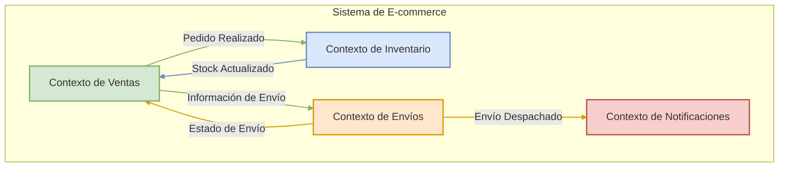
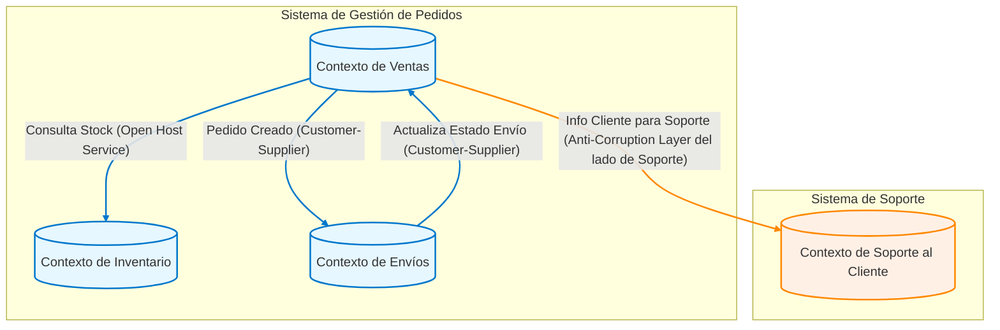
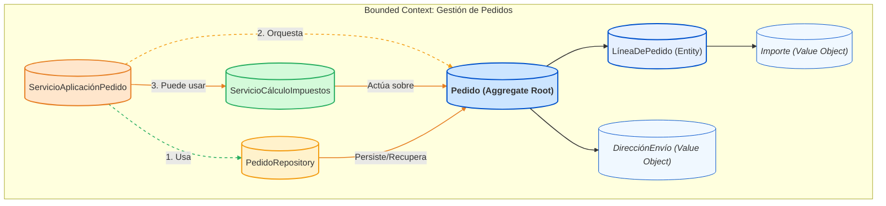
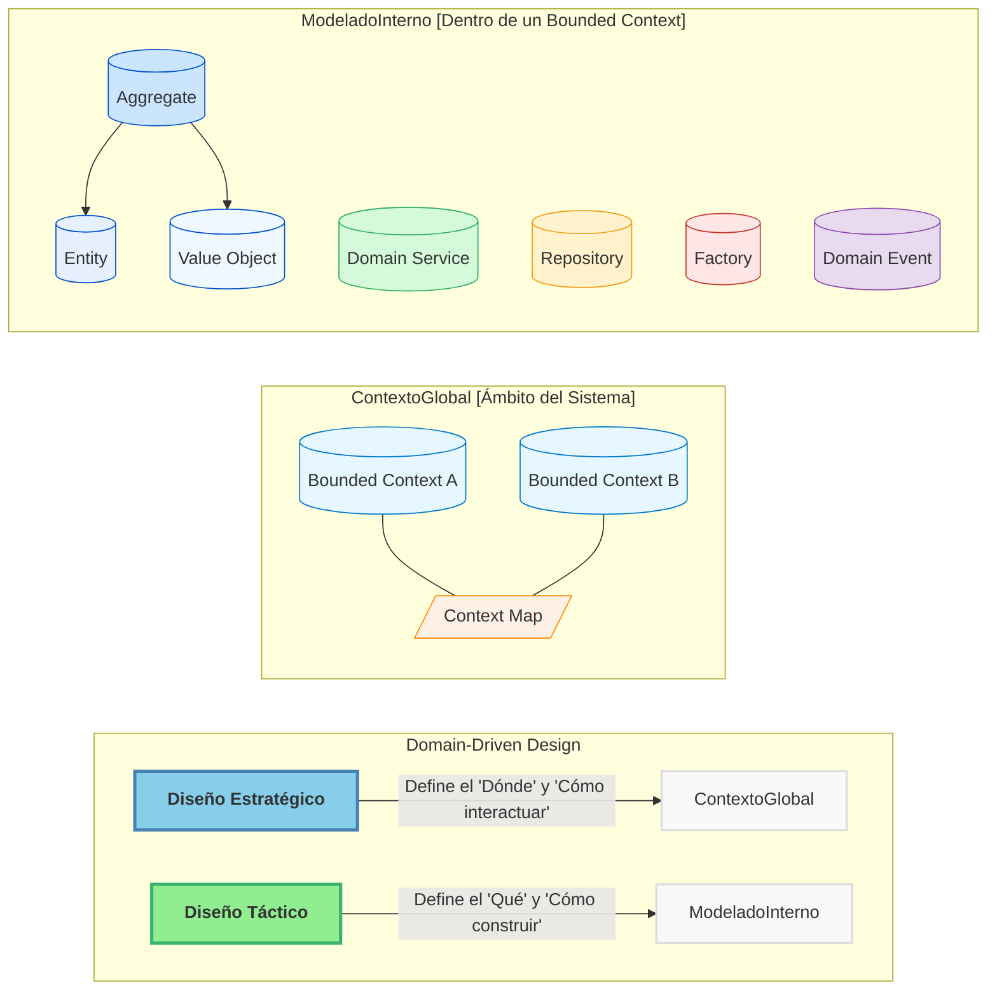
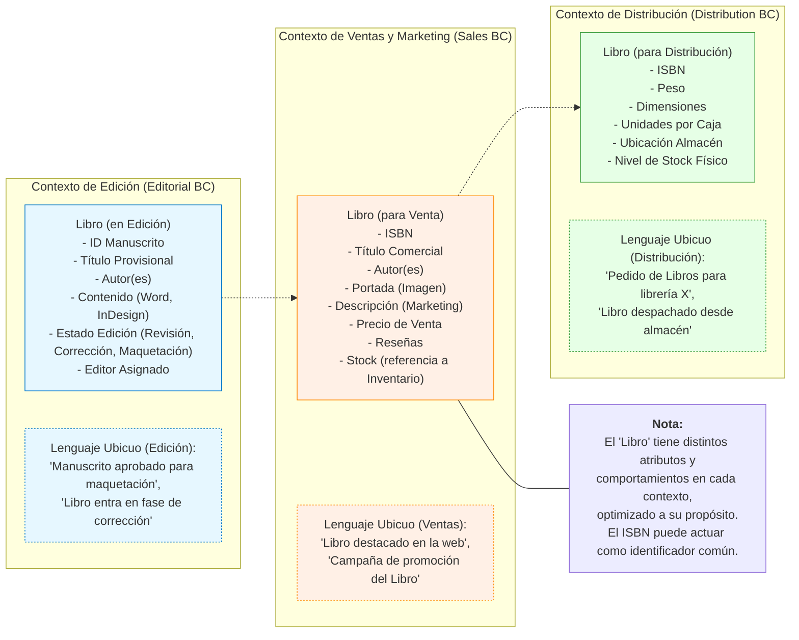

# Tema 7. INTRODUCCIÓN A DOMAIN-DRIVEN DESIGN (DDD)

## Tabla de Contenidos

- [Tema 7. INTRODUCCIÓN A DOMAIN-DRIVEN DESIGN (DDD)](#tema-7-introducción-a-domain-driven-design-ddd)
  - [Tabla de Contenidos](#tabla-de-contenidos)
  - [7. Contenidos](#7-contenidos)
    - [7.1 Bloques tácticos y estratégicos del DDD](#71-bloques-tácticos-y-estratégicos-del-ddd)
      - [**A. Diseño Estratégico (Strategic Design)**](#a-diseño-estratégico-strategic-design)
      - [**B. Diseño Táctico (Tactical Design)**](#b-diseño-táctico-tactical-design)
      - [**Relación entre Diseño Estratégico y Táctico**](#relación-entre-diseño-estratégico-y-táctico)
    - [7.2 Rol de Aggregates, Entities y Value Objects](#72-rol-de-aggregates-entities-y-value-objects)
      - [Bloques Estratégicos del DDD: La Visión General](#bloques-estratégicos-del-ddd-la-visión-general)
      - [Bloques Tácticos del DDD: Los Cimientos del Modelo](#bloques-tácticos-del-ddd-los-cimientos-del-modelo)
      - [Relación entre Bloques Estratégicos y Tácticos](#relación-entre-bloques-estratégicos-y-tácticos)
    - [7.3 Definición de Bounded Contexts y sus fronteras](#73-definición-de-bounded-contexts-y-sus-fronteras)
      - [¿Qué es un Bounded Context? El Corazón de la Autonomía del Modelo](#qué-es-un-bounded-context-el-corazón-de-la-autonomía-del-modelo)
      - [Identificando y Definiendo las Fronteras: El Arte y la Ciencia](#identificando-y-definiendo-las-fronteras-el-arte-y-la-ciencia)
      - [Características de Fronteras Efectivas](#características-de-fronteras-efectivas)
      - [Bounded Contexts en la Práctica: El Ejemplo del "Libro"](#bounded-contexts-en-la-práctica-el-ejemplo-del-libro)
      - [Bounded Contexts y su Aplicación con FastAPI y Microservicios](#bounded-contexts-y-su-aplicación-con-fastapi-y-microservicios)
    - [7.4 Diseño de Domain Services](#74-diseño-de-domain-services)
    - [7.5 Repositorios como abstracción de persistencia](#75-repositorios-como-abstracción-de-persistencia)
      - [¿Qué es un Repositorio en DDD?](#qué-es-un-repositorio-en-ddd)
      - [Principios Clave de Diseño de los Repositorios](#principios-clave-de-diseño-de-los-repositorios)
      - [Repositorios en el Contexto de FastAPI](#repositorios-en-el-contexto-de-fastapi)
      - [Lo que NO son los Repositorios (Distinciones Importantes)](#lo-que-no-son-los-repositorios-distinciones-importantes)
    - [7.6 Integración de DDD con FastAPI y Pydantic](#76-integración-de-ddd-con-fastapi-y-pydantic)
    - [7.7 Creación de factories para entidades complejas](#77-creación-de-factories-para-entidades-complejas)
    - [7.8 Desarrollo de Ubiquitous Language](#78-desarrollo-de-ubiquitous-language)
    - [7.9 Capa de aplicación sobre la lógica de dominio](#79-capa-de-aplicación-sobre-la-lógica-de-dominio)
    - [7.10 Refactorización de dominio en capas desacopladas](#710-refactorización-de-dominio-en-capas-desacopladas)

## 7. Contenidos


### 7.1 Bloques tácticos y estratégicos del DDD

Domain-Driven Design (DDD) es una metodología para el desarrollo de software que se enfoca en modelar el software para que coincida con un dominio o negocio complejo. Para abordar esta complejidad, DDD se divide en dos conjuntos principales de patrones o "bloques": **Estratégicos** y **Tácticos**.

Comprender ambos es fundamental para aplicar DDD eficazmente, ya que los patrones estratégicos nos ayudan a definir el panorama general y los límites, mientras que los patrones tácticos nos guían en la construcción de los modelos dentro de esos límites.

#### **A. Diseño Estratégico (Strategic Design)**

El Diseño Estratégico se centra en la **visión macro del sistema**. Su objetivo principal es descomponer sistemas grandes y complejos en partes más manejables, definiendo límites claros y las relaciones entre ellas. Es el primer paso y el más crucial para evitar el "Big Ball of Mud" (Gran Bola de Lodo), donde todo está interconectado sin una estructura clara.

Los pilares fundamentales del Diseño Estratégico son:

1.  **Bounded Context (Contexto Delimitado):**

      * **Concepto:** Es el núcleo del diseño estratégico. Un Bounded Context define una frontera explícita (lógica o física) dentro de la cual un modelo de dominio particular es consistente y aplicable. Dentro de este contexto, cada término, concepto y regla de negocio tiene un significado único y bien definido.
      * **Importancia:** Permite que diferentes partes del sistema tengan sus propios modelos especializados sin interferencias. Por ejemplo, el concepto de "Cliente" puede tener diferentes atributos y comportamientos en un contexto de "Ventas" versus un contexto de "Soporte Técnico".
      * **Resultado:** Claridad, autonomía de los equipos y reducción de la complejidad cognitiva.

2.  **Ubiquitous Language (Lenguaje Ubicuo):**

      * **Concepto:** Un lenguaje común, riguroso y compartido desarrollado por el equipo (desarrolladores, expertos del dominio, stakeholders) *dentro de un Bounded Context específico*. Este lenguaje se utiliza en todas las comunicaciones, discusiones, documentos y, crucialmente, en el código.
      * **Importancia:** Elimina ambigüedades y malentendidos. Si el negocio habla de un "Prospecto" y el código implementa un `Lead`, hay una desconexión. El Lenguaje Ubicuo asegura que el modelo de software refleje fielmente el modelo de negocio.
      * **Resultado:** Comunicación fluida, código más expresivo y alineación entre el negocio y la tecnología.

3.  **Context Map (Mapa de Contextos):**

      * **Concepto:** Una representación visual y documental de los diferentes Bounded Contexts y las relaciones entre ellos. Muestra cómo interactúan, se integran y qué tipo de dependencias existen (por ejemplo, Cliente-Proveedor, Shared Kernel, Anticorruption Layer).
      * **Importancia:** Proporciona una visión global de la arquitectura del sistema y ayuda a tomar decisiones informadas sobre la integración y la evolución de los contextos.
      * **Resultado:** Visibilidad de las interdependencias, facilitación de la planificación estratégica y gestión de la integración.

A continuación, un diagrama Mermaid que ilustra un Mapa de Contextos simplificado:



*Este diagrama muestra cuatro Bounded Contexts (Ventas, Inventario, Envíos y Notificaciones) y las interacciones principales entre ellos, representando un Mapa de Contextos básico.*

#### **B. Diseño Táctico (Tactical Design)**

Una vez que los Bounded Contexts están definidos estratégicamente, el Diseño Táctico se enfoca en **cómo construir un modelo de dominio rico y expresivo *dentro* de cada uno de ellos**. Proporciona un conjunto de bloques de construcción (building blocks) para diseñar objetos de dominio que sean robustos, flexibles y que reflejen fielmente el Lenguaje Ubicuo.

Los elementos clave del Diseño Táctico son:

1.  **Entities (Entidades):**

      * **Concepto:** Objetos que no se definen fundamentalmente por sus atributos, sino por un hilo de continuidad e identidad. Tienen un identificador único que perdura a lo largo del tiempo, incluso si sus otros atributos cambian.
      * **Ejemplo:** Un `Usuario` (identificado por `user_id`), un `Pedido` (identificado por `order_id`).

2.  **Value Objects (Objetos de Valor):**

      * **Concepto:** Objetos que describen características de un dominio. No tienen una identidad conceptual propia; se definen por sus atributos. Son inmutables y pueden ser compartidos. Dos Value Objects son iguales si todos sus atributos son iguales.
      * **Ejemplo:** Una `Dirección` (compuesta por calle, ciudad, código postal), un `RangoDeFechas`, una `Moneda`.

3.  **Aggregates (Agregados):**

      * **Concepto:** Un clúster de Entidades y Value Objects asociados que se tratan como una única unidad para los cambios de datos. Cada Agregado tiene una raíz, conocida como **Aggregate Root**, que es una Entidad específica.
      * **Regla:** El Aggregate Root es el único punto de entrada para cualquier modificación dentro del Agregado. Las referencias externas solo pueden apuntar al Aggregate Root. Esto garantiza la consistencia de las reglas de negocio dentro del Agregado.
      * **Ejemplo:** Un `Pedido` (Aggregate Root) podría contener `LineasDePedido` (Entidades) y una `DireccionDeEnvio` (Value Object). Solo se puede acceder o modificar las `LineasDePedido` a través del `Pedido`.

4.  **Domain Services (Servicios de Dominio):**

      * **Concepto:** Operaciones o lógica de negocio significativa que no encajan naturalmente en una Entidad o Value Object. A menudo coordinan la actividad entre múltiples objetos de dominio.
      * **Importancia:** Evitan "anemizar" los objetos de dominio (es decir, convertirlos en meros contenedores de datos sin comportamiento) al extraer lógica que no es responsabilidad de un único objeto.
      * **Ejemplo:** Un servicio para transferir fondos entre dos `CuentasBancarias` (Entidades), que implica reglas de negocio complejas y coordinación.

5.  **Repositories (Repositorios):**

      * **Concepto:** Abstracciones que median entre el dominio y las capas de mapeo de datos (persistencia). Proporcionan una interfaz similar a una colección para acceder a los Aggregate Roots.
      * **Importancia:** Desacoplan el modelo de dominio de las preocupaciones de infraestructura (cómo se almacenan y recuperan los datos). Permiten que el dominio ignore los detalles de la base de datos.
      * **Ejemplo:** `PedidoRepository` con métodos como `findById(id)`, `save(pedido)`.

6.  **Factories (Fábricas):**

      * **Concepto:** Encapsulan la lógica de creación de objetos complejos (especialmente Aggregates y Entidades) cuando esta creación es en sí misma una operación significativa o cuando se quiere asegurar que el objeto se crea en un estado válido.
      * **Importancia:** Simplifican el cliente que necesita crear el objeto y centralizan la lógica de construcción, asegurando la validez e invarianza del objeto creado.
      * **Ejemplo:** Una `PedidoFactory` que toma información del cliente y productos para construir un nuevo `Pedido` asegurando que todas las reglas de negocio iniciales se cumplan.

7.  **Domain Events (Eventos de Dominio):**

      * **Concepto:** Objetos que representan algo significativo que ha ocurrido en el dominio. Son hechos pasados e inmutables.
      * **Importancia:** Permiten comunicar cambios entre diferentes partes del dominio (o incluso diferentes Bounded Contexts de forma asíncrona) de manera desacoplada. Son fundamentales para arquitecturas reactivas y CQRS.
      * **Ejemplo:** `PedidoRealizadoEvent`, `InventarioActualizadoEvent`.

A continuación, un diagrama Mermaid que ilustra las relaciones entre algunos de estos bloques tácticos dentro de un Bounded Context:


*Este diagrama de clases muestra cómo un Aggregate Root (que es una Entidad) puede contener otras Entidades y Value Objects. Los Domain Services pueden operar sobre estos objetos. Los Repositories se encargan de la persistencia de los Aggregate Roots, y las Factories ayudan en su creación.*

#### **Relación entre Diseño Estratégico y Táctico**

Es crucial entender que el Diseño Táctico se aplica *dentro* de los límites definidos por el Diseño Estratégico. No se puede empezar a modelar Entidades y Value Objects sin antes haber delimitado los Bounded Contexts y entendido el Lenguaje Ubicuo específico de cada uno.

  * El **Diseño Estratégico** define el "dónde" y el "por qué" de un modelo de dominio.
  * El **Diseño Táctico** define el "cómo" se construye ese modelo dentro de esos límites.

Al dominar ambos conjuntos de patrones, los desarrolladores pueden construir sistemas que no solo son técnicamente sólidos, sino que también están profundamente alineados con las necesidades y la lógica del negocio, lo que resulta en software más mantenible, escalable y valioso. En un entorno de microservicios, cada microservicio a menudo se alinea con un Bounded Context, y dentro de él, se aplican los patrones tácticos para construir su lógica de dominio.

-----

### 7.2 Rol de Aggregates, Entities y Value Objects

El Domain-Driven Design (DDD) es un enfoque para el desarrollo de software que se centra en modelar el software para que coincida con un dominio o negocio subyacente. Para lograr esto, DDD se divide en dos conjuntos principales de herramientas o "bloques": los **Bloques Estratégicos** y los **Bloques Tácticos**. Ambos son cruciales para construir aplicaciones complejas, como las que desarrollaréis con FastAPI, que sean mantenibles, escalables y alineadas con las necesidades del negocio.

-----

#### Bloques Estratégicos del DDD: La Visión General

Los patrones estratégicos de DDD nos ayudan a lidiar con la complejidad a gran escala. Se enfocan en definir el "espacio del problema" y cómo dividir un sistema grande en partes manejables y autónomas. Son fundamentales antes de sumergirnos en el código detallado.

Los conceptos clave del diseño estratégico son:

1.  **Ubiquitous Language (Lenguaje Ubicuo):**

      * **Concepto:** Es un lenguaje compartido y riguroso desarrollado por el equipo (desarrolladores, expertos del dominio, stakeholders) para hablar sobre el dominio del software. Este lenguaje se utiliza en todas las conversaciones, diagramas, código y documentación.
      * **Importancia:** Elimina la ambigüedad y los malentendidos. Asegura que el modelo de software refleje con precisión el modelo de negocio. Por ejemplo, si en el dominio de "envíos" un "Paquete" tiene un significado específico, ese término se usará consistentemente en todas partes.
      * **Relación con FastAPI:** Al definir vuestros modelos con Pydantic o las operaciones en FastAPI, los nombres de las clases, atributos y *path operations* deben provenir directamente del Lenguaje Ubicuo.

2.  **Bounded Context (Contexto Delimitado):**

      * **Concepto:** Define una frontera explícita (lingüística, conceptual y técnica) dentro de la cual un modelo de dominio particular es consistente y válido. Un término del Lenguaje Ubicuo puede tener diferentes significados o implicaciones en diferentes Bounded Contexts.
      * **Importancia:** Permite que los modelos sean más pequeños, cohesivos y precisos. Evita la creación de un único modelo monolítico ("gran bola de barro") que intente abarcarlo todo, lo cual es difícil de mantener y evolucionar. Un "Cliente" en el contexto de "Ventas" puede tener atributos y comportamientos diferentes a un "Cliente" en el contexto de "Soporte Técnico".
      * **Relación con Microservicios y FastAPI:** Cada microservicio idealmente se alinea con uno o varios Bounded Contexts. Vuestras aplicaciones FastAPI que exponen las capacidades de un microservicio operarán dentro de las fronteras de su Bounded Context.

3.  **Context Map (Mapa de Contextos):**

      * **Concepto:** Es una representación visual y documental de los diferentes Bounded Contexts y las relaciones entre ellos. Muestra cómo interactúan los equipos y los modelos.
      * **Importancia:** Proporciona una visión global del paisaje del sistema, clarificando las dependencias, los puntos de integración y las estrategias de colaboración entre equipos.
      * **Tipos de Relaciones Comunes (ejemplos):**
          * **Shared Kernel (Núcleo Compartido):** Dos o más contextos comparten una parte del modelo. Requiere alta coordinación.
          * **Customer-Supplier (Cliente-Proveedor):** Un contexto (proveedor) proporciona servicios a otro (cliente).
          * **Conformist (Conformista):** Un contexto se adhiere al modelo de otro sin cuestionarlo.
          * **Anti-Corruption Layer (Capa Anticorrupción):** Un contexto crea una capa de traducción para proteger su modelo de las influencias de un sistema externo o legado.
          * **Open Host Service (Servicio de Host Abierto):** Un contexto expone un conjunto de servicios bien definidos a los que otros pueden acceder.

A continuación, un diagrama Mermaid que ilustra un Mapa de Contextos simple:



Este diagrama muestra cuatro Bounded Contexts y cómo podrían interactuar. Por ejemplo, el "Contexto de Ventas" consulta el stock al "Contexto de Inventario" (que podría exponer sus servicios como un Open Host Service) y notifica al "Contexto de Envíos" cuando un pedido se crea (una relación Cliente-Proveedor).

-----

#### Bloques Tácticos del DDD: Los Cimientos del Modelo

Una vez que hemos definido los Bounded Contexts y cómo se relacionan (diseño estratégico), podemos enfocarnos en construir el modelo *dentro* de cada Bounded Context utilizando los patrones tácticos. Estos son los "ladrillos" con los que construimos nuestro dominio.

Los principales bloques tácticos son:

1.  **Entities (Entidades):**

      * **Concepto:** Objetos que tienen una identidad única que persiste a lo largo del tiempo y a través de diferentes estados. Su identidad no se define por sus atributos, sino por un ID.
      * **Ejemplo:** `Pedido` (identificado por `id_pedido`), `Usuario` (identificado por `id_usuario`).
      * **Se tratarán en detalle en 7.2.**

2.  **Value Objects (Objetos de Valor):**

      * **Concepto:** Objetos que describen características o atributos y se definen por la combinación de sus valores. Son inmutables. No tienen una identidad conceptual propia.
      * **Ejemplo:** `Dirección` (compuesta por calle, ciudad, código postal), `Dinero` (compuesto por cantidad y divisa), `RangoDeFechas`.
      * **Se tratarán en detalle en 7.2.**

3.  **Aggregates (Agregados):**

      * **Concepto:** Un clúster de Entidades y Value Objects relacionados que se tratan como una única unidad para los cambios de datos. Cada Agregado tiene una raíz (Aggregate Root), que es una Entidad específica. Es el único punto de entrada para acceder y modificar el Agregado.
      * **Importancia:** Garantizan la consistencia de las reglas de negocio (invariantes) dentro de sus límites. Las transacciones y la concurrencia se manejan a nivel de Agregado.
      * **Ejemplo:** Un Agregado `Pedido` podría incluir la Entidad `Pedido` (como Aggregate Root), una lista de Entidades `LineaDePedido` y un Value Object `DireccionEnvio`.
      * **Se tratarán en detalle en 7.2.**

4.  **Domain Services (Servicios de Dominio):**

      * **Concepto:** Operaciones o lógica de negocio que no encajan naturalmente en una Entidad o Value Object. Suelen coordinar varias Entidades o realizar cálculos que involucran múltiples objetos de dominio. Son *stateless*.
      * **Ejemplo:** Un servicio que calcula la mejor ruta de envío basándose en varios Pedidos y la disponibilidad de transportistas.
      * **Se tratarán en detalle en 7.4.**

5.  **Repositories (Repositorios):**

      * **Concepto:** Abstracciones que encapsulan la lógica de acceso y persistencia de los Agregados. Proveen una interfaz similar a una colección para recuperar y almacenar Agregados, ocultando los detalles de la base de datos.
      * **Importancia:** Desacoplan el modelo de dominio de la infraestructura de persistencia.
      * **Ejemplo:** `PedidoRepository` con métodos como `findById(id_pedido)` o `save(pedido)`.
      * **Se tratarán en detalle en 7.5.**

6.  **Factories (Fábricas):**

      * **Concepto:** Encapsulan la lógica de creación de objetos complejos, especialmente Agregados o Entidades, asegurando que se creen en un estado válido y consistente.
      * **Importancia:** Simplifican la creación de objetos y garantizan que se cumplan todas las invariantes al momento de la instanciación.
      * **Ejemplo:** Una `PedidoFactory` que toma los datos necesarios y devuelve un Agregado `Pedido` completamente formado.
      * **Se tratarán en detalle en 7.7.**

7.  **Domain Events (Eventos de Dominio):**

      * **Concepto:** Representan algo significativo que ha ocurrido en el dominio. Son hechos pasados e inmutables.
      * **Importancia:** Permiten la comunicación desacoplada entre diferentes partes del sistema, incluyendo distintos Agregados o incluso Bounded Contexts (a menudo usados en arquitecturas orientadas a eventos y CQRS).
      * **Ejemplo:** `PedidoRealizado`, `StockActualizado`, `UsuarioRegistrado`.

A continuación, un diagrama Mermaid que ilustra cómo estos bloques tácticos pueden interactuar dentro de un Bounded Context:



En este diagrama:

  * El `ServicioAplicaciónPedido` (que podría ser invocado por un endpoint de FastAPI) utiliza el `PedidoRepository` para obtener un Agregado `Pedido`.
  * Luego, orquesta las operaciones sobre el Agregado `Pedido` (el Aggregate Root).
  * Si es necesario, puede utilizar un `ServicioCálculoImpuestos` (Domain Service) que opera sobre el Agregado.
  * Finalmente, el `PedidoRepository` se encarga de persistir los cambios en el Agregado.

-----

#### Relación entre Bloques Estratégicos y Tácticos

Es vital entender que los bloques estratégicos y tácticos no son independientes; se complementan:

  * **El Diseño Estratégico establece el escenario:** Define los límites (Bounded Contexts) y las reglas de enfrentamiento (Context Maps). Sin una buena estrategia, los esfuerzos tácticos pueden ser caóticos y redundantes.
  * **El Diseño Táctico implementa la obra:** Proporciona las herramientas para construir modelos ricos y expresivos *dentro* de esos límites.

<!-- end list -->



Este diagrama final resume la relación: el Diseño Estratégico sienta las bases para el sistema global con Bounded Contexts y sus interacciones (Context Map), mientras que el Diseño Táctico se enfoca en la implementación detallada del modelo de dominio dentro de cada uno de esos contextos, utilizando elementos como Agregados, Entidades y Value Objects.

-----

**En resumen para este punto 7.1:**

  * **Estratégico DDD (la gran imagen):** Se centra en identificar y delimitar las diferentes áreas del problema (Bounded Contexts), establecer un lenguaje común (Ubiquitous Language) y mapear cómo estas áreas interactúan (Context Map).
  * **Táctico DDD (los detalles):** Proporciona los bloques de construcción (Entities, Value Objects, Aggregates, Services, Repositories, Factories, Domain Events) para crear modelos de dominio ricos y expresivos dentro de cada Bounded Context.

Comprender y aplicar ambos conjuntos de herramientas es esencial para aprovechar al máximo el DDD y construir aplicaciones FastAPI robustas y alineadas con el negocio. Los siguientes puntos del temario profundizarán en varios de estos bloques tácticos.

-----


### 7.3 Definición de Bounded Contexts y sus fronteras

En el punto 7.1 introdujimos los Bounded Contexts (Contextos Delimitados) como un pilar del diseño estratégico en DDD. Ahora, profundizaremos en qué son exactamente, por qué son cruciales y, lo más importante, cómo podemos empezar a definir sus fronteras en nuestros sistemas. Esta comprensión es fundamental para estructurar vuestras aplicaciones FastAPI de manera que reflejen y sirvan eficazmente al dominio de negocio.

-----

#### ¿Qué es un Bounded Context? El Corazón de la Autonomía del Modelo

Un **Bounded Context** (Contexto Delimitado) es una **frontera explícita** dentro de la cual un modelo de dominio particular es coherente y tiene un significado unívoco. Dentro de esta frontera:

1.  **El Lenguaje Ubicuo es Consistente:** Cada término del Lenguaje Ubicuo (Ubiquitous Language) tiene una definición precisa y compartida por todos los miembros del equipo que trabajan dentro de ese contexto.
2.  **El Modelo de Dominio es Específico:** Las entidades, objetos de valor y reglas de negocio se diseñan específicamente para resolver los problemas de esa parte particular del dominio.
3.  **La Integridad del Modelo está Protegida:** Las influencias externas no corrompen la lógica y el lenguaje del modelo interno.

Imagina un Bounded Context como una habitación con reglas propias. Lo que una palabra significa o cómo se comporta un objeto dentro de esa habitación está claramente definido y es válido allí. Fuera de esa habitación, la misma palabra u objeto podría tener un significado o comportamiento diferente.

**Propósito Fundamental:**

  * **Manejar la Complejidad:** Descomponer un sistema grande y complejo en partes más pequeñas y manejables.
  * **Permitir la Autonomía del Equipo:** Diferentes equipos pueden trabajar en diferentes Bounded Contexts de forma independiente, cada uno con su propio modelo y ritmo de desarrollo.
  * **Claridad y Precisión del Modelo:** Evita la ambigüedad al permitir que un mismo concepto del mundo real (ej. "Cliente") tenga diferentes modelos según las necesidades específicas de cada contexto. Por ejemplo, un "Cliente" en el contexto de "Marketing" es diferente a un "Cliente" en el contexto de "Facturación".
  * **Habilitador de Microservicios:** En arquitecturas de microservicios, cada servicio (o un pequeño conjunto de servicios cohesivos) a menudo se alinea con un Bounded Context. Tu aplicación FastAPI podría exponer las funcionalidades de uno de estos contextos.

-----

#### Identificando y Definiendo las Fronteras: El Arte y la Ciencia

Definir las fronteras de un Bounded Context es una de las tareas más críticas y, a menudo, desafiantes del DDD estratégico. No siempre hay una respuesta única "correcta", y las fronteras pueden evolucionar con el tiempo a medida que mejora la comprensión del dominio.

**¿Por qué son tan importantes las fronteras?**
Sin fronteras claras, los modelos tienden a mezclarse, el lenguaje se vuelve ambiguo y el sistema degenera en lo que Eric Evans llama una "Gran Bola de Barro" (Big Ball of Mud): un monolito enredado, difícil de entender, mantener y evolucionar.

**¿Cómo definir estas fronteras?**

1.  **El Lenguaje Ubicuo como Guía Principal:**

      * **Escucha las Conversaciones:** Presta atención a cómo los expertos del dominio y los diferentes departamentos hablan sobre conceptos y procesos. ¿Usan los mismos términos de manera diferente? ¿Existen sinónimos que en realidad ocultan conceptos distintos?
      * **Ambigüedades Lingüísticas:** Si un término como "Producto" tiene múltiples significados o atributos dependiendo de quién hable (Ventas, Inventario, Soporte), es una señal fuerte de que podrías necesitar Bounded Contexts separados. Cada contexto refinará el término "Producto" para sus necesidades específicas.

2.  **Alineación con Capacidades de Negocio (Business Capabilities):**

      * Una capacidad de negocio es algo que la empresa hace para generar valor (ej: "Gestión de Catálogo", "Procesamiento de Pedidos", "Gestión de Inventario").
      * A menudo, un Bounded Context se alinea bien con una o varias capacidades de negocio cohesivas. Esto ayuda a asegurar que el software esté estructurado en torno a las funciones clave del negocio.

    <!-- end list -->

    ```mermaid
    graph TD
        subgraph "Empresa de E-commerce"
            BC_Catalogo["BC: Gestión de Catálogo"]
            BC_Pedidos["BC: Procesamiento de Pedidos"]
            BC_Inventario["BC: Control de Inventario"]
            BC_Envios["BC: Logística de Envíos"]
        end

        Capability_MostrarProductos["Capacidad: Mostrar Productos al Cliente"] --> BC_Catalogo
        Capability_GestionarPrecios["Capacidad: Gestionar Precios y Ofertas"] --> BC_Catalogo
        Capability_TomarPedido["Capacidad: Tomar Pedido del Cliente"] --> BC_Pedidos
        Capability_ValidarPedido["Capacidad: Validar y Confirmar Pedido"] --> BC_Pedidos
        Capability_ControlStock["Capacidad: Controlar Niveles de Stock"] --> BC_Inventario
        Capability_RecepcionMercancia["Capacidad: Recepción de Mercancía"] --> BC_Inventario
        Capability_ProgramarEnvio["Capacidad: Programar Envío del Paquete"] --> BC_Envios
        Capability_SeguimientoEnvio["Capacidad: Seguimiento del Estado del Envío"] --> BC_Envios

        classDef capability fill:#c9ffc9,stroke:#27ae60,stroke-width:2px;
        classDef bc fill:#cce5ff,stroke:#0052cc,stroke-width:2px;

        class Capability_MostrarProductos,Capability_GestionarPrecios,Capability_TomarPedido,Capability_ValidarPedido,Capability_ControlStock,Capability_RecepcionMercancia,Capability_ProgramarEnvio,Capability_SeguimientoEnvio capability;
        class BC_Catalogo,BC_Pedidos,BC_Inventario,BC_Envios bc;

        style BC_Catalogo_Content fill:#f0f8ff
        style BC_Pedidos_Content fill:#f0f8ff
        style BC_Inventario_Content fill:#f0f8ff
        style BC_Envios_Content fill:#f0f8ff
    ```

    *Este diagrama ilustra cómo diferentes capacidades de negocio pueden agruparse naturalmente en Bounded Contexts específicos.*

3.  **Estructura Organizacional y de Equipos (Ley de Conway):**

      * La Ley de Conway sugiere que las organizaciones diseñan sistemas que reflejan su estructura de comunicación. A veces, las fronteras de los Bounded Contexts pueden (o deben) alinearse con las estructuras de los equipos existentes para minimizar la fricción en la comunicación y maximizar la autonomía.
      * Si un equipo es responsable de un conjunto cohesivo de funcionalidades, ese conjunto podría ser un buen candidato para un Bounded Context.

4.  **Cohesión y Acoplamiento:**

      * Busca fronteras que maximicen la **cohesión interna** (los elementos dentro del contexto están fuertemente relacionados y trabajan juntos para un propósito común) y minimicen el **acoplamiento externo** (el contexto depende lo menos posible de otros contextos).

5.  **Técnicas de Descubrimiento:**

      * **Event Storming:** Es una técnica de taller colaborativo muy efectiva para explorar dominios complejos, identificar eventos de dominio, comandos, agregados y, crucialmente, las fronteras entre Bounded Contexts a través de la identificación de cambios en el lenguaje o en los procesos.
      * **Análisis de Procesos de Negocio:** Desglosar los flujos de trabajo y procesos clave de la empresa puede revelar costuras naturales donde los modelos y responsabilidades cambian.

-----

#### Características de Fronteras Efectivas

  * **Explícitas:** Las fronteras no deben ser ambiguas. Deben ser conocidas y respetadas por los equipos. Documentarlas, a menudo a través de un Mapa de Contextos (Context Map), es crucial.
  * **Protectoras de la Integridad del Modelo:** Cada Bounded Context debe ser libre de optimizar su modelo y lenguaje para su propósito específico, sin ser forzado a compromisos por las necesidades de otros contextos.
  * **Habilitadoras de Autonomía:** Permiten que los equipos tomen decisiones tecnológicas y de modelado dentro de sus fronteras con un impacto mínimo en otros equipos.

-----

#### Bounded Contexts en la Práctica: El Ejemplo del "Libro"

Un mismo concepto del mundo real puede (y a menudo debe) ser modelado de manera diferente en distintos Bounded Contexts. Consideremos el concepto de "Libro" en una editorial:



En el diagrama anterior:

  * En el **Contexto de Edición**, "Libro" se enfoca en el proceso de creación: manuscrito, revisiones, editor.
  * En el **Contexto de Ventas y Marketing**, "Libro" se centra en cómo se presenta y vende al público: portada, descripción comercial, precio, reseñas.
  * En el **Contexto de Distribución**, "Libro" se refiere a la unidad física: peso, dimensiones, ubicación en el almacén.

Intentar crear una única clase `Libro` que satisfaga todas estas necesidades resultaría en un objeto hinchado, complejo y lleno de campos opcionales y lógica condicional. Los Bounded Contexts permiten modelos más limpios y enfocados. La frontera entre estos contextos es una **interfaz contractual** que define cómo se comunican (tema que se explora más con los Mapas de Contexto).

-----

#### Bounded Contexts y su Aplicación con FastAPI y Microservicios

Como se mencionó, los Bounded Contexts son un precursor natural de los microservicios:

  * **Un Microservicio por Bounded Context (generalmente):** Una aplicación FastAPI podría implementar la lógica y exponer la API para un Bounded Context específico. Por ejemplo, `servicio_ventas_fastapi`, `servicio_inventario_fastapi`.
  * **Modelo y Lógica Propios:** Cada aplicación FastAPI tendría sus propios modelos Pydantic (reflejando el Lenguaje Ubicuo de su contexto), su lógica de dominio y sus repositorios.
  * **Comunicación entre Contextos:** La comunicación entre estos servicios FastAPI (que representan diferentes Bounded Contexts) se gestionaría mediante los patrones definidos en el Mapa de Contextos (APIs RESTful, mensajería asíncrona, etc.).

La definición clara de Bounded Contexts y sus fronteras os permitirá diseñar sistemas FastAPI que no solo son técnicamente sólidos, sino que también están profundamente alineados con la estructura y las necesidades del negocio, facilitando su evolución y mantenimiento a largo plazo.

### 7.4 Diseño de Domain Services
### 7.5 Repositorios como abstracción de persistencia

Dentro de los patrones tácticos de Domain-Driven Design, el **Repositorio (Repository)** juega un papel crucial al actuar como una capa de abstracción entre la lógica de dominio y los mecanismos de persistencia de datos. Su correcta implementación es vital para construir aplicaciones (como las que desarrollaréis con FastAPI) que sean robustas, mantenibles y fáciles de probar, al desacoplar el "qué" del dominio del "cómo" de la infraestructura de datos.

-----

#### ¿Qué es un Repositorio en DDD?

Un Repositorio es un objeto que **media entre el dominio y las capas de mapeo de datos**, utilizando una interfaz similar a una colección para acceder a los objetos de dominio (específicamente, a las Raíces de Agregado o *Aggregate Roots*).

Imagina un Repositorio como una colección de objetos de dominio que reside en memoria. Desde la perspectiva del código cliente (como un Servicio de Aplicación), no importa si estos objetos provienen de una base de datos SQL, un almacén NoSQL, un archivo o incluso un servicio externo. El Repositorio oculta estos detalles.

**Propósito Fundamental:**

  * **Desacoplar el Dominio de la Infraestructura de Persistencia:** Permite que el modelo de dominio sea ignorante de la tecnología de almacenamiento de datos utilizada. Esto significa que podrías cambiar de PostgreSQL a MongoDB (o viceversa) con un impacto mínimo en tu lógica de negocio principal.
  * **Simplificar el Acceso a Datos para el Cliente:** Proporciona métodos claros y con intención (ej: `findById`, `save`, `findByCriteria`) que devuelven Agregados completamente constituidos.
  * **Centralizar la Lógica de Acceso a Datos:** Las consultas y la lógica de mapeo entre el modelo de dominio y el esquema de la base de datos se encapsulan dentro de la implementación del Repositorio.
  * **Mejorar la Testeabilidad:** Puedes fácilmente sustituir la implementación real del Repositorio por un *mock* o *fake* en tus pruebas unitarias o de integración, permitiendo probar la lógica de dominio y de aplicación de forma aislada.

-----

#### Principios Clave de Diseño de los Repositorios

1.  **Un Repositorio por Raíz de Agregado (Aggregate Root):**

      * Los Repositorios se definen para gestionar Agregados completos. La Raíz del Agregado es el único miembro del Agregado al que los objetos externos (como los Repositorios) pueden hacer referencia directamente.
      * Por ejemplo, si tienes un Agregado `Pedido` (con `LineaDePedido` como entidad interna), tendrás un `IPedidoRepository`, no un `ILineaDePedidoRepository`. Las líneas de pedido se gestionan a través del Agregado `Pedido`.

2.  **La Interfaz en el Dominio, la Implementación en la Infraestructura:**

      * La **interfaz** del Repositorio (ej: `IPedidoRepository`) se define en la capa de Dominio. Esto es porque la interfaz define el contrato de cómo el dominio espera recuperar y persistir sus Agregados. Forma parte del vocabulario del dominio.
      * La **implementación concreta** (ej: `PedidoSQLAlchemyRepository` o `PedidoMongoRepository`) reside en la capa de Infraestructura. Esta implementación contiene el código específico para interactuar con la base de datos (SQLAlchemy, PyMongo, etc.).
      * Esto sigue el Principio de Inversión de Dependencias (DIP): las capas de alto nivel (Dominio) no deben depender de las capas de bajo nivel (Infraestructura); ambas deben depender de abstracciones (la interfaz del Repositorio).

    <!-- end list -->

    ```mermaid
    graph TD
        subgraph "Capa de Aplicación (Application Layer)"
            direction LR
            AppService["ServicioAplicacionPedido"]
        end

        subgraph "Capa de Dominio (Domain Layer)"
            direction LR
            AggregateRoot[("Pedido (Aggregate Root)")]
            RepoInterface[/"IPedidoRepository (Interfaz)"/]
        end

        subgraph "Capa de Infraestructura (Infrastructure Layer)"
            direction LR
            RepoImpl["PedidoSQLAlchemyRepository (Impl.)"]
            ORM["SQLAlchemy ORM"]
            DB[(Base de Datos<br>(PostgreSQL, MySQL, etc.))]
        end

        AppService -- "1. Usa (depende de)" --> RepoInterface
        RepoInterface -- "2. Define contrato para recuperar/guardar" --> AggregateRoot
        RepoImpl -- "3. Implementa" --> RepoInterface
        RepoImpl -- "4. Usa" --> ORM
        ORM -- "5. Mapea a/desde" --> DB
        RepoImpl -- "6. Construye/Deconstruye" --- AggregateRoot


        classDef app fill:#E9D8FD,stroke:#9B59B6,stroke-width:2px;
        classDef domain fill:#D5F5E3,stroke:#2ECC71,stroke-width:2px;
        classDef infra fill:#FDEDEC,stroke:#E74C3C,stroke-width:2px;

        class AppService app;
        class AggregateRoot,RepoInterface domain;
        class RepoImpl,ORM,DB infra;

        style AppService_Content fill:#f0f8ff
    ```

    *Este diagrama ilustra cómo el Servicio de Aplicación depende de la interfaz del Repositorio definida en el Dominio, mientras que la implementación concreta reside en la Infraestructura, interactuando con la base de datos (a menudo mediante un ORM).*

3.  **Interfaz Similar a una Colección (Collection-like Interface):**

      * Los métodos comunes incluyen:
          * `add(aggregate: AggregateRoot)`: Añade un nuevo Agregado.
          * `save(aggregate: AggregateRoot)`: Guarda los cambios de un Agregado existente (o lo añade si es nuevo, a veces se distingue de `update`).
          * `findById(id: AggregateId) -> Optional[AggregateRoot]`: Busca un Agregado por su identificador único.
          * `remove(aggregate: AggregateRoot)` o `removeById(id: AggregateId)`: Elimina un Agregado.
          * Métodos de consulta específicos del dominio: `findByClienteId(cliente_id: ClienteId) -> List[AggregateRoot]`, `findPedidosPendientes() -> List[AggregateRoot]`.
      * **Importante:** Las consultas deben devolver Agregados completos y consistentes, listos para ser utilizados por el dominio. No deben devolver DTOs parciales o datos "crudos" de la base de datos directamente a la capa de dominio.

4.  **Gestión de Transacciones:**

      * Un método del Repositorio (como `save`) a menudo implica una transacción para asegurar la atomicidad al persistir un Agregado.
      * Para operaciones que involucran múltiples Agregados o requieren coordinación transaccional más amplia, se suele utilizar un patrón como **Unit of Work**, que a menudo es gestionado por el Servicio de Aplicación. El Unit of Work rastrea los cambios en los Agregados y los consolida en una única transacción al final de la operación de negocio.

-----

#### Repositorios en el Contexto de FastAPI

Cuando desarrollas aplicaciones con FastAPI, los Repositorios son tus aliados para mantener tu código organizado y limpio:

  * **Servicios de Aplicación y Endpoints:** Tus *endpoints* de FastAPI (definidos con `@app.get`, `@app.post`, etc.) normalmente invocarán a Servicios de Aplicación. Estos servicios, a su vez, utilizarán las interfaces de los Repositorios para obtener o guardar los Agregados necesarios para cumplir con la solicitud.

```python
# Ejemplo conceptual en un servicio de aplicación
    class PedidoService:
        def __init__(self, pedido_repository: IPedidoRepository):
            self.pedido_repository = pedido_repository

        def crear_nuevo_pedido(self, datos_pedido: PedidoCreateSchema) -> Pedido:
            # ... lógica para crear el Agregado Pedido ...
            nuevo_pedido = Pedido(**datos_pedido.dict()) # Asumiendo Pydantic y creación de Agregado
            self.pedido_repository.add(nuevo_pedido)
            # Podría haber un UnitOfWork.commit() aquí o al final del endpoint
            return nuevo_pedido

        def obtener_pedido(self, pedido_id: UUID) -> Optional[Pedido]:
            return self.pedido_repository.findById(pedido_id)
```

* **Inyección de Dependencias:** En FastAPI, puedes usar el sistema de inyección de dependencias (ej. `Depends`) para proporcionar la implementación concreta del Repositorio a tus Servicios de Aplicación o directamente a tus *path operation functions* si el servicio es muy simple.
  * **Manteniendo los Endpoints Limpios:** Los *endpoints* se centran en la lógica HTTP (validación de entrada, serialización de salida, códigos de estado) y delegan la lógica de negocio y el acceso a datos a los servicios y repositorios.

-----

#### Lo que NO son los Repositorios (Distinciones Importantes)

  * **No son DAOs Genéricos (Data Access Objects):** Aunque ambos patrones tratan con el acceso a datos, los DAOs tradicionales suelen ser más granulares, a menudo mapeando uno a uno con tablas de base de datos o documentos, y pueden devolver datos sin formato o DTOs simples. Los Repositorios operan a nivel de Agregados y devuelven objetos de dominio ricos y completamente constituidos.
  * **No son una Simple Fachada sobre un O/RM:** Si bien un O/RM (como SQLAlchemy) es una herramienta común para *implementar* un Repositorio, el Repositorio no debe exponer directamente las capacidades genéricas del O/RM (como un constructor de consultas genérico) a la capa de dominio. La interfaz del Repositorio debe ser específica del dominio y sus necesidades de consulta sobre los Agregados.


**Conclusión:**

El patrón Repositorio es una piedra angular en DDD para lograr un diseño desacoplado y centrado en el dominio. Al abstraer los detalles de la persistencia, facilita la evolución del sistema, mejora la testeabilidad y permite que la lógica de dominio se mantenga pura y enfocada en las reglas de negocio, lo cual es esencial al construir aplicaciones FastAPI complejas y de alta calidad.

-----

### 7.6 Integración de DDD con FastAPI y Pydantic
### 7.7 Creación de factories para entidades complejas
### 7.8 Desarrollo de Ubiquitous Language
### 7.9 Capa de aplicación sobre la lógica de dominio
### 7.10 Refactorización de dominio en capas desacopladas
