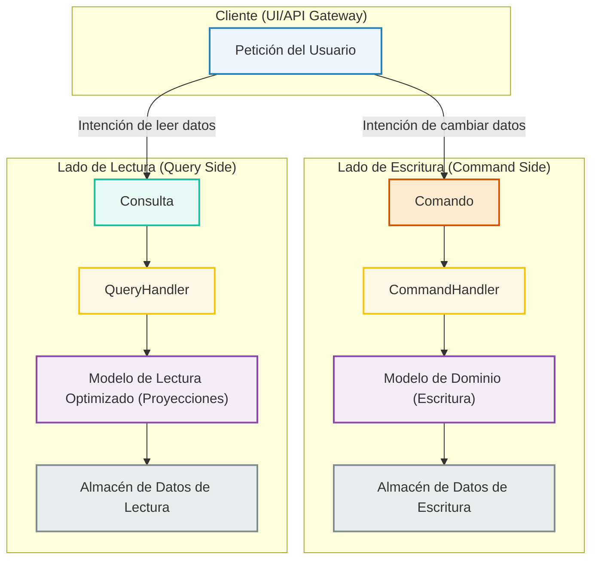
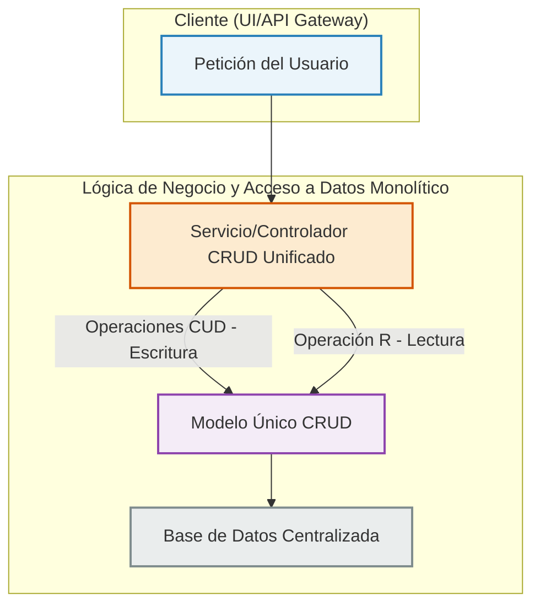

# Tema 8. PATRÓN CQRS EN MICROSERVICIOS

## Tabla de Contenidos

- [Tema 8. PATRÓN CQRS EN MICROSERVICIOS](#tema-8-patrón-cqrs-en-microservicios)
  - [Tabla de Contenidos](#tabla-de-contenidos)
  - [8. Contenidos](#8-contenidos)
    - [8.1 Explicación del patrón CQRS y diferencias con CRUD tradicional](#81-explicación-del-patrón-cqrs-y-diferencias-con-crud-tradicional)
    - [8.2 Diseño de comandos y queries como elementos separados](#82-diseño-de-comandos-y-queries-como-elementos-separados)
    - [8.3 Implementación de CommandHandlers desacoplados de controladores](#83-implementación-de-commandhandlers-desacoplados-de-controladores)
    - [8.4 Creación de QueryHandlers para operaciones de lectura especializadas](#84-creación-de-queryhandlers-para-operaciones-de-lectura-especializadas)
    - [8.5 Introducción a la persistencia por evento (Event Sourcing)](#85-introducción-a-la-persistencia-por-evento-event-sourcing)
    - [8.6 Aplicación de validadores de comandos (Command Validators)](#86-aplicación-de-validadores-de-comandos-command-validators)
    - [8.7 Gestión de la separación entre modelo de escritura y lectura](#87-gestión-de-la-separación-entre-modelo-de-escritura-y-lectura)
    - [8.8 Uso de FastAPI como gateway para coordinar comandos y queries](#88-uso-de-fastapi-como-gateway-para-coordinar-comandos-y-queries)
    - [8.9 Desacoplamiento de servicios mediante colas o buses de eventos](#89-desacoplamiento-de-servicios-mediante-colas-o-buses-de-eventos)
    - [8.10 Análisis de pros y contras de CQRS en sistemas reales](#810-análisis-de-pros-y-contras-de-cqrs-en-sistemas-reales)
    - [Bibliografía](#bibliografía)
  - [Libros Fundamentales y de Referencia](#libros-fundamentales-y-de-referencia)
  - [Artículos, Blogs y Contribuciones Clave](#artículos-blogs-y-contribuciones-clave)
  - [Recursos Específicos para Subtemas](#recursos-específicos-para-subtemas)
  - [Comunidades y Sitios Web](#comunidades-y-sitios-web)

## 8. Contenidos

### 8.1 Explicación del patrón CQRS y diferencias con CRUD tradicional

En el desarrollo de software moderno, especialmente al abordar la complejidad inherente a las arquitecturas de microservicios, la gestión eficiente y escalable de los datos se erige como un pilar fundamental. Si bien el patrón **CRUD** (Create, Read, Update, Delete) ha sido una solución tradicional y efectiva para muchos escenarios, su aplicabilidad puede verse limitada ante sistemas de gran envergadura y requisitos de rendimiento diferenciados. Es en este contexto donde el patrón **CQRS** (Command Query Responsibility Segregation) emerge como una alternativa estratégica y poderosa.

**¿Qué es CQRS? El Principio de Separación de Responsabilidades**

CQRS es un patrón arquitectónico que aboga por una **separación explícita entre las operaciones que modifican el estado del sistema (Comandos) y aquellas que lo consultan (Consultas)**. En contraposición a un modelo único para leer y escribir, CQRS propone la implementación de modelos y flujos de datos distintos y optimizados para cada una de estas responsabilidades.

  * **Comandos (Commands):** Representan la intención de cambiar el estado del sistema. Son imperativos (ej. "CrearNuevoPedido", "ActualizarStockProducto"). Fundamentalmente, no devuelven datos como resultado de su ejecución, aunque pueden indicar éxito o fracaso. Su objetivo es la ejecución de una acción y la consistencia de los datos.
  * **Consultas (Queries):** Representan la intención de obtener información del sistema sin alterar su estado. Son interrogativas (ej. "ObtenerDetallesDePedido", "ListarProductosDisponibles"). Devuelven datos (a menudo en forma de DTOs - Data Transfer Objects) y están optimizadas para la eficiencia de la lectura.

**Visualizando la Arquitectura CQRS:**

Podemos concebir CQRS como dos caminos bien diferenciados que se originan a partir de las interacciones del cliente, uno dedicado a las escrituras y otro a las lecturas, cada uno con sus propios modelos y, potencialmente, sus propios almacenes de datos.

En este diagrama:

  * Las **Peticiones del Usuario** se traducen en **Comandos** para modificar datos o **Consultas** para leerlos.
  * Los **CommandHandlers** orquestan la ejecución de los comandos, interactuando con un **Modelo de Dominio** rico y validado, optimizado para la escritura. Los cambios se persisten en un **Almacén de Datos de Escritura** (transaccional).
  * Los **QueryHandlers** gestionan las consultas, utilizando **Modelos de Lectura** (proyecciones o DTOs) diseñados específicamente para las necesidades de cada consulta. Estos pueden leer de un **Almacén de Datos de Lectura** optimizado (que podría ser una réplica, una base de datos NoSQL, una caché, etc.).

**Contraste con el CRUD Tradicional:**

El enfoque CRUD, si bien intuitivo, generalmente opera sobre un modelo de datos unificado y un único almacén para todas las interacciones (Crear, Leer, Actualizar, Eliminar).

En un sistema CRUD típico:

  * Un **Servicio o Controlador** centralizado gestiona todas las operaciones.
  * Se emplea un **Modelo Único** que debe satisfacer tanto las necesidades de validación y lógica de negocio para las escrituras, como los requisitos de formato y presentación para las lecturas.
  * Se interactúa, por lo general, con una **Base de Datos Centralizada**.

**Tabla Comparativa: CQRS vs. CRUD Tradicional**

| Característica        | CRUD Tradicional                                     | CQRS                                                                           |
| :-------------------- | :--------------------------------------------------- | :----------------------------------------------------------------------------- |
| **Modelo de Datos** | Único y compartido para lectura/escritura.         | Modelos distintos y especializados para lectura y escritura.                  |
| **Responsabilidad** | Concentrada en un único objeto/servicio.             | Separación clara: Comandos (modificación) y Consultas (lectura).               |
| **Complejidad** | Menor complejidad inicial, ideal para apps simples.  | Mayor complejidad estructural inicial, justificada en sistemas complejos.       |
| **Escalabilidad** | Escalabilidad conjunta; puede generar cuellos de botella. | Permite escalar los lados de lectura y escritura de forma independiente.       |
| **Optimización** | Optimizaciones generales sobre un modelo único.      | Optimización específica para cada modelo (escritura validada vs. lectura rápida). |
| **Flexibilidad DB** | Usualmente una única tecnología de base de datos.    | Posibilidad de usar diferentes tecnologías de BBDD para escritura y lectura.  |
| **Consistencia** | Típicamente consistencia fuerte e inmediata.         | Puede introducir consistencia eventual si los almacenes están separados y se sincronizan. |
| **Casos de Uso** | Aplicaciones CRUD-intensivas, prototipos, MVPs, lógica de lectura/escritura similar. | Sistemas con alta concurrencia, requisitos de rendimiento diferenciados (ej. muchas lecturas, pocas escrituras o viceversa), dominios complejos. |

**Beneficios Clave de Adoptar CQRS:**

1.  **Escalabilidad Diferenciada:** Permite ajustar los recursos de infraestructura de forma independiente para las cargas de trabajo de lectura y escritura. Esto es vital en sistemas donde, por ejemplo, las lecturas superan masivamente a las escrituras.
2.  **Modelos de Datos Optimizados:** El modelo de escritura puede ser un agregado rico en lógica de negocio (DDD), mientras que el modelo de lectura puede ser una proyección plana y desnormalizada, perfecta para una API o una interfaz de usuario.
3.  **Seguridad y Gobernanza Refinadas:** Facilita la aplicación de políticas de seguridad y permisos más granulares para las operaciones de modificación frente a las de consulta.
4.  **Heterogeneidad Tecnológica:** Abre la puerta al uso de la tecnología de persistencia más adecuada para cada lado. Por ejemplo, una base de datos SQL robusta para la consistencia de las escrituras y Elasticsearch o Redis para la velocidad de las lecturas.
5.  **Rendimiento Optimizado:** Las consultas se benefician de modelos de lectura precalculados o simplificados, evitando la carga de procesar modelos de escritura complejos o realizar joins costosos en tiempo real.

**Consideraciones Importantes (Desventajas Potenciales):**

  * **Incremento de la Complejidad:** La separación introduce más artefactos de código y una mayor complejidad conceptual inicial.
  * **Consistencia Eventual:** Si se opta por almacenes de datos separados, la sincronización entre ellos (necesaria para que las lecturas reflejen las escrituras) puede no ser instantánea, llevando a un modelo de consistencia eventual que debe ser cuidadosamente gestionado y comprendido.
  * **Duplicación de Información (Controlada):** Aunque los modelos son distintos, puede existir cierta redundancia en la representación de los datos, lo cual es una decisión de diseño consciente para lograr la optimización.

-----

**Nota sobre Colaboración y Compartir este Material:**

Para facilitar la colaboración y el estudio en equipo de este material, incluyendo los diagramas Mermaid:

  * **Código de los Diagramas:** El código fuente de los diagramas Mermaid (`graph TD ...`) puede ser copiado directamente.
      * **Editores Online:** Pega este código en editores Mermaid online (como el editor oficial en [mermaid.live](https://mermaid.live) o herramientas como [Mermaid Chart](https://www.mermaidchart.com/), que pueden ofrecer opciones de "collab" o guardado en la nube) para visualizarlo, modificarlo y compartir enlaces al diagrama.
      * **Repositorios y Documentación:** Integra el código Mermaid en vuestros ficheros Markdown (en plataformas como GitHub, GitLab, Gitea, Azure DevOps) o en vuestros sistemas de documentación (Confluence, Notion, etc.) que soporten Mermaid. Esto permite versionar los diagramas junto con el código o la documentación del proyecto.
  * **Contenido del Curso:** Este texto puede ser copiado y pegado en documentos compartidos (Google Docs, Microsoft Office 365, etc.) para discusiones, anotaciones y trabajo colaborativo.
  * **Herramientas de Diseño:** Para una colaboración más visual, pueden recrear estos diagramas en herramientas de diseño colaborativo (Miro, Lucidchart, FigJam) e importar/exportar según sea necesario, aunque el código Mermaid ofrece la ventaja de ser "diagramas como código".

Fomentar la revisión por pares y la discusión sobre estos conceptos y diagramas dentro del equipo es crucial para una comprensión profunda y una aplicación exitosa de CQRS.

En conclusión, si bien CQRS no es una solución universal, su adopción en el contexto de microservicios desarrollados con FastAPI y orientados por DDD puede desbloquear niveles superiores de rendimiento, escalabilidad y mantenibilidad. Supone un cambio de paradigma respecto al CRUD tradicional, enfocándose en la especialización de las operaciones de datos.

En las siguientes secciones, exploraremos cómo diseñar e implementar los componentes específicos de CQRS: los Comandos, las Consultas y sus respectivos Handlers.

-----

### 8.2 Diseño de comandos y queries como elementos separados
### 8.3 Implementación de CommandHandlers desacoplados de controladores
### 8.4 Creación de QueryHandlers para operaciones de lectura especializadas
### 8.5 Introducción a la persistencia por evento (Event Sourcing)
### 8.6 Aplicación de validadores de comandos (Command Validators)
### 8.7 Gestión de la separación entre modelo de escritura y lectura
### 8.8 Uso de FastAPI como gateway para coordinar comandos y queries
### 8.9 Desacoplamiento de servicios mediante colas o buses de eventos
### 8.10 Análisis de pros y contras de CQRS en sistemas reales
----

### Bibliografía
## Libros Fundamentales y de Referencia

1.  **Newman, Sam.** *Building Microservices: Designing Fine-Grained Systems*. O'Reilly Media, 2021 (2ª Edición).
    * Aunque no se centra exclusivamente en CQRS, este libro es una referencia esencial para el diseño de microservicios y cubre patrones que a menudo se usan junto con CQRS, como la comunicación basada en eventos y la descentralización de datos. Proporciona el contexto en el que CQRS brilla.

2.  **Vernon, Vaughn.** *Implementing Domain-Driven Design*. Addison-Wesley Professional, 2013.
    * Si bien se enfoca en DDD, Vernon dedica secciones a CQRS y Event Sourcing, mostrando cómo estos patrones pueden complementar un enfoque DDD. Es útil para entender cómo los comandos y eventos se relacionan con el modelo de dominio.

3.  **Richardson, Chris.** *Microservices Patterns: With examples in Java*. Manning Publications, 2018.
    * Este libro es una excelente guía sobre diversos patrones de microservicios, incluyendo CQRS y Event Sourcing. Explica los problemas que estos patrones resuelven y cómo implementarlos.

## Artículos, Blogs y Contribuciones Clave

* **Greg Young:**
    * Considerado el creador o al menos el principal popularizador del término CQRS. Sus charlas y artículos son fundamentales, aunque a veces difíciles de encontrar centralizados. Buscar "Greg Young CQRS" en YouTube o plataformas de conferencias es muy recomendable.
    * **Artículo de referencia (aunque antiguo, conceptualmente clave):** Young, Greg. "CQRS". (A menudo se encuentra en su blog o citado en otros recursos).
    * **Artículo de Martin Fowler (basado en las ideas de Young):** Fowler, Martin. "CQRS". [martinfowler.com/bliki/CQRS.html](https://martinfowler.com/bliki/CQRS.html) - Una explicación clara y concisa del patrón.

* **Udi Dahan:**
    * Otro experto influyente en arquitecturas de software, DDD y CQRS. Sus artículos de blog y charlas (disponibles en Particular Software y YouTube) ofrecen una visión profunda sobre la implementación de sistemas escalables y mantenibles utilizando CQRS.
    * **Recursos:** Su blog en [udidahan.com](https://udidahan.com/) y el sitio de NServiceBus/Particular Software.

* **Microsoft Docs / Azure Architecture Center:**
    * Ofrecen guías muy prácticas y bien documentadas sobre el patrón CQRS, a menudo en el contexto de arquitecturas de Azure, pero los principios son universalmente aplicables.
    * **Ejemplo:** "CQRS pattern" - [docs.microsoft.com/en-us/azure/architecture/patterns/cqrs](https://docs.microsoft.com/en-us/azure/architecture/patterns/cqrs)

## Recursos Específicos para Subtemas

* **Para Comandos, Queries, Handlers (8.2, 8.3, 8.4, 8.6):**
    * Los artículos de Fowler, Young y Dahan son la base. Ejemplos de implementación en diversos lenguajes se pueden encontrar en GitHub buscando "CQRS example" o "CQRS implementation". Para validadores, busca "CQRS command validation".

* **Para Event Sourcing (8.5):**
    * **Fowler, Martin.** "Event Sourcing". [martinfowler.com/eaaDev/EventSourcing.html](https://martinfowler.com/eaaDev/EventSourcing.html)
    * **Libro:** *Event Sourcing and CQRS* - Hay varios libros y guías más cortas que se centran específicamente en esta combinación.
    * **Greg Young:** También tiene mucho material sobre Event Sourcing.
    * **Documentación de EventStoreDB:** Una base de datos popular para Event Sourcing.

* **Para Separación de Modelos y FastAPI (8.7, 8.8):**
    * La documentación de CQRS de Microsoft y los artículos de Fowler explican bien la separación.
    * Para FastAPI, busca tutoriales o proyectos de ejemplo que implementen CQRS. "FastAPI CQRS example", "Python CQRS microservice" pueden ser buenos términos de búsqueda. La clave es cómo FastAPI puede enrutar peticiones a diferentes manejadores de comandos y queries.

* **Para Desacoplamiento con Colas/Buses (8.9):**
    * Libros como *Enterprise Integration Patterns* de Gregor Hohpe y Bobby Woolf, aunque más generales, son fundamentales para entender la mensajería.
    * Documentación de tecnologías como RabbitMQ, Apache Kafka, Azure Service Bus, AWS SQS/SNS.

* **Para Pros y Contras (8.10):**
    * La mayoría de los recursos introductorios (Fowler, Microsoft Docs) discuten esto. Busca artículos que analicen "CQRS advantages disadvantages" o "when to use CQRS".

---

## Comunidades y Sitios Web

* **InfoQ:** Presentaciones y artículos sobre CQRS y arquitecturas de software.
* **Conferences (YouTube Channels):** Canales de conferencias de desarrollo de software (como NDC Conferences, GOTO Conferences, etc.) suelen tener charlas sobre CQRS.
* **Stack Overflow y comunidades específicas de lenguajes/frameworks:** Para preguntas y discusiones sobre implementaciones concretas.
