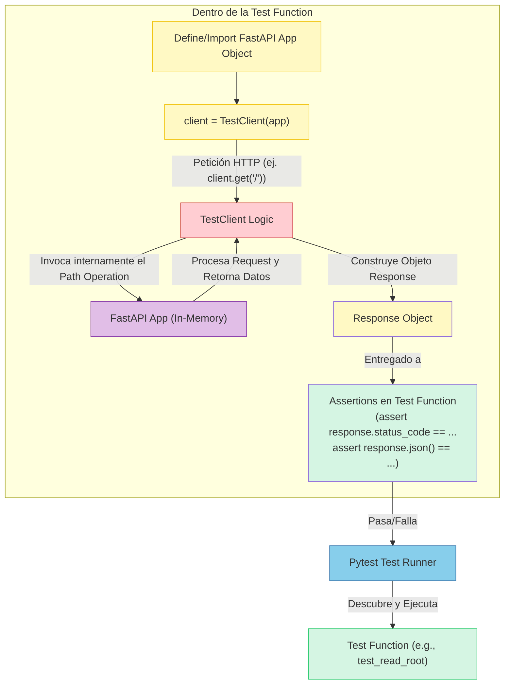

# Tema 14. BREVE INTRODUCCIÓN AL TESTING

## Tabla de Contenidos

- [Tema 14. BREVE INTRODUCCIÓN AL TESTING](#tema-14-breve-introducción-al-testing)
  - [Tabla de Contenidos](#tabla-de-contenidos)
  - [14. Contenidos](#14-contenidos)
    - [14.1 Entorno de pruebas con Pytest en FastAPI](#141-entorno-de-pruebas-con-pytest-en-fastapi)
    - [14.2 Pruebas unitarias para servicios de dominio](#142-pruebas-unitarias-para-servicios-de-dominio)
    - [14.3 Simulación de dependencias con `unittest.mock`](#143-simulación-de-dependencias-con-unittestmock)
    - [14.4 `TestClient` para REST y WebSocket](#144-testclient-para-rest-y-websocket)
    - [14.5 Pruebas de integración con DB temporal](#145-pruebas-de-integración-con-db-temporal)
    - [14.6 Pruebas E2E entre microservicios](#146-pruebas-e2e-entre-microservicios)
    - [14.7 Validación de eventos y colas en tests async](#147-validación-de-eventos-y-colas-en-tests-async)
    - [14.8 Cobertura y calidad con `coverage.py`](#148-cobertura-y-calidad-con-coveragepy)
    - [14.9 Estructura de carpetas y fixtures](#149-estructura-de-carpetas-y-fixtures)
    - [14.10 Automatización en pipelines CI/CD](#1410-automatización-en-pipelines-cicd)

## 14. Contenidos

### 14.1 Entorno de pruebas con Pytest en FastAPI
Este es un tema absolutamente crucial. No importa cuán brillante sea el diseño de tu API, cuán eficientes sean tus `WebSockets` o cuán elegante sea tu lógica de dominio; sin un conjunto robusto de pruebas, estás navegando en aguas turbulentas sin un mapa ni un salvavidas. El `testing` no es una ocurrencia tardía, es una parte integral del desarrollo profesional de software.

Iniciaremos con el **14.1**, sentando las bases de nuestro entorno de pruebas con dos herramientas fundamentales en el ecosistema Python y FastAPI: `Pytest` y el `TestClient` de FastAPI.

-----


Construir software es un arte, pero asegurar su calidad y fiabilidad es una ciencia. Las pruebas son el proceso mediante el cual validamos que nuestra aplicación se comporta como esperamos, hoy y después de cada cambio futuro. En este tema, exploraremos diferentes niveles de pruebas:

  * **`Unit Tests` (Pruebas Unitarias):** Verifican pequeñas piezas de código aisladas (ej. una función, un método de una clase).
  * **`Integration Tests` (Pruebas de Integración):** Verifican la interacción entre varios componentes (ej. tu API con la base de datos).
  * **`End-to-End (E2E) Tests` (Pruebas de Extremo a Extremo):** Verifican flujos completos de la aplicación desde la perspectiva del usuario.

Para orquestar todo esto, necesitamos un `test runner` y herramientas que faciliten la interacción con nuestra aplicación FastAPI.

**1. `Pytest`: El Compañero de Pruebas Elegido por Su Simplicidad y Poder 🛡️**

Mientras que Python viene con el módulo `unittest` en su librería estándar, **`pytest`** se ha convertido en el `framework` de pruebas de facto para muchos en la comunidad Python, y por buenas razones:

  * **Menos `Boilerplate`:** Escribir pruebas con `pytest` es a menudo más conciso. No necesitas heredar de clases base para la mayoría de los casos.
  * **`Fixtures` Potentes:** Un sistema de `dependency injection` para tus pruebas, que permite configurar `setup/teardown` de forma modular y reutilizable (veremos `fixtures` en 14.9).
  * **`Assertions` Simples:** Usa el `assert` estándar de Python, lo que hace las pruebas más legibles. `Pytest` proporciona introspección detallada en caso de fallo.
  * **Vasto Ecosistema de `Plugins`:** Para `reporting`, `coverage`, pruebas asíncronas, integración con otros `frameworks`, etc.
  * **Excelente Integración con FastAPI:** Funciona de maravilla para probar aplicaciones FastAPI, incluyendo sus aspectos asíncronos.

**2. Configurando Tu Laboratorio de Pruebas: Instalación y Convenciones 🧪**

Manos a la obra. Para empezar a probar tu aplicación FastAPI con `pytest`:

  * **Instalación:**
    Necesitarás `pytest` y, dado que FastAPI es asíncrono, `pytest-asyncio` es indispensable. `httpx` es usado por el `TestClient` de FastAPI.

    ```bash
    pip install pytest pytest-asyncio httpx
    ```

  * **Convenciones Fundamentales de `Pytest`:**
    `Pytest` usa convenciones para descubrir automáticamente tus pruebas:

    | Elemento        | Convención de Nombrado (`Naming Convention`) | Ejemplo (`Example`)            |
    | :-------------- | :------------------------------------------- | :----------------------------- |
    | Archivos de Test (`Test Files`) | `test_*.py`  o  `*_test.py`               | `test_main_api.py`, `auth_test.py` |
    | Funciones Test (`Test Functions`) | `test_*()`                                   | `test_read_root_success()`     |
    | Clases Test (`Test Classes`)    | `Test*` (si decides agrupar tests en clases) | `TestUserAuthentication`       |
    | `Assertions`    | `assert <expresión_booleana>`                | `assert response.status_code == 200` |

**3. `TestClient` de FastAPI: Tu Cliente Fantasma para Pruebas HTTP 👻**

FastAPI viene con una herramienta increíblemente útil para probar tus `endpoints` HTTP: `TestClient`.

  * **Importación:** `from fastapi.testclient import TestClient`
  * **¿Qué es?** Es un cliente que te permite hacer peticiones HTTP (como `GET`, `POST`, etc.) a tu aplicación FastAPI **directamente en memoria, sin necesidad de levantar un servidor HTTP real** (como Uvicorn). Interactúa con tu aplicación a través de la interfaz ASGI.
  * **Basado en `httpx`:** Esto significa que soporta operaciones tanto síncronas como asíncronas de forma transparente para tu aplicación FastAPI (que es asíncrona).
  * **Instanciación:** Se crea una instancia pasándole tu objeto de aplicación FastAPI.
    ```python
    from fastapi import FastAPI
    from fastapi.testclient import TestClient

    app = FastAPI() # Tu aplicación FastAPI

    @app.get("/")
    async def read_root():
        return {"message": "Hello, FastAPI!"}

    client = TestClient(app) # Instancia del TestClient asociada a tu app
    ```

**4. Tu Primera Prueba `Pytest` con `TestClient`: ¡El "Hola Mundo" de la Calidad\! 🚦**

Vamos a escribir una prueba simple para el `endpoint` `/` que definimos arriba.

  * **Crear un Archivo de Prueba:** Por ejemplo, `test_main.py` en un directorio `tests/` (o en el mismo directorio de tu `app` para empezar).

    ```python
    # tests/test_main.py
    from fastapi import FastAPI
    from fastapi.testclient import TestClient

    # Puedes definir una app simple aquí para probar o importar tu app principal
    # Para este ejemplo, definimos una app simple:
    app_for_testing = FastAPI()

    @app_for_testing.get("/")
    async def read_root_for_testing():
        return {"greeting": "Hello from Test"}

    # Crear un cliente para esta app de prueba
    client = TestClient(app_for_testing)


    def test_read_root_endpoint():
        """
        Prueba el endpoint raíz para verificar el status code y el contenido JSON.
        """
        response = client.get("/") # El TestClient hace la petición
        
        assert response.status_code == 200 # Verificar el status code
        assert response.json() == {"greeting": "Hello from Test"} # Verificar el payload JSON

    def test_non_existent_endpoint():
        response = client.get("/non-existent-path")
        assert response.status_code == 404 # FastAPI devuelve 404 para rutas no encontradas
    ```

  * **Ejecutando `pytest`:**
    Abre tu terminal en el directorio raíz de tu proyecto (donde está tu directorio `tests/` o tu archivo `test_main.py`) y simplemente ejecuta:

    ```bash
    pytest
    ```

    `Pytest` descubrirá y ejecutará automáticamente tus funciones `test_*`. Deberías ver una salida indicando que las pruebas han pasado.

**5. Probando `Endpoints` Asíncronos (y Pruebas Asíncronas) ⚡**

Tu aplicación FastAPI es asíncrona. El `TestClient` está diseñado para trabajar con esto sin problemas, incluso si tu función de prueba es síncrona (como `test_read_root_endpoint` arriba). El `TestClient` maneja el `event loop` internamente para llamar a tu `path operation function` asíncrona.

Sin embargo, si tu **lógica de prueba en sí misma necesita usar `await`** (por ejemplo, para preparar datos con una dependencia asíncrona antes de la llamada HTTP, o para interactuar con `WebSockets` de forma asíncrona en una prueba), entonces tu función de prueba debe ser `async def` y debes usar el `marker` de `pytest-asyncio`.

  * **Ejemplo (Ilustrativo, no estrictamente necesario para `GET` simple):**
    ```python
    # tests/test_main.py (continuación)
    import pytest # Necesario para el marker @pytest.mark.asyncio

    # ... (app_for_testing y client definidos como antes) ...

    @pytest.mark.asyncio
    async def test_read_root_async_test_function():
        # En este caso particular, la llamada client.get("/") sigue siendo síncrona en su interfaz,
        # pero el TestClient se encarga de ejecutar la app FastAPI asíncrona.
        # Marcar el test como async es útil si necesitas 'await' otras cosas dentro del test.
        
        # async_setup_data = await some_async_setup_function() # Ejemplo de necesidad de await
        
        response = client.get("/") # Esta llamada sigue siendo síncrona desde la perspectiva del test
        
        assert response.status_code == 200
        assert response.json() == {"greeting": "Hello from Test"}
        
        # await some_async_teardown_function(async_setup_data) # Ejemplo de necesidad de await
    ```
    *Para la mayoría de las pruebas de `endpoints` HTTP simples con `TestClient`, no necesitarás marcar tus tests como `@pytest.mark.asyncio` a menos que la lógica de *configuración o aserción de tu prueba* sea asíncrona. El `TestClient` "puentea" el mundo síncrono de la prueba con el mundo asíncrono de tu `app` FastAPI para las llamadas HTTP.* Cuando probemos `WebSockets` (14.4), veremos un uso más claro de `@pytest.mark.asyncio`.

**Diagrama `Mermaid`: El Flujo de una Prueba con `TestClient` 🌊**




-----


### 14.2 Pruebas unitarias para servicios de dominio
 Con nuestro entorno de pruebas FastAPI + `Pytest` listo (14.1), es hora de sumergirnos en el corazón de nuestra aplicación: la **lógica de negocio**. El **14.2** se enfoca en las **pruebas unitarias (`unit tests`) para los servicios de dominio o aplicación**. Estas pruebas son fundamentales porque verifican la corrección de la lógica central de tu sistema de forma aislada, rápida y precisa.

Imagina que tus `endpoints` API son la fachada de una fábrica compleja. Las pruebas unitarias de servicios son como inspeccionar cada máquina individual dentro de la fábrica para asegurar que realiza su tarea específica a la perfección, sin depender de que el resto de la línea de ensamblaje esté funcionando.

-----


Mientras que las pruebas con `TestClient` (que veremos más en 14.4) verifican el comportamiento de tus `endpoints` HTTP, las pruebas unitarias para `services` se centran en una capa más profunda: la lógica de negocio que orquesta las operaciones, aplica reglas y toma decisiones. Esta capa es a menudo donde reside la complejidad y el valor real de tu aplicación.

**¿Qué Son las Pruebas Unitarias para `Services` de Dominio/Aplicación? 🎯**

  * **Definición:** Una prueba unitaria verifica la funcionalidad de una "unidad" de código de forma **aislada**. En este contexto, una "unidad" suele ser una función, un método dentro de una clase de servicio, o la clase de servicio completa si sus métodos colaboran estrechamente para un caso de uso.
  * **Objetivos Principales:**
      * Verificar que la lógica interna de la unidad funciona como se espera para diferentes entradas.
      * Asegurar que se manejan correctamente los casos límite (`edge cases`) y los escenarios de error.
      * Validar que la unidad interactúa correctamente con sus dependencias (aunque estas dependencias serán simuladas o `mocked`).
  * **El Principio de Aislamiento (CRUCIAL):**
    Una prueba unitaria **NO** debe interactuar con sistemas externos como:
      * Bases de datos reales.
      * Servicios de red (otras APIs, `message brokers`).
      * El `filesystem`.
        Cualquier dependencia de este tipo debe ser reemplazada por un **`test double`** (un `mock`, `stub`, o `fake`) durante la prueba.

**Identificando Tus "Unidades" de Prueba: `Services` y Lógica de Negocio 🔎**

En una arquitectura bien estructurada (como la Hexagonal o una arquitectura por capas), los candidatos ideales para pruebas unitarias son:

  * **`Application Services` o `Use Case Handlers`:** Clases que orquestan un caso de uso específico, coordinando repositorios, `domain entities`, y otros servicios.
  * **`Domain Services`:** Clases que encapsulan lógica de dominio que no encaja naturalmente dentro de una `entity` o `value object`.
  * **Métodos Complejos dentro de `Entities` o `Aggregates`:** A veces, la lógica dentro de tus objetos de dominio es lo suficientemente compleja como para justificar sus propias pruebas unitarias.

La clave es identificar piezas de código con lógica de negocio que puedan ser probadas de forma independiente, simulando sus interacciones con el mundo exterior.

**El Arte de la Simulación: `Mocking` y `Stubbing` Dependencias con `unittest.mock` 🎭**

Para lograr el aislamiento, necesitamos simular las dependencias de nuestro servicio bajo prueba. La librería estándar de Python `unittest.mock` (que se integra perfectamente con `pytest`, o puedes usar el `plugin` `pytest-mock` que provee `fixtures` convenientes) es nuestra herramienta para esto.

  * **¿Por Qué `Mockear`?**

      * **Aislamiento:** Permite probar la lógica del servicio sin los efectos secundarios o la imprevisibilidad de las dependencias reales.
      * **Velocidad:** Los `mocks` son rápidos; no hay latencia de red o BBDD.
      * **Control:** Puedes configurar los `mocks` para que devuelvan valores específicos o simulen condiciones de error, permitiéndote probar todos los caminos de tu código.
      * **Verificación de Interacciones:** Puedes verificar que tu servicio llamó a los métodos correctos de sus dependencias con los argumentos esperados.

  * **Conceptos Clave de `unittest.mock` (Tabla Resumen):**

    | Atributo/Método del `Mock` | Propósito                                                                                               | Ejemplo de Uso (`mock_obj.attribute`)                               |
    | :------------------------- | :------------------------------------------------------------------------------------------------------ | :------------------------------------------------------------------ |
    | `return_value`             | Especifica el valor que un `mock` (o un método `mockeado`) debe devolver cuando se llama.              | `mock_repo.get_user.return_value = User(...)`                     |
    | `side_effect`              | Puede ser una función a llamar, una excepción a lanzar, o una lista de valores a devolver secuencialmente. | `mock_api.call.side_effect = NetworkError("Fallo")`                 |
    | `call_count`               | Entero que indica cuántas veces se ha llamado al `mock` o a uno de sus atributos.                      | `assert mock_logger.log.call_count == 2`                          |
    | `called`                   | `Boolean` que indica si el `mock` (o un atributo) fue llamado al menos una vez.                        | `assert mock_notifier.send_email.called is True`                  |
    | `assert_called()`          | Afirma que el `mock` fue llamado al menos una vez. Lanza `AssertionError` si no.                        | `mock_obj.some_method.assert_called()`                              |
    | `assert_called_once()`     | Afirma que el `mock` fue llamado exactamente una vez.                                                  | `mock_obj.some_method.assert_called_once()`                         |
    | `assert_called_with(*args, **kwargs)` | Verifica que la última llamada al `mock` fue con los argumentos y `keywords` especificados. | `mock_repo.save.assert_called_with(user_instance)`                |
    | `assert_called_once_with(*args, **kwargs)` | Igual, pero asegura que fue llamado exactamente una vez con esos argumentos.            | `mock_repo.save.assert_called_once_with(user_instance)`           |
    | `assert_any_call(*args, **kwargs)` | Verifica si el `mock` fue llamado alguna vez con los argumentos especificados.                     | `mock_logger.info.assert_any_call("Proceso iniciado")`              |
    | `call_args`                | Tupla `(args, kwargs)` de la última llamada. O `None`.                                                 | `args, kwargs = mock_obj.some_method.call_args`                   |
    | `call_args_list`           | Lista de todas las llamadas hechas al `mock`, cada una una tupla `(args, kwargs)`.                     | `for call_obj in mock_obj.some_method.call_args_list: ...`        |
    | `patch` (de `unittest.mock`) | Un `context manager` o decorador para reemplazar temporalmente objetos en un módulo con `mocks`.     | `@patch('module.Clase.metodo')` o `with patch(...) as mock_metodo:` |

      * **`AsyncMock`:** Para `mockear` funciones o métodos `async`, `unittest.mock.AsyncMock` es esencial. Se comporta como un `MagicMock` pero sus métodos `mockeados` devuelven `awaitables` y las `assertions` como `assert_awaited_once_with` están disponibles.

  * **Diagrama Conceptual: Prueba Unitaria de un Servicio con `Mocks`**

    ```mermaid
    graph TD
        TestCase["Test Case (Pytest Function)"]
        
        subgraph "Entorno de Prueba Aislado"
            SUT[("Service Under Test<br/>(ej. OrderService)")]
            MockRepo[("Mocked IOrderRepository<br/>(configurado con return_values)")]
            MockNotifier[("Mocked INotificationService<br/>(configurado con return_values)")]
        end

        TestCase -- 1. Arrange: Crea SUT con Mocks --> SUT
        TestCase -- . --> MockRepo
        TestCase -- . --> MockNotifier
        
        TestCase -- 2. Act: Llama a método de SUT --> SUT
        SUT -- Interactúa con --> MockRepo
        SUT -- Interactúa con --> MockNotifier
        
        MockRepo -- Devuelve datos simulados --> SUT
        MockNotifier -- (No devuelve nada, solo se verifica llamada) --> SUT

        TestCase -- 3. Assert: Verifica resultado del SUT --> SUT
        TestCase -- 3. Assert: Verifica interacciones con Mocks --> MockRepo
        TestCase -- 3. Assert: Verifica interacciones con Mocks --> MockNotifier

        style SUT fill:#D5F5E3,stroke:#2ECC71,stroke-width:3px
        style MockRepo fill:#AED6F1,stroke:#3498DB
        style MockNotifier fill:#AED6F1,stroke:#3498DB
        style TestCase fill:#FFF9C4,stroke:#F1C40F
    ```

**Escribiendo Pruebas Unitarias para un `Service`: Un Ejemplo Práctico 🧪**

Imaginemos un `PremiumUserService` que decide si un usuario puede acceder a una `feature` premium basándose en su tipo de suscripción y quizás alguna otra lógica.

  * **Definición del `Service` y sus Dependencias (Interfaces):**

    ```python
    # app/services/premium_service.py
    from typing import Protocol, Optional
    from enum import Enum

    class SubscriptionType(str, Enum):
        FREE = "free"
        PREMIUM = "premium"
        VIP = "vip"

    class User(BaseModel): # Asumimos un Pydantic model para User
        id: int
        username: str
        subscription_type: SubscriptionType

    class IUserRepository(Protocol): # Puerto para el repositorio de usuarios
        async def get_user_by_id(self, user_id: int) -> Optional[User]: ...

    class PremiumFeatureAccessError(Exception):
        pass

    class PremiumUserService:
        def __init__(self, user_repo: IUserRepository):
            self.user_repo = user_repo

        async def can_user_access_feature(self, user_id: int, feature_name: str) -> bool:
            if not feature_name:
                raise ValueError("Feature name cannot be empty.")

            user = await self.user_repo.get_user_by_id(user_id)
            if not user:
                raise ValueError(f"User with ID {user_id} not found.")

            if feature_name == "ultra_hd_streaming":
                if user.subscription_type in [SubscriptionType.PREMIUM, SubscriptionType.VIP]:
                    return True
                else:
                    raise PremiumFeatureAccessError("Ultra HD Streaming only for PREMIUM or VIP users.")
            
            if feature_name == "exclusive_content":
                if user.subscription_type == SubscriptionType.VIP:
                    return True
                else:
                    raise PremiumFeatureAccessError("Exclusive Content only for VIP users.")
            
            # Por defecto, otras features no premium podrían ser accesibles
            return True # O lanzar error si la feature no es conocida
    ```

  * **Escribiendo las Pruebas con `pytest` y `AsyncMock`:**
    (Asegúrate de tener `pip install pytest pytest-asyncio`)

    ```python
    # tests/unit/services/test_premium_service.py
    import pytest
    from unittest.mock import AsyncMock # Para mockear coroutines
    from pydantic import BaseModel # Necesario para definir User en el test o importar

    # Re-definir o importar las clases necesarias para el test si están en otros módulos
    # from app.services.premium_service import (
    #     PremiumUserService, IUserRepository, User, SubscriptionType, PremiumFeatureAccessError
    # )

    # --- Definiciones simplificadas para el test (si no se importan) ---
    from enum import Enum
    from typing import Protocol, Optional

    class SubscriptionType(str, Enum):
        FREE = "free"; PREMIUM = "premium"; VIP = "vip"

    class User(BaseModel): 
        id: int; username: str; subscription_type: SubscriptionType

    class IUserRepository(Protocol):
        async def get_user_by_id(self, user_id: int) -> Optional[User]: ...

    class PremiumFeatureAccessError(Exception): pass

    class PremiumUserService: # Copia de la clase para que el test sea autocontenido
        def __init__(self, user_repo: IUserRepository): self.user_repo = user_repo
        async def can_user_access_feature(self, user_id: int, feature_name: str) -> bool:
            if not feature_name: raise ValueError("Feature name cannot be empty.")
            user = await self.user_repo.get_user_by_id(user_id)
            if not user: raise ValueError(f"User with ID {user_id} not found.")
            if feature_name == "ultra_hd_streaming":
                if user.subscription_type in [SubscriptionType.PREMIUM, SubscriptionType.VIP]: return True
                else: raise PremiumFeatureAccessError("Ultra HD Streaming only for PREMIUM or VIP users.")
            if feature_name == "exclusive_content":
                if user.subscription_type == SubscriptionType.VIP: return True
                else: raise PremiumFeatureAccessError("Exclusive Content only for VIP users.")
            return True 
    # --- Fin Definiciones simplificadas ---


    @pytest.fixture
    def mock_user_repo(self) -> AsyncMock: # Usando pytest-mock 'mocker' también es una opción
        return AsyncMock(spec=IUserRepository)

    @pytest.mark.asyncio
    async def test_vip_user_can_access_ultra_hd(mock_user_repo: AsyncMock):
        # Arrange
        vip_user = User(id=1, username="vip_user", subscription_type=SubscriptionType.VIP)
        mock_user_repo.get_user_by_id.return_value = vip_user # Configurar el mock
        
        service = PremiumUserService(user_repo=mock_user_repo)
        
        # Act
        can_access = await service.can_user_access_feature(user_id=1, feature_name="ultra_hd_streaming")
        
        # Assert
        assert can_access is True
        mock_user_repo.get_user_by_id.assert_awaited_once_with(1) # Verificar llamada al mock

    @pytest.mark.asyncio
    async def test_free_user_cannot_access_ultra_hd(mock_user_repo: AsyncMock):
        # Arrange
        free_user = User(id=2, username="free_user", subscription_type=SubscriptionType.FREE)
        mock_user_repo.get_user_by_id.return_value = free_user
        service = PremiumUserService(user_repo=mock_user_repo)
        
        # Act & Assert
        with pytest.raises(PremiumFeatureAccessError) as exc_info:
            await service.can_user_access_feature(user_id=2, feature_name="ultra_hd_streaming")
        
        assert "only for PREMIUM or VIP users" in str(exc_info.value)
        mock_user_repo.get_user_by_id.assert_awaited_once_with(2)

    @pytest.mark.asyncio
    async def test_access_non_existent_user_raises_error(mock_user_repo: AsyncMock):
        # Arrange
        mock_user_repo.get_user_by_id.return_value = None # Simular usuario no encontrado
        service = PremiumUserService(user_repo=mock_user_repo)
        
        # Act & Assert
        with pytest.raises(ValueError) as exc_info:
            await service.can_user_access_feature(user_id=999, feature_name="any_feature")
        
        assert "User with ID 999 not found" in str(exc_info.value)

    # ... más tests para otros casos (ej. feature_name vacío, otras features) ...
    ```

**Estructura de Pruebas: El Patrón `Arrange, Act, Assert (AAA)`**

Una buena práctica para estructurar tus pruebas unitarias es seguir el patrón AAA:

1.  **`Arrange` (Organizar):** Prepara todo lo necesario para la prueba. Esto incluye:
      * Crear instancias de los objetos necesarios.
      * Configurar los `mocks` (establecer `return_value`, `side_effect`, etc.).
      * Definir los `inputs` para la unidad bajo prueba.
2.  **`Act` (Actuar):** Ejecuta la unidad de código que estás probando (ej. llamar al método del servicio).
3.  **`Assert` (Afirmar):** Verifica que los resultados sean los esperados. Esto incluye:
      * Comprobar el valor de retorno de la unidad.
      * Verificar que los `mocks` fueron llamados como se esperaba (`call_count`, `assert_called_with`).
      * Verificar que se lanzaron las excepciones correctas en casos de error.

Los ejemplos anteriores siguen este patrón.

**Beneficios Concretos de las Pruebas Unitarias de `Services` 🏆**

  * **Ejecución Extremadamente Rápida:** Al no depender de BBDD, red, etc., estas pruebas se ejecutan en milisegundos. Esto permite un `feedback loop` muy corto durante el desarrollo.
  * **Feedback Preciso y Aislado:** Si una prueba unitaria falla, sabes que el problema está en la lógica de esa unidad específica, no en una dependencia externa.
  * **Fomenta el Buen Diseño (SOLID, DI):** Escribir código que sea fácil de probar unitariamente te empuja naturalmente hacia principios de diseño como la `Single Responsibility Principle (SRP)` y la `Dependency Inversion Principle (DIP)` (usando interfaces y `Dependency Injection`).
  * **Documentación Viva y Ejecutable:** Tus pruebas unitarias sirven como ejemplos concretos de cómo se espera que se comporte cada parte de tu `service`.
  * **Seguridad en la Refactorización:** Puedes cambiar la implementación interna de un `service` con mucha más confianza si tienes una buena `suite` de pruebas unitarias que verifiquen que su comportamiento observable no ha cambiado.

**Conclusión: Construyendo Confianza Desde el Núcleo de Tu Aplicación ❤️‍🩹**

Las pruebas unitarias de tus `services` de dominio y aplicación son la primera y más fundamental línea de defensa contra `bugs` y regresiones. Son el microscopio que te permite examinar y validar la lógica más crítica de tu sistema.
`Pytest` y las capacidades de `mocking` de Python (`unittest.mock` o `pytest-mock`) te proporcionan todas las herramientas necesarias para escribir estas pruebas de forma efectiva, aislada y elegante. Esta práctica no solo mejora la calidad de tu `software`, sino que también acelera el desarrollo a largo plazo al proporcionar una red de seguridad para la evolución y refactorización de tu código.

-----


### 14.3 Simulación de dependencias con `unittest.mock`
### 14.4 `TestClient` para REST y WebSocket
### 14.5 Pruebas de integración con DB temporal
### 14.6 Pruebas E2E entre microservicios
### 14.7 Validación de eventos y colas en tests async
### 14.8 Cobertura y calidad con `coverage.py`
### 14.9 Estructura de carpetas y fixtures
### 14.10 Automatización en pipelines CI/CD