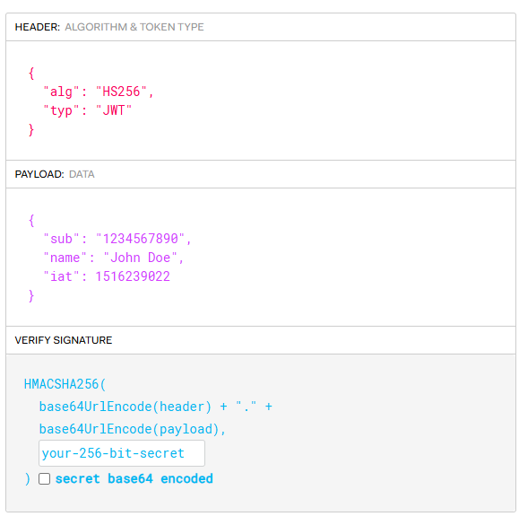

# Tema 5. Seguridad y buenas prácticas en Microservicios

  * [Objetivos](#objetivos)
  * [5.1 Autenticación basada en JWT con FastAPI](Tema5.md#51-autenticación-basada-en-jwt-con-fastapi)
  * [5.2 Autorización por roles y scopes (RBAC)](Tema5.md#52-autorización-por-roles-y-scopes-rbac)
  * [5.3 Comunicación segura con HTTPS y certificados](Tema5.md#53-comunicación-segura-con-https-y-certificados)
  * [5.4 Validación de inputs y outputs](Tema5.md#54-validación-de-inputs-y-outputs)
  * [5.5 Políticas de CORS estrictas](Tema5.md#55-políticas-de-cors-estrictas)
  * [5.6 Protección de endpoints WebSocket y REST](Tema5.md#56-protección-de-endpoints-websocket-y-rest)
  * [5.7 Rotación de claves y secretos](Tema5.md#57-rotación-de-claves-y-secretos-57-rotación-de-claves-y-secretos)
  * [5.8 Gestión de credenciales con Vault o AWS Secrets Manager](Tema5.md#58-gestión-de-credenciales-con-vault-o-aws-secrets-manager)
  * [5.9 Análisis de vulnerabilidades OWASP](Tema5.md#59-análisis-de-vulnerabilidades-owasp)
  * [5.10 Auditoría y trazabilidad de usuarios](Tema5.md#510-auditoría-y-trazabilidad-de-usuarios)
  * [5.11 Configuración de rate limiting](Tema5.md#511-configuración-de-rate-limiting)
  * [Referencias](#referencias)

***
## Objetivos

* Comprender los principios fundamentales de seguridad aplicables a arquitecturas de microservicios.

* Implementar mecanismos de autenticación y autorización robustos, como JWT y RBAC, en aplicaciones FastAPI.

* Aplicar buenas prácticas para asegurar la comunicación, la validación de datos y la gestión de secretos en microservicios.

* Identificar y mitigar vulnerabilidades comunes en APIs, tomando como referencia el Top 10 de OWASP.

* Establecer estrategias para la auditoría, trazabilidad y limitación de tasa en los servicios.

***

!!! Info La seguridad en arquitecturas de microservicios es un desafío multifacético pero crítico. La naturaleza distribuida de los microservicios introduce nuevas superficies de ataque y complejidades en comparación con los monolitos. Adoptar un enfoque de "defensa en profundidad", donde múltiples capas de seguridad se complementan, es esencial. Este tema cubre los aspectos fundamentales de la seguridad y las buenas prácticas para construir microservicios robustos y protegidos, con ejemplos y consideraciones para FastAPI.

## 5.1 Autenticación basada en JWT con FastAPI

La autenticación es el proceso de verificar la identidad de un usuario, cliente o servicio. JSON Web Tokens (JWT) son un estándar abierto (RFC 7519) que define una forma compacta y autónoma para transmitir información de forma segura entre partes como un objeto JSON. Son especialmente adecuados para escenarios de microservicios debido a su naturaleza stateless.



**Estructura de un JWT:** Un JWT consta de tres partes separadas porpuntos (`.`):

1. **Header (Cabecera):** Típicamente consiste en dos partes: el tipo de token (`typ`, que es JWT) y el algoritmo de firma utilizado (`alg`, como HMAC SHA256 o RSA SHA256).`json { "alg": "HS256", "typ": "JWT" }` Esta parte se codifica en Base64Url.
2.  **Payload (Carga Útil):** Contiene las "claims" (afirmaciones), que son declaraciones sobre una entidad (normalmente el usuario) y datos adicionales. Hay tres tipos de claims:

    * **Registered claims (Registradas):** Un conjunto de claims\
      predefinidas no obligatorias pero recomendadas, como `iss`\
      (issuer/emisor), `exp` (expiration time/tiempo de expiración),`sub` (subject/sujeto, el ID del usuario), `aud`\
      (audience/audiencia, el destinatario del token).
    * **Public claims (Públicas):** Definidas por quienes usan JWTs,\
      pero deben ser globalmente únicas (registradas en el IANA JSON\
      Web Token Registry o usar URIs resistentes a colisiones).
    * **Private claims (Privadas):** Claims personalizadas creadas\
      para compartir información entre partes que acuerdan usarlas\
      (ej. roles, permisos).

    ```json
    {
      "sub": "user123",
      "name": "Alice Wonderland",
      "roles": ["user", "reader"],
      "exp": 1715289000 // Ejemplo: Timestamp de expiración
    }
    ```

    Esta parte también se codifica en Base64Url.
3. **Signature (Firma):** Para crear la firma, se toman el header\
   codificado, el payload codificado, un secreto (para HMAC) o una\
   clave privada (para RSA/ECDSA), y se firman con el algoritmo\
   especificado en el header.`HMACSHA256( base64UrlEncode(header) + "." + base64UrlEncode(payload), secret )`\
   La firma se utiliza para verificar que el remitente del JWT es quien\
   dice ser y para asegurar que el mensaje no ha sido alterado en\
   tránsito.

**Ventajas de JWT en Microservicios:**

* **Stateless:** El servidor no necesita almacenar el estado de la\
  sesión del token. Toda la información necesaria está en el propio\
  token (aunque se puede verificar contra una lista de revocación si\
  es necesario). Esto es ideal para la escalabilidad horizontal de los\
  microservicios.
* **Distribuible:** Los tokens pueden ser generados por un servicio de\
  autenticación y luego validados por múltiples microservicios (si\
  comparten el secreto o la clave pública).
* **Seguridad (si se usa correctamente):** La firma asegura la\
  integridad y autenticidad del token.

**Flujo Típico (OAuth2 Password Flow con Bearer Tokens):**

1. El usuario envía sus credenciales (username/password) a un endpoint\
   de autenticación (ej. `/token` o `/login`).
2. El servicio de autenticación verifica las credenciales.
3. Si son válidas, genera un JWT (access token) y opcionalmente un\
   refresh token.
4. El cliente almacena el access token (ej. en `localStorage`,`sessionStorage`, o memoria) y lo envía en la cabecera`Authorization` con el esquema `Bearer` en cada solicitud a los\
   endpoints protegidos. `Authorization: Bearer <token>`


#### **Ejemplo Práctico** 

Vamos a construir una API con dos endpoints:
* `/token`: Un endpoint público donde el usuario envía su nombre y contraseña para recibir un JWT.
* `/users/me`: Un endpoint protegido que solo devuelve información si se presenta un JWT válido.

**1. Preparación (Instalación de librerías):**
Abre tu terminal e instala todo lo necesario:
```bash
pip install "fastapi[all]" "python-jose[cryptography]" "passlib[bcrypt]" bcrypt==3.2.0
```

**2. Código de la Aplicación:**
Guarda este código en un fichero llamado `main_sec_5_1.py`:

```python
# main_sec_5_1.py
from datetime import datetime, timedelta, timezone
from fastapi import Depends, FastAPI, HTTPException, status
from fastapi.security import OAuth2PasswordBearer, OAuth2PasswordRequestForm
from jose import JWTError, jwt
from passlib.context import CryptContext

# --- 1. Configuración de Seguridad ---
# ¡IMPORTANTE! En un proyecto real, esta clave debe ser mucho más compleja y
# cargada desde un lugar seguro (variables de entorno, gestor de secretos), NUNCA en el código.
SECRET_KEY = "mi-clave-secreta-para-el-ejemplo-de-jwt"
ALGORITHM = "HS256"
ACCESS_TOKEN_EXPIRE_MINUTES = 30

# --- 2. Utilidades para Contraseñas y Tokens ---
pwd_context = CryptContext(schemes=["bcrypt"], deprecated="auto")
oauth2_scheme = OAuth2PasswordBearer(tokenUrl="token") # Le dice a FastAPI dónde está el endpoint de login

# --- 3. Base de Datos Ficticia de Usuarios ---
# En un caso real, esto vendría de una base de datos.
fake_users_db = {
    "user1": {
        "username": "user1",
        "full_name": "Usuario Uno",
        "email": "user1@example.com",
        "hashed_password": pwd_context.hash("pass123"), # La contraseña "pass123" hasheada
    }
}

# --- 4. Funciones de Creación y Verificación de JWT ---
def create_access_token(data: dict):
    to_encode = data.copy()
    expire = datetime.now(timezone.utc) + timedelta(minutes=ACCESS_TOKEN_EXPIRE_MINUTES)
    to_encode.update({"exp": expire})
    encoded_jwt = jwt.encode(to_encode, SECRET_KEY, algorithm=ALGORITHM)
    return encoded_jwt

async def get_current_user(token: str = Depends(oauth2_scheme)):
    """
    Esta es la dependencia "guardián". Se encarga de:
    1. Extraer el token de la cabecera 'Authorization'.
    2. Decodificarlo y validar su firma y expiración.
    3. Devolver los datos del usuario si todo es correcto.
    4. Lanzar una excepción si algo falla.
    """
    credentials_exception = HTTPException(
        status_code=status.HTTP_401_UNAUTHORIZED,
        detail="No se pudieron validar las credenciales",
        headers={"WWW-Authenticate": "Bearer"},
    )
    try:
        payload = jwt.decode(token, SECRET_KEY, algorithms=[ALGORITHM])
        username: str = payload.get("sub")
        if username is None:
            raise credentials_exception
    except JWTError:
        raise credentials_exception
    
    user = fake_users_db.get(username)
    if user is None:
        raise credentials_exception
    return user

# --- 5. La Aplicación FastAPI ---
app = FastAPI()

@app.post("/token", summary="Iniciar sesión y obtener un token")
async def login_for_access_token(form_data: OAuth2PasswordRequestForm = Depends()):
    user_in_db = fake_users_db.get(form_data.username)
    if not user_in_db or not pwd_context.verify(form_data.password, user_in_db["hashed_password"]):
        raise HTTPException(
            status_code=status.HTTP_401_UNAUTHORIZED,
            detail="Usuario o contraseña incorrectos",
        )
    # El "sub" (subject) es el identificador único del usuario en el token.
    access_token = create_access_token(data={"sub": user_in_db["username"]})
    return {"access_token": access_token, "token_type": "bearer"}

@app.get("/users/me", summary="Obtener perfil del usuario actual (protegido)")
async def read_users_me(current_user: dict = Depends(get_current_user)):
    # Gracias a `Depends(get_current_user)`, este código solo se ejecuta
    # si el token es válido. `current_user` contendrá los datos del usuario.
    # Eliminamos el hash de la contraseña antes de devolver los datos.
    user_info = current_user.copy()
    user_info.pop("hashed_password")
    return user_info
```

**3. Ejecuta la Aplicación:**
```bash
uvicorn main_sec_5_1:app --reload
```

#### **Pruebas con `curl`** ✅

Ahora, vamos a probar que nuestra autenticación funciona.

**1. Intenta acceder al endpoint protegido SIN token (debe fallar):**
```bash
curl -X GET "http://localhost:8000/users/me"
```
*Respuesta esperada (401 Unauthorized):*
```json
{"detail":"Not authenticated"}
```
¡Perfecto! El guardián está haciendo su trabajo.

**2. Inicia sesión para obtener un token:**
```bash
curl -X POST "http://localhost:8000/token" \
-H "Content-Type: application/x-www-form-urlencoded" \
-d "username=user1&password=pass123"
```
*Respuesta esperada:*
```json
{"access_token":"eyJhbGciOi...","token_type":"bearer"}
```
**Copia el valor del `access_token`**. Lo necesitaremos para el siguiente paso.

**3. Accede al endpoint protegido CON el token (debe funcionar):**

Reemplaza `TU_TOKEN_COPIADO_AQUI` con el token que acabas de obtener.

```bash
TOKEN="TU_TOKEN_COPIADO_AQUI"

curl -X GET "http://localhost:8000/users/me" \
-H "Authorization: Bearer $TOKEN"
```
*Respuesta esperada (200 OK):*
```json
{"username":"user1","full_name":"Usuario Uno","email":"user1@example.com"}
```


---
**Consideraciones de Seguridad para JWT:**

* **HTTPS Siempre:** Los JWTs solo deben transmitirse sobre HTTPS para\
  protegerlos de la interceptación.
* **Algoritmo de Firma (`alg`):**
  * `HS256` (HMAC con SHA-256) usa un único secreto compartido entre\
    el emisor y el validador. Es más simple pero requiere compartir\
    el secreto.
  * `RS256` (RSA con SHA-256) usa un par de claves pública/privada.\
    El emisor firma con la clave privada, y los validadores\
    verifican con la clave pública. Esto es más seguro para\
    microservicios, ya que la clave privada no necesita ser\
    compartida con todos los servicios.
  * Evitar el algoritmo `none` (deshabilítalo en tu biblioteca de\
    validación).
* **Gestión de Secretos/Claves:** El `SECRET_KEY` (para HS256) o la\
  clave privada (para RS256) deben ser fuertes, únicos y gestionados\
  de forma segura (ver secciones 5.7 y 5.8).
* **Expiración (`exp`):** Los access tokens deben tener una vida corta\
  (ej. 15-60 minutos) para limitar el impacto si son robados.
* **Refresh Tokens:** Para obtener nuevos access tokens sin que el\
  usuario tenga que volver a ingresar credenciales, se usan refresh\
  tokens. Estos son tokens de larga duración, almacenados de forma\
  segura por el cliente, y se envían a un endpoint especial para\
  obtener un nuevo access token. Los refresh tokens pueden ser\
  revocados.
* **Revocación de Tokens:** Aunque los JWT son stateless, a veces es\
  necesario revocar un token antes de su expiración (ej. si el usuario\
  cierra sesión, cambia contraseña, o se detecta compromiso). Esto\
  requiere una solución stateful, como una lista negra de IDs de token\
  (claim `jti`) o una lista blanca de sesiones activas, consultada\
  durante la validación.
* **Sensibilidad del Payload:** No incluyas información altamente\
  sensible directamente en el payload del JWT si este puede ser leído\
  por el cliente. Aunque firmado, el payload es solo Base64Url\
  codificado, no cifrado. Si se necesita cifrado, usar JWE (JSON Web\
  Encryption).

## 5.2 Autorización por roles y scopes (RBAC)


> **RBAC**: Role Based Access Control

> La **autorización** es el proceso que ocurre *después* de la autenticación. Responde a la pregunta: **"¿Tiene este usuario permiso para realizar esta acción?"**.

Existen varios modelos para gestionar permisos, pero uno muy común y flexible es una combinación de **roles** y **scopes** [RFC 6749](https://datatracker.ietf.org/doc/html/rfc6749):

* **Rol**: Es una etiqueta que agrupa a un tipo de usuario. Define *quién* es el usuario en un sentido funcional.
    * *Ejemplos*: `admin`, `editor`, `viewer`, `premium_user`.

* **Scope (Ámbito o Permiso)**: Es una autorización granular para realizar una acción muy específica. Define *qué puede hacer* el usuario.
    * *Ejemplos*: `items:read`, `items:write`, `users:delete`, `billing:view`.

La práctica habitual es asignar uno o más roles a un usuario, y que cada rol lleve asociados un conjunto de scopes. Para mantener nuestros microservicios rápidos y autónomos, la mejor estrategia es **incluir los roles y scopes del usuario directamente en el payload del JWT** al iniciar sesión.

#### **Ejemplo Práctico** 

Vamos a ampliar nuestro ejemplo anterior. Ahora, al iniciar sesión, el token JWT contendrá los permisos del usuario. Crearemos endpoints que requieran scopes específicos para poder ser accedidos.

**1. Preparación:**
Continuaremos con el fichero del punto anterior. No se necesitan nuevas librerías.

**2. Código de la Aplicación:**
Guarda este código como `main_sec_5_2.py`. Fíjate en los cambios marcados con comentarios.

```python
# main_sec_5_2.py
from datetime import datetime, timedelta, timezone
from fastapi import Depends, FastAPI, HTTPException, status
from fastapi.security import OAuth2PasswordBearer, OAuth2PasswordRequestForm
from jose import JWTError, jwt
from passlib.context import CryptContext

# --- Configuración (sin cambios) ---
SECRET_KEY = "mi-clave-secreta-para-el-ejemplo-de-jwt"
ALGORITHM = "HS256"
ACCESS_TOKEN_EXPIRE_MINUTES = 30
pwd_context = CryptContext(schemes=["bcrypt"], deprecated="auto")
oauth2_scheme = OAuth2PasswordBearer(tokenUrl="token")

# --- Base de Datos Ficticia (¡Ahora con roles y scopes!) ---
fake_users_db = {
    "user_viewer": {
        "username": "user_viewer",
        "full_name": "Usuario Lector",
        "email": "viewer@example.com",
        "hashed_password": pwd_context.hash("pass123"),
        "roles": ["viewer"],
        "scopes": ["items:read"], # Solo puede leer
    },
    "user_editor": {
        "username": "user_editor",
        "full_name": "Usuario Editor",
        "email": "editor@example.com",
        "hashed_password": pwd_context.hash("pass456"),
        "roles": ["editor"],
        "scopes": ["items:read", "items:write"], # Puede leer y escribir
    }
}

# --- Funciones de JWT (create_access_token sin cambios) ---
def create_access_token(data: dict):
    to_encode = data.copy()
    expire = datetime.now(timezone.utc) + timedelta(minutes=ACCESS_TOKEN_EXPIRE_MINUTES)
    to_encode.update({"exp": expire})
    encoded_jwt = jwt.encode(to_encode, SECRET_KEY, algorithm=ALGORITHM)
    return encoded_jwt

# --- Dependencias de Seguridad (get_current_user ahora extrae más claims) ---
async def get_current_user_from_token(token: str = Depends(oauth2_scheme)):
    credentials_exception = HTTPException(
        status_code=status.HTTP_401_UNAUTHORIZED,
        detail="No se pudieron validar las credenciales",
        headers={"WWW-Authenticate": "Bearer"},
    )
    try:
        payload = jwt.decode(token, SECRET_KEY, algorithms=[ALGORITHM])
        username: str = payload.get("sub")
        if username is None:
            raise credentials_exception
        
        # Extraemos los scopes del payload del token
        scopes = payload.get("scopes", [])
        
    except JWTError:
        raise credentials_exception
    
    # Devolvemos un diccionario con los datos del usuario del token
    return {"username": username, "scopes": scopes}


# --- NUEVA Dependencia de AUTORIZACIÓN ---
def require_scope(required_scope: str):
    """
    Esta es una factoría de dependencias. Devuelve una función 'checker'
    que verifica si el scope requerido está en la lista de scopes del usuario.
    """
    async def scope_checker(current_user: dict = Depends(get_current_user_from_token)):
        if required_scope not in current_user.get("scopes", []):
            raise HTTPException(
                status_code=status.HTTP_403_FORBIDDEN,
                detail=f"Permisos insuficientes. Se requiere el scope: '{required_scope}'"
            )
        return current_user
    return scope_checker

# --- Aplicación FastAPI ---
app = FastAPI()

# El endpoint de login ahora debe incluir los scopes en el token
@app.post("/token", summary="Iniciar sesión para obtener un token con scopes")
async def login_for_access_token(form_data: OAuth2PasswordRequestForm = Depends()):
    user_in_db = fake_users_db.get(form_data.username)
    if not user_in_db or not pwd_context.verify(form_data.password, user_in_db["hashed_password"]):
        raise HTTPException(
            status_code=status.HTTP_401_UNAUTHORIZED,
            detail="Usuario o contraseña incorrectos",
        )
    
    # Creamos el token incluyendo el username (sub) y sus scopes
    access_token = create_access_token(
        data={"sub": user_in_db["username"], "scopes": user_in_db["scopes"]}
    )
    return {"access_token": access_token, "token_type": "bearer"}


# --- Endpoints Protegidos por Scopes ---
@app.get("/items", summary="Leer lista de items (requiere scope 'items:read')")
async def read_items(current_user: dict = Depends(require_scope("items:read"))):
    return [{"id": 1, "name": "Poción de Salud"}, {"id": 2, "name": "Espada Mágica"}]

@app.post("/items", summary="Crear un item (requiere scope 'items:write')")
async def create_item(current_user: dict = Depends(require_scope("items:write"))):
    return {"status": "success", "message": f"Item creado por el usuario '{current_user['username']}'"}

```

**3. Ejecuta la Aplicación:**
```bash
uvicorn main_sec_5_2:app --reload
```

#### **Pruebas con `curl`** ✅

Vamos a probar los permisos de nuestros dos usuarios.

**Escenario 1: El Lector (`user_viewer`)**

1.  **Obtén el token para `user_viewer`:**
    ```bash
    curl -X POST "http://localhost:8000/token" -H "Content-Type: application/x-www-form-urlencoded" -d "username=user_viewer&password=pass123"
    ```
    Copia el `access_token` que te devuelve.

2.  **Intenta LEER items (debería funcionar):**
    ```bash
    TOKEN_VIEWER="TU_TOKEN_DE_VIEWER_AQUI"
    curl -X GET "http://localhost:8000/items" -H "Authorization: Bearer $TOKEN_VIEWER"
    ```
    *Respuesta esperada (200 OK):* Un JSON con la lista de items.

3.  **Intenta CREAR un item (debería fallar):**
    ```bash
    TOKEN_VIEWER="TU_TOKEN_DE_VIEWER_AQUI"
    curl -X POST "http://localhost:8000/items" -H "Authorization: Bearer $TOKEN_VIEWER"
    ```
    *Respuesta esperada (403 Forbidden):*
    ```json
    {"detail":"Permisos insuficientes. Se requiere el scope: 'items:write'"}
    ```

**Escenario 2: El Editor (`user_editor`)**

1.  **Obtén el token para `user_editor`:**
    ```bash
    curl -X POST "http://localhost:8000/token" -H "Content-Type: application/x-www-form-urlencoded" -d "username=user_editor&password=pass456"
    ```
    Copia este nuevo `access_token`.

2.  **Intenta CREAR un item (debería funcionar):**
    ```bash
    TOKEN_EDITOR="TU_TOKEN_DE_EDITOR_AQUI"
    curl -X POST "http://localhost:8000/items" -H "Authorization: Bearer $TOKEN_EDITOR"
    ```
    *Respuesta esperada (200 OK):*
    ```json
    {"status":"success","message":"Item creado por el usuario 'user_editor'"}
    ```

---
**Validación de varios scopes**:

La combinación de `Security` y `SecurityScopes` en FastAPI es un mecanismo elegante para la autorización granular. En el decorador de un endpoint, usas `Security(funcion_guardia, scopes=['permiso1', 'permiso2'])` para dar una orden clara: "protege esta ruta con este guardia y exígele que el usuario tenga todos estos permisos". 

```python
@app.post("/items/publish")
async def publish_item(current_user: dict = Security(get_current_user, scopes=["items:write", "items:publish"])
...
```

FastAPI entonces llama a tu `funcion_guardia` e "inyecta" esa lista de permisos en un parámetro especial tipado como `SecurityScopes`. De este modo, tu función de guardia se vuelve genérica y reutilizable: no conoce los permisos de antemano, simplemente recibe la lista de requisitos del endpoint a través de `SecurityScopes` y comprueba si el token del usuario los cumple todos, implementando una lógica de autorización (Y/AND) limpia y desacoplada de la lógica de negocio.

```python
async def get_current_user(security_scopes: SecurityScopes, token: str = Depends(oauth2_scheme) ):
    ...
     for required_scope in security_scopes.scopes: # `scopes` es la lista de strings dentro del objeto SecurityScopes
        if required_scope not in user_scopes:
    ...
```


## 5.3 Comunicación segura con HTTPS y certificados

La definición de HTTPS, TLS y certificados es la misma que la anterior. La diferencia radica en la implementación.

HTTPS cifra el tráfico para protegerlo de espionaje y manipulación. En una arquitectura de producción, un servidor web como Nginx actúa como "terminador TLS", gestionando la conexión segura con el cliente y comunicándose con nuestra aplicación FastAPI a través de una red interna más simple y rápida.

`Cliente <--- (Tráfico Cifrado HTTPS) ---> Nginx <--- (Tráfico sin cifrar HTTP) ---> Aplicación FastAPI`

#### Ejemplo Práctico 

La forma más sencilla y reproducible de montar este entorno es con Docker y Docker Compose. Así definimos nuestros dos servicios (la app y el proxy) y cómo se conectan.


**Paso 1: La Aplicación FastAPI (Sin Cambios en el Código)**

Usaremos exactamente el mismo fichero `main_sec_5_2.py` de la sección anterior. Lo importante es que **nuestra app no sabrá nada de SSL**. Ella correrá en HTTP normal.

**Paso 2: Generar los Certificados (Igual que Antes)**

En la raíz de tu proyecto, ejecuta el comando para crear tu certificado y clave auto-firmados:
```bash
openssl req -x509 -newkey rsa:4096 -nodes -out cert.pem -keyout key.pem -days 365
```
(Recuerda que puedes pulsar Enter a todas las preguntas para desarrollo local).

**Paso 3: Crear la Configuración de Nginx**

Crea un fichero llamado `nginx.conf`. Este le dice a Nginx cómo comportarse.

**Fichero: `nginx.conf`**
```nginx
server {
    # Nginx escuchará en el puerto 443 para tráfico HTTPS
    listen 443 ssl;
    listen [::]:443 ssl;
    server_name localhost;

    # Le indicamos dónde están el certificado y la clave privada
    ssl_certificate /etc/nginx/certs/cert.pem;
    ssl_certificate_key /etc/nginx/certs/key.pem;

    # La raíz de la web, aunque no la usaremos mucho para la API
    root /usr/share/nginx/html;

    # La configuración principal: todo lo que llegue se reenvía a la API
    location / {
        # 'fastapi_app' es el nombre del servicio de nuestra API en docker-compose
        # El puerto 8000 es donde escucha Uvicorn dentro de la red de Docker
        proxy_pass http://fastapi_app:8000;
        
        # Cabeceras importantes para que la app FastAPI sepa
        # de dónde vino la petición original
        proxy_set_header Host $host;
        proxy_set_header X-Real-IP $remote_addr;
        proxy_set_header X-Forwarded-For $proxy_add_x_forwarded_for;
        proxy_set_header X-Forwarded-Proto $scheme;
    }
}
```

**Paso 4: Crear los Ficheros de Docker**

Necesitaremos tres ficheros más para orquestar todo: `requirements.txt`, `Dockerfile` para nuestra app, y `docker-compose.yml` para unirlos.

**Fichero: `requirements.txt`**
```txt
fastapi[all]
python-jose[cryptography]
passlib[bcrypt]
```

**Fichero: `Dockerfile`**
```dockerfile
# Usamos una imagen oficial de Python
FROM python:3.11-slim

# Establecemos el directorio de trabajo dentro del contenedor
WORKDIR /app

# Copiamos el fichero de requisitos e instalamos las dependencias
COPY ./requirements.txt .
RUN pip install --no-cache-dir --upgrade -r requirements.txt

# Copiamos el código de nuestra aplicación
COPY ./main_sec_5_2.py .

# El comando que se ejecutará cuando el contenedor arranque
# --host 0.0.0.0 es crucial para que sea accesible desde otros contenedores
CMD ["uvicorn", "main_sec_5_2:app", "--host", "0.0.0.0", "--port", "8000"]
```

**Fichero: `docker-compose.yml`**
```yaml
version: '3.8'

services:
  fastapi_app:
    build: . # Construye la imagen usando el Dockerfile en la carpeta actual
    container_name: mi_fastapi_app
    # No exponemos el puerto 8000 al exterior, solo Nginx necesita verlo.

  nginx:
    image: nginx:latest
    container_name: mi_nginx_proxy
    ports:
      # Mapeamos el puerto 443 del host al 443 del contenedor
      - "443:443"
    volumes:
      # Montamos nuestra configuración de Nginx dentro del contenedor
      - ./nginx.conf:/etc/nginx/conf.d/default.conf
      # Montamos nuestros certificados dentro del contenedor
      - ./cert.pem:/etc/nginx/certs/cert.pem
      - ./key.pem:/etc/nginx/certs/key.pem
    depends_on:
      - fastapi_app # Nginx no arrancará hasta que la app esté lista
```

**Estructura final de tu carpeta:**
```
.
├── cert.pem
├── key.pem
├── main_sec_5_2.py
├── requirements.txt
├── Dockerfile
├── nginx.conf
└── docker-compose.yml
```

#### **Pruebas con el Entorno Completo** ✅

**1. Levantar todo el sistema:**
Con todos los ficheros en su sitio, abre una terminal en esa carpeta y ejecuta:
```bash
docker-compose up --build
```
Docker construirá la imagen de tu aplicación y arrancará ambos contenedores.

**2. Prueba con el Navegador:**
* Abre tu navegador y ve a `https://localhost/docs` (ya no necesitas especificar el puerto, porque usamos el 443 estándar de HTTPS).
* Verás la misma advertencia de seguridad que antes. Acéptala.
* ¡La documentación de FastAPI cargará! Has accedido de forma segura a través de Nginx.

**3. Prueba con `curl`:**
`curl` ahora hablará directamente con Nginx en el puerto 443.
```bash
# Obtén un token (recuerda que ahora es a través de https://localhost)
curl https://localhost/token --insecure \
-H "Content-Type: application/x-www-form-urlencoded" \
-d "username=user_viewer&password=pass123"
```
Copia el token y úsalo para acceder a un endpoint protegido:
```bash
TOKEN="TU_TOKEN_AQUI"
curl https://localhost/items --insecure -H "Authorization: Bearer $TOKEN"
```
La respuesta debería ser un `200 OK` con la lista de items. Has completado el flujo profesional: tu petición `curl` viaja cifrada hasta Nginx, y Nginx la reenvía de forma segura a tu aplicación FastAPI.

---

## 5.4 Validación de inputs y outputs


La validación de datos de entrada (input) y salida (output) es una de las prácticas de seguridad más fundamentales en cualquier aplicación, y cobra especial relevancia en una arquitectura de microservicios. Su objetivo es asegurar que solo datos que cumplen con un formato, tipo y conjunto de reglas predefinido puedan ser procesados por el servicio y devueltos al cliente.

Esta validación previene una multitud de vulnerabilidades, incluyendo ataques de inyección (SQL, NoSQL, command), cross-site scripting (XSS), y errores inesperados que pueden dejar al sistema en un estado inconsistente o revelar información sensible.

### Validación de Inputs con FastAPI y Pydantic

FastAPI integra de manera nativa la librería **Pydantic**, que permite definir "modelos" de datos usando anotaciones de tipo de Python. FastAPI utiliza estos modelos para realizar una validación automática de los datos de entrada en las peticiones.

Si los datos recibidos no cumplen con la estructura o las restricciones definidas en el modelo Pydantic, FastAPI rechaza automáticamente la petición y devuelve una respuesta HTTP `422 Unprocessable Entity` con un JSON detallado que describe los errores.

**Funcionamiento:**

1.  **Definición del Modelo:** Se crea una clase que hereda de `pydantic.BaseModel`.
2.  **Anotación de Tipos:** Cada atributo de la clase se anota con un tipo de Python (`int`, `str`, `float`, `bool`, etc.).
3.  **Uso en el Endpoint:** El modelo se utiliza como un parámetro de la función del endpoint.

#### Ejemplo Básico

Imagina un endpoint para crear un nuevo ítem. El ítem debe tener un nombre, una descripción opcional y un precio.

```python
from fastapi import FastAPI
from pydantic import BaseModel, Field
from typing import Optional

app = FastAPI()

# 1. Definición del modelo de entrada
class ItemCreate(BaseModel):
    name: str
    description: Optional[str] = None
    price: float
    tax: Optional[float] = None

@app.post("/items/")
async def create_item(item: ItemCreate):
    # Si el código llega aquí, 'item' es una instancia de ItemCreate
    # y los datos han sido validados exitosamente.
    # Por ejemplo: item.name es un string, item.price es un float.
    return {"message": "Item created successfully", "item_data": item.dict()}
```

Si un cliente intenta enviar datos incorrectos, como un precio no numérico, recibirá un error automático:

**Petición inválida (usando `curl`):**
```bash
curl -X POST "http://127.0.0.1:8000/items/" \
-H "Content-Type: application/json" \
-d '{"name": "Mi Item", "price": "caro"}'
```

**Respuesta automática de FastAPI (`422 Unprocessable Entity`):**
```json
{
  "detail": [
    {
      "loc": [
        "body",
        "price"
      ],
      "msg": "value is not a valid float",
      "type": "type_error.float"
    }
  ]
}
```

#### Validación Avanzada

Pydantic permite definir reglas de validación mucho más estrictas utilizando `Field`.

**Ejemplo con restricciones:**

```python
from pydantic import BaseModel, Field, EmailStr

class UserRegistration(BaseModel):
    username: str = Field(
        ...,  # El '...' indica que el campo es obligatorio
        min_length=3, 
        max_length=50,
        regex="^[a-zA-Z0-9_]+$"  # Solo caracteres alfanuméricos y guiones bajos
    )
    email: EmailStr  # Valida que sea un formato de email válido
    age: int = Field(
        ...,
        gt=17,  # 'gt' (greater than): la edad debe ser mayor que 17
        le=120  # 'le' (less or equal): la edad debe ser menor o igual a 120
    )
```

En este modelo:
* `username` debe tener entre 3 y 50 caracteres y solo puede contener letras, números y `_`.
* `email` se valida para que tenga un formato de correo electrónico estándar.
* `age` debe ser un entero estrictamente mayor que 17 y menor o igual a 120.

***

### Validación de Outputs

Así como es crucial validar lo que entra, también lo es controlar lo que sale. La validación de outputs asegura que la respuesta del microservicio:

* **Cumple con el contrato de la API:** Garantiza que los clientes siempre recibirán una estructura de datos predecible.
* **No filtra datos sensibles:** Evita que información interna o sensible (como contraseñas hasheadas, claves internas, etc.) sea expuesta accidentalmente en la respuesta.

FastAPI facilita esto mediante el parámetro `response_model` en los decoradores de los endpoints.

**Funcionamiento:**

1.  **Definir un Modelo de Salida:** Se crea un modelo Pydantic que representa la estructura de la respuesta deseada.
2.  **Aplicar `response_model`:** Se añade `response_model=MiModeloDeSalida` al decorador (`@app.get`, `@app.post`, etc.).

#### Ejemplo de Filtrado de Datos

Imaginemos que en nuestra base de datos, el modelo de usuario incluye un `hashed_password`, pero nunca queremos que este campo se devuelva en la API.

```python
from fastapi import FastAPI
from pydantic import BaseModel, EmailStr

app = FastAPI()

# Modelo de datos interno (podría ser de la BD)
class UserInDB(BaseModel):
    username: str
    email: EmailStr
    hashed_password: str
    is_active: bool = True

# 1. Modelo de salida (respuesta pública)
#    No incluye el campo 'hashed_password'
class UserPublic(BaseModel):
    username: str
    email: EmailStr
    is_active: bool

# Creamos un usuario "falso" para el ejemplo
fake_user_db = UserInDB(
    username="john.doe",
    email="john.doe@example.com",
    hashed_password="averysecretpasswordhash",
    is_active=True
)

# 2. Aplicamos el response_model al endpoint
@app.get("/users/{username}", response_model=UserPublic)
async def get_user(username: str):
    # La lógica interna puede trabajar con el modelo completo de la BD
    # que incluye el hash de la contraseña.
    # ... buscar usuario en la base de datos ...
    # return fake_user_db
    
    # FastAPI filtrará automáticamente los datos de 'fake_user_db'
    # para que coincidan con la estructura de 'UserPublic' antes de enviarlos.
    return fake_user_db
```

**Respuesta del endpoint:**

Aunque el objeto `fake_user_db` devuelto por la función contiene `hashed_password`, la respuesta HTTP JSON que recibe el cliente no lo incluirá, ya que `response_model=UserPublic` lo ha filtrado.

```json
{
  "username": "john.doe",
  "email": "john.doe@example.com",
  "is_active": true
}
```

### Buenas Prácticas en Validación

* **Valida en la Frontera:** Realiza la validación tan pronto como los datos ingresan al microservicio (en la capa de la API), antes de que lleguen a la lógica de negocio.
* **Sé Explícito y Estricto:** Define las reglas de validación más estrictas posibles. No permitas longitudes de cadena infinitas, rangos numéricos abiertos o tipos de datos genéricos si no son necesarios.
* **No Confíes en Nadie:** Trata todos los datos de entrada como no confiables, sin importar si provienen de un cliente final, de otro microservicio interno o incluso de tu propia base de datos.
* **Reutiliza Modelos:** Define modelos Pydantic en una librería compartida si varios microservicios necesitan validar las mismas estructuras de datos, asegurando la consistencia.
* **Combina Validación y Documentación:** Una de las grandes ventajas de FastAPI es que estos modelos Pydantic se utilizan para generar automáticamente la documentación de la API (Swagger UI / OpenAPI), por lo que la validación y la documentación siempre están sincronizadas.


### Definición y Explicación de lo Importante

**¿Qué es CORS?**
CORS (Cross-Origin Resource Sharing o Intercambio de Recursos de Origen Cruzado) es un mecanismo de seguridad implementado en los navegadores web. Por defecto, los navegadores aplican la **Política del Mismo Origen** (Same-Origin Policy), que impide que una página web cargada desde un dominio (ej. `https://mi-frontend.com`) pueda realizar peticiones a un API alojada en un dominio diferente (ej. `https://api.mi-servicio.com`). CORS es la forma en que el servidor (`api.mi-servicio.com`) le dice al navegador que está bien permitir esas peticiones de origen cruzado.

**¿Por qué son cruciales las políticas "estrictas"?**
Una política de CORS **laxa** o mal configurada, como `allow_origins=["*"]`, es un riesgo de seguridad grave. Este ajuste le dice al navegador que **cualquier página web en Internet** tiene permiso para realizar peticiones a tu API.

Esto abre la puerta a ataques como:
* **Cross-Site Request Forgery (CSRF):** Un sitio malicioso (`https://sitio-malvado.com`) podría ejecutar código que haga una petición `POST` a tu API (`https://api.mi-servicio.com/transferencia`). Si un usuario autenticado en tu servicio visita el sitio malvado, su navegador enviará la petición con sus cookies de sesión, y la API la procesará como si fuera legítima.
* **Fuga de datos:** El sitio malicioso podría realizar peticiones `GET` a endpoints que devuelven datos sensibles del usuario y robar esa información.

Una **política de CORS estricta** mitiga estos riesgos al definir explícitamente una **lista blanca** de qué orígenes (dominios), métodos HTTP y cabeceras están permitidos. Solo los frontends de confianza podrán interactuar con tu API.

---

### Ejemplos Prácticos y Pruebas con `curl`

Usaremos FastAPI para configurar un microservicio con una política de CORS estricta que solo permite peticiones desde `http://localhost:3000` y `https://mi-frontend-seguro.com`.

#### Código del Servidor (FastAPI)

Guarda este código en un archivo llamado `main.py` y ejecútalo con `uvicorn main:app --reload`.

```python
# main.py
from fastapi import FastAPI
from fastapi.middleware.cors import CORSMiddleware

app = FastAPI()

# 1. Lista blanca de orígenes permitidos
# NUNCA uses ["*"] en producción para endpoints que requieren autenticación.
origins = [
    "https://mi-frontend-seguro.com",
    "http://localhost:3000", # Para desarrollo local
]

# 2. Configuración del middleware de CORS
app.add_middleware(
    CORSMiddleware,
    allow_origins=origins,            # Especifica los orígenes permitidos
    allow_credentials=True,           # Permite cookies/tokens de autorización
    allow_methods=["GET", "POST"],    # Permite solo métodos GET y POST
    allow_headers=["Authorization"],  # Permite solo la cabecera Authorization
)

# Endpoint de ejemplo para obtener datos
@app.get("/api/data")
def get_data():
    return {"message": "¡Estos son datos seguros!"}

# Endpoint de ejemplo para enviar datos
@app.post("/api/data")
def post_data(data: dict):
    return {"message": "Datos recibidos", "received": data}
```

#### Pruebas con `curl`

Para probar CORS, simularemos la petición `OPTIONS` (conocida como "preflight request") que un navegador envía automáticamente antes de la petición real (ej. `POST`) para verificar si tiene permiso.

**Prueba 1: Origen Válido (Simulando el frontend permitido)** 🟢

El navegador pregunta primero si tiene permiso con `OPTIONS`.

```bash
# Simulamos la petición PREFLIGHT desde un origen permitido
curl -X OPTIONS "http://127.0.0.1:8000/api/data" \
  -H "Origin: https://mi-frontend-seguro.com" \
  -H "Access-Control-Request-Method: POST" \
  -H "Access-Control-Request-Headers: Authorization" \
  -v # El flag -v (verbose) nos muestra las cabeceras de respuesta
```

**Respuesta Esperada (Fragmento):**
El servidor responde afirmativamente, devolviendo las cabeceras `Access-Control-*` que le dan luz verde al navegador.

```
< HTTP/1.1 200 OK
...
< access-control-allow-origin: https://mi-frontend-seguro.com
< access-control-allow-credentials: true
< access-control-allow-methods: GET, POST
< access-control-allow-headers: Authorization
...
```
Como la petición preflight fue exitosa, el navegador procedería a hacer la petición `POST` real, la cual también tendría éxito.

**Prueba 2: Origen Inválido (Simulando un sitio malicioso)** 🔴

Ahora, un sitio no autorizado intenta hacer lo mismo.

```bash
# Simulamos la petición PREFLIGHT desde un origen NO permitido
curl -X OPTIONS "http://127.0.0.1:8000/api/data" \
  -H "Origin: https://sitio-malvado.com" \
  -H "Access-Control-Request-Method: POST" \
  -H "Access-Control-Request-Headers: Authorization" \
  -v
```

**Respuesta Esperada:**
El servidor recibe la petición, pero como `https://sitio-malvado.com` no está en su lista blanca, **no incluye las cabeceras `Access-Control-*` en la respuesta**. Al no verlas, el navegador bloqueará la petición `POST` subsecuente y mostrará un error de CORS en la consola del desarrollador. La respuesta de `curl` simplemente no contendrá las cabeceras `access-control-allow-origin`.

**Prueba 3: Método No Permitido** 🔴

Intentamos usar el método `DELETE`, que no incluimos en `allow_methods`.

```bash
# Simulamos la petición PREFLIGHT con un método no permitido
curl -X OPTIONS "http://127.0.0.1:8000/api/data" \
  -H "Origin: https://mi-frontend-seguro.com" \
  -H "Access-Control-Request-Method: DELETE" \
  -v
```
El resultado será el mismo que en la prueba 2: el servidor no devolverá las cabeceras de permiso porque el método no está en la lista blanca.

---
¡Excelente idea\! Realizar una prueba real en el navegador es la forma definitiva de ver una política de CORS en acción.

Aquí tienes una prueba adaptada a nuestro ejemplo anterior, que demuestra de manera irrefutable cómo funciona una política de CORS estricta.

-----

### Prueba Definitiva: El Escenario Real en el Navegador

Esta prueba simula un ataque o un uso no autorizado desde una página web que no está en nuestra lista blanca de orígenes.

#### 1\. Prepara el Entorno

  * **Servidor Corriendo:** Asegúrate de que tu servidor FastAPI del paso anterior (`main.py`) se está ejecutando.

    ```bash
    uvicorn main:app --reload
    ```

    Recuerda que su configuración de CORS solo permite `https://mi-frontend-seguro.com` y `http://localhost:3000`.

  * **Crea el Fichero de Prueba:** Crea un fichero en tu ordenador llamado `test_cors_estricto.html`.

  * **Pega el Siguiente Código:** Este código HTML contiene un script que intenta hacer una petición `POST` a nuestro endpoint `/api/data`.

    ```html
    <!DOCTYPE html>
    <html lang="es">
    <head>
        <meta charset="UTF-8">
        <title>Test CORS Estricto</title>
    </head>
    <body>
        <h1>Prueba de Política de CORS Estricta</h1>
        <button onclick="realizarPeticion()">Intentar Enviar Datos a la API</button>
        <p>Abre la consola del desarrollador (F12) para ver el resultado.</p>
        <p><strong>Origen de esta página:</strong> <script>document.write(window.location.origin)</script></p>

        <script>
            function realizarPeticion() {
                const apiUrl = 'http://127.0.0.1:8000/api/data';
                const token = "un-token-de-ejemplo"; 

                console.log(`Intentando realizar una petición POST a ${apiUrl}...`);
                console.log(`El origen de esta petición es: ${window.location.origin}`);

                fetch(apiUrl, {
                    method: 'POST',
                    headers: {
                        // Un navegador siempre añade la cabecera 'Authorization' en una petición preflight
                        // si se incluye aquí. Es crucial para la prueba.
                        'Authorization': `Bearer ${token}`,
                        'Content-Type': 'application/json'
                    },
                    body: JSON.stringify({ "contenido": "datos enviados desde una web local" })
                })
                .then(response => {
                    if (!response.ok) {
                        // Este bloque probablemente no se ejecute en un error de CORS,
                        // ya que el error se captura en el .catch()
                        throw new Error(`La respuesta de red no fue OK: ${response.statusText}`);
                    }
                    return response.json();
                })
                .then(data => {
                    console.log('✅ ¡Éxito! Respuesta:', data);
                    alert('✅ ¡Petición exitosa! Esto no debería haber ocurrido con una política estricta.');
                })
                .catch(error => {
                    console.error('❌ Error en la petición fetch:', error);
                    alert('❌ ¡La petición falló! Revisa la consola para ver el error de CORS. ¡Esto es lo esperado!');
                });
            }
        </script>
    </body>
    </html>
    ```

#### 2\. Ejecuta la Prueba

1.  **Abre el fichero** `test_cors_estricto.html` directamente en tu navegador (simplemente haz doble clic sobre él).
2.  **Abre la consola de desarrollador** (pulsa `F12` y ve a la pestaña "Consola").
3.  **Haz clic en el botón** "Intentar Enviar Datos a la API".

#### 3\. Analiza el Resultado (Fracaso Esperado)

Verás que salta la alerta de error y en la consola aparecerá un mensaje inequívoco, similar a este:

```
❌ Error en la petición fetch: TypeError: Failed to fetch
```

Y justo encima, el navegador mostrará la razón real del fallo, que es el error de CORS (el texto puede variar ligeramente entre navegadores):

**Mensaje de error en Chrome/Edge:**

> Access to fetch at '[http://127.0.0.1:8000/api/data](https://www.google.com/url?sa=E&source=gmail&q=http://127.0.0.1:8000/api/data)' from origin 'null' has been blocked by CORS policy: Response to preflight request doesn't pass access control check: No 'Access-Control-Allow-Origin' header is present on the requested resource.

**Mensaje de error en Firefox:**

> Cross-Origin Request Blocked: The Same Origin Policy disallows reading the remote resource at [http://127.0.0.1:8000/api/data](https://www.google.com/url?sa=E&source=gmail&q=http://127.0.0.1:8000/api/data). (Reason: CORS header ‘Access-Control-Allow-Origin’ missing).

**¿Por qué ha fallado?**
El diagnóstico es claro:

1.  Al abrir un fichero local, el navegador le asigna el origen `null`.
2.  El navegador, antes de enviar la petición `POST` real, envió una petición de comprobación `OPTIONS` (preflight) al servidor.
3.  El servidor FastAPI recibió esta petición `OPTIONS` y vio que venía del `Origin: null`.
4.  Como `null` **no está** en su lista blanca `["https://mi-frontend-seguro.com", "http://localhost:3000"]`, el servidor respondió sin la cabecera `Access-Control-Allow-Origin`.
5.  El navegador, al no recibir el permiso explícito, bloqueó la petición `POST` por seguridad.


-----

### Parámetros de Configuración de `CORSMiddleware`

Esta tabla detalla cada opción disponible para configurar el middleware, su propósito, y la cabecera HTTP que controla.

| Parámetro | Descripción | Tipo de Valor | Ejemplo de Uso | Cabecera HTTP Asociada |
| :--- | :--- | :--- | :--- | :--- |
| **`allow_origins`** | Una lista con los orígenes (dominios) que tienen permiso para hacer peticiones. Es la medida de seguridad principal. 🟢 **Recomendado usar una lista explícita.** 🔴 **Usar `["*"]` es inseguro si la API no es 100% pública.** | `list[str]` | `["https://mi-app.com", "http://localhost:3000"]` | `Access-Control-Allow-Origin` |
| **`allow_origin_regex`** | Una expresión regular para validar los orígenes permitidos. Útil para casos con subdominios dinámicos. 🟡 **Debe usarse con cuidado** para no crear un patrón demasiado permisivo. | `str` | `r"https://.*\.mi-app\.com"` (permite cualquier subdominio de https://www.google.com/search?q=mi-app.com) | `Access-Control-Allow-Origin` |
| **`allow_methods`** | Lista de métodos HTTP permitidos (ej. `GET`, `POST`). Si no se especifica, por defecto es `["GET"]`. Se puede usar `["*"]` para permitir todos los métodos. | `list[str]` | `["GET", "POST", "PUT", "DELETE"]` | `Access-Control-Allow-Methods` |
| **`allow_headers`** | Lista de cabeceras HTTP que el cliente puede enviar en la petición. Se puede usar `["*"]` para permitir todas. Ciertas cabeceras simples siempre están permitidas. | `list[str]` | `["Content-Type", "Authorization", "X-CSRF-Token"]` | `Access-Control-Allow-Headers` |
| **`allow_credentials`** | Un booleano que indica si se permiten cookies o tokens de autorización en las peticiones. 🔴 **No se puede usar si `allow_origins` está configurado como `["*"]`**. | `bool` | `True` | `Access-Control-Allow-Credentials` |
| **`expose_headers`** | Lista de cabeceras de la **respuesta** que pueden ser accedidas por el código JavaScript del navegador, además de las cabeceras simples por defecto. | `list[str]` | `["Content-Disposition", "X-Pagination-Total-Count"]` | `Access-Control-Expose-Headers` |
| **`max_age`** | El tiempo máximo en segundos que el navegador puede cachear la respuesta a una petición de comprobación previa (`OPTIONS`). Mejora el rendimiento al evitar peticiones `OPTIONS` repetitivas. | `int` | `600` (10 minutos) | `Access-Control-Max-Age` |
---

### Mejoras y Retos

#### Mejoras 

1.  **Configuración Dinámica de Orígenes:** En lugar de codificar la lista de orígenes en el código, cárgala desde variables de entorno o un servicio de configuración. Esto te permite modificar los orígenes permitidos para diferentes entornos (desarrollo, staging, producción) sin cambiar el código.
    ```python
    # Ejemplo de mejora
    import os
    from dotenv import load_dotenv

    load_dotenv() # Carga variables de .env

    ALLOWED_ORIGINS_STR = os.getenv("ALLOWED_ORIGINS")
    origins = ALLOWED_ORIGINS_STR.split(",") if ALLOWED_ORIGINS_STR else []

    app.add_middleware(CORSMiddleware, allow_origins=origins, ...)
    ```

2.  **Centralización en un API Gateway:** En una arquitectura de microservicios compleja, gestionar las políticas de CORS en cada servicio individualmente es repetitivo y propenso a errores. La mejor práctica es delegar la gestión de CORS a un **API Gateway** (como NGINX, Kong, AWS API Gateway, etc.). El Gateway actúa como único punto de entrada, aplica la política de CORS de forma centralizada y luego reenvía la petición a los microservicios internos. Esto simplifica enormemente la configuración de los servicios.

#### Retos 

1.  **Gestión de Múltiples Entornos:** El mayor reto es mantener la coherencia de las políticas a través de los entornos de desarrollo (`localhost`), pruebas (`staging.dominio.com`) y producción (`app.dominio.com`). La configuración dinámica mencionada arriba es la solución clave para este problema.

2.  **Depuración (Debugging):** Los errores de CORS pueden ser confusos porque el error se manifiesta en el cliente (navegador), no en el servidor. Un desarrollador puede ver que una petición `curl` al API funciona perfectamente, pero la misma petición falla desde la aplicación web. La clave para depurar es siempre usar las herramientas de desarrollador del navegador (pestaña "Network") para inspeccionar la respuesta a la petición `OPTIONS` y verificar si el servidor devuelve las cabeceras `Access-Control-Allow-Origin` correctas.

3.  **Credenciales y Wildcards:** Un error común es intentar usar `allow_origins=["*"]` junto con `allow_credentials=True`. Los navegadores prohíben esta combinación por seguridad. Si necesitas enviar credenciales (cookies, tokens), **debes** especificar los orígenes explícitamente.

## 5.6 Protección de endpoints WebSocket y REST

Tanto los endpoints RESTful tradicionales como los endpoints WebSocket\
requieren estrategias de protección adecuadas, aunque con algunas\
diferencias.

* **Protección de Endpoints REST (HTTP):**
  1. **Autenticación:**
     * **JWT (Bearer Tokens):** Como se vio en 5.1. El cliente\
       envía el JWT en la cabecera `Authorization`. Es el método\
       preferido para APIs consumidas por frontends SPA o\
       servicios.
     * **API Keys:** Para acceso programático por parte de otros\
       servicios o scripts. La API key se puede enviar en una\
       cabecera personalizada (ej. `X-API-Key`) o como un query\
       parameter (menos seguro). Deben ser gestionadas como\
       secretos.
     * **OAuth2:** Un framework de autorización más completo, a\
       menudo usado para delegar acceso a APIs de terceros en\
       nombre de un usuario. JWT es comúnmente usado como el\
       formato del access token en flujos OAuth2.
     * FastAPI `Security` y dependencias para implementar estos\
       mecanismos.
  2. **Autorización:**
     * RBAC y scopes (ver 5.2) para controlar qué puede hacer un\
       usuario/cliente autenticado.
     * Implementado mediante dependencias en FastAPI.
  3. **Validación de Entradas:**
     * Uso riguroso de Pydantic para validar path/query parameters,\
       cabeceras y cuerpos de solicitud (ver 5.4). Previene muchos\
       tipos de ataques de inyección y errores de datos.
  4. **Validación de Salidas (`response_model`):**
     * Para evitar fuga de datos sensibles y asegurar el contrato\
       API (ver 5.4).
  5. **HTTPS:**
     * Toda la comunicación debe ser sobre HTTPS (ver 5.3).
  6. **Rate Limiting:**
     * Para prevenir abuso y DoS (ver 5.11).
  7. **Políticas CORS Estrictas:**
     * Si la API es consumida por navegadores desde diferentes\
       orígenes (ver 5.5).
  8. **Protección contra Ataques Comunes (OWASP Top 10):**
     * **Inyección (SQLi, NoSQLi, Command Inj.):** Pydantic ayuda\
       con la validación de tipos. Usar ORMs parametrizados (como\
       SQLAlchemy con FastAPI) o bibliotecas de base de datos que\
       manejen el escapado. Nunca construir queries concatenando\
       strings con input del usuario.
     * **Cross-Site Scripting (XSS):** Si FastAPI devuelve HTML (lo\
       cual es menos común para APIs de microservicios, pero\
       posible), usar plantillas que auto-escapen (Jinja2 lo hace).\
       Para APIs JSON, el riesgo de XSS se traslada al frontend que\
       consume el JSON y lo renderiza. Validar salidas si es\
       necesario. `Content-Security-Policy` (CSP) header.
     * **Server-Side Request Forgery (SSRF):** Si el servicio hace\
       peticiones a URLs proporcionadas por el usuario o derivadas\
       de la entrada del usuario, validar y sanitizar\
       cuidadosamente esas URLs. Usar listas blancas de\
       dominios/IPs permitidos.
     * FastAPI, por defecto, con Pydantic y buenas prácticas, ya\
       mitiga varios riesgos, pero la concienciación y pruebas son\
       clave.
* **Protección de Endpoints WebSocket:** Los WebSockets proporcionan\
  comunicación bidireccional y persistente, lo que introduce desafíos\
  de seguridad adicionales.
  1. **Autenticación:**
     * **No se pueden usar cabeceras `Authorization` directamente**\
       en la conexión WebSocket inicial de la misma manera que en\
       HTTP después del handshake.
     * **Opciones Comunes:**
       * **Token en Query Parameter durante el Handshake:**`ws://example.com/ws?token=YOUR_JWT_HERE` Menos seguro\
         porque el token puede quedar en logs del servidor,\
         proxies, o historial del navegador. Usar solo sobre WSS\
         (WebSocket Secure).
       * **Token en Cookie durante el Handshake:** Si el\
         WebSocket se origina desde una página web en el mismo\
         dominio (o con `SameSite` bien configurado), el\
         navegador podría enviar cookies. El servidor puede leer\
         la cookie durante el handshake.
       * **Autenticación HTTP Inicial y luego Upgrade:** El\
         cliente primero se autentica a través de un endpoint\
         HTTP normal (obteniendo un ticket/token de sesión de\
         corta duración específico para WebSocket) y luego usa\
         ese ticket para la conexión WebSocket.
       * **Autenticación a Nivel de Subprotocolo:** Enviar un\
         mensaje de autenticación (con el token) como el primer\
         mensaje después de establecer la conexión WebSocket,\
         usando un subprotocolo acordado. El servidor valida el\
         token y solo entonces permite más comunicación.
     * **FastAPI y Autenticación WebSocket:** Se puede usar una\
       dependencia en la función de endpoint WebSocket para manejar\
       la autenticación.

```python
from fastapi import FastAPI, WebSocket, WebSocketDisconnect, Depends, status, HTTPException
            # from .auth import get_current_user_from_token_in_query_or_cookie # Función de autenticación adaptada

            app = FastAPI()

            async def get_current_user_ws(
                websocket: WebSocket,
                token: str | None = Query(None, alias="jwt_token"), # Desde query param
                # session: str | None = Cookie(None) # O desde cookie
            ) -> dict: # Devuelve payload del usuario
                if not token: # y no session
                    await websocket.close(code=status.WS_1008_POLICY_VIOLATION, reason="Missing token")
                    # Nota: cerrar el websocket desde la dependencia puede no ser ideal en todos los escenarios.
                    # Podrías devolver un valor especial y que el endpoint lo maneje,
                    # o lanzar una excepción que un manejador de excepciones de websocket capture.
                    # Para este ejemplo, cerramos y lanzamos para detener.
                    raise WebSocketDisconnect(code=status.WS_1008_POLICY_VIOLATION, reason="Missing token")

                # Aquí iría la lógica para validar el 'token' (ej. JWT)
                # similar a `get_current_user` para HTTP, pero adaptada.
                # Por simplicidad, simulamos:
                if token == "valid_jwt_for_user123":
                    return {"sub": "user123", "roles": ["chat_user"]}

                await websocket.close(code=status.WS_1008_POLICY_VIOLATION, reason="Invalid token")
                raise WebSocketDisconnect(code=status.WS_1008_POLICY_VIOLATION, reason="Invalid token")


            @app.websocket("/ws/{chat_room}")
            async def websocket_endpoint(
                websocket: WebSocket,
                chat_room: str,
                # La dependencia se ejecuta cuando se acepta la conexión
                user_payload: dict = Depends(get_current_user_ws)
            ):
                await websocket.accept()
                username = user_payload.get("sub")
                print(f"User {username} connected to chat room {chat_room}")
                try:
                    while True:
                        data = await websocket.receive_text()
                        # Validar y procesar 'data' aquí
                        # Aplicar autorización si es necesario para acciones específicas
                        await websocket.send_text(f"User {username} in room {chat_room} says: {data}")
                except WebSocketDisconnect:
                    print(f"User {username} disconnected from chat room {chat_room}")
                except Exception as e:
                    print(f"Error in websocket for user {username}: {e}")
                    await websocket.close(code=status.WS_1011_INTERNAL_ERROR, reason=f"Server error: {type(e).__name__}")
```

1. **Autorización:** \* Una vez autenticado, aplicar lógica de RBAC o\
   scopes para las acciones que el usuario intenta realizar a través\
   del WebSocket. \* El payload del usuario (con roles/scopes) obtenido\
   durante la autenticación se puede usar para esto.
   1. **Validación de Mensajes (Input/Output):**
      * Los mensajes recibidos del cliente a través del WebSocket\
        deben ser validados rigurosamente (contenido, tipo, tamaño)\
        antes de ser procesados, similar a los cuerpos de solicitud\
        HTTP. Se pueden usar modelos Pydantic.
      * Igualmente, validar los mensajes enviados al cliente.
   2. **WSS (WebSocket Secure):**
      * Siempre usar `wss://` en producción. Esto es WebSocket sobre\
        TLS, proporcionando cifrado. La configuración es similar a\
        HTTPS (mismo certificado y clave).
   3. **Validación de Origen (Origin Validation):**
      * Durante el handshake WebSocket, el navegador envía una\
        cabecera `Origin`. El servidor debe validar esta cabecera\
        para asegurar que la conexión proviene de un origen\
        permitido, similar a CORS para HTTP, pero las políticas de\
        WebSocket son un poco diferentes y no usan todas las\
        cabeceras CORS. FastAPI puede acceder a`websocket.headers.get("origin")`.
   4. **Gestión de Estado de Conexión Segura:**
      * Manejar cuidadosamente la creación y destrucción de recursos\
        asociados a una conexión WebSocket.
      * Asegurar la limpieza adecuada cuando una conexión se cierra\
        (normal o anormalmente).
   5. **Protección contra DoS/DDoS:**
      * **Límites de Tamaño de Mensaje:** Imponer límites al tamaño\
        de los mensajes que se pueden enviar/recibir.
      * **Límites de Conexión:** Limitar el número de conexiones\
        WebSocket concurrentes por IP o por usuario autenticado.
      * **Rate Limiting de Mensajes:** Limitar la frecuencia con la\
        que un cliente puede enviar mensajes.
      * Herramientas a nivel de infraestructura (WAFs, CDNs) pueden\
        ayudar.

## 5.7 Rotación de claves y secretos

Las claves y secretos (API keys, contraseñas de bases de datos, claves\
de firma de JWT, claves de cifrado, etc.) son fundamentales para la\
seguridad. Si un secreto se compromete y no se rota, un atacante puede\
tener acceso persistente. La rotación regular de secretos es una\
práctica de seguridad crítica.

* **Importancia:**
  * **Limita la Ventana de Exposición:** Si una clave es\
    comprometida (ej. por una fuga de datos, un empleado deshonesto,\
    un error de configuración), la rotación asegura que la clave\
    robada solo sea válida por un tiempo limitado.
  * **Cumplimiento Normativo:** Algunas regulaciones (ej. PCI DSS)\
    exigen la rotación periódica de claves.
  * **Reduce el Riesgo de Claves Débiles o Antiguas:** Fuerza la\
    regeneración con algoritmos o longitudes potencialmente más\
    fuertes.
  * **Parte de "Defense in Depth":** Es una capa adicional de\
    seguridad.
* **Tipos de Secretos a Rotar:**
  * Claves de firma de JWT (el `SECRET_KEY` para HS256, o el par de\
    claves para RS256).
  * Contraseñas de bases de datos y otros servicios backend.
  * API keys (tanto las que tu servicio consume de terceros, como\
    las que tu servicio emite).
  * Claves de cifrado simétricas y asimétricas usadas para proteger\
    datos en reposo.
  * Credenciales de acceso a servicios cloud (aunque aquí se\
    prefiere usar roles IAM con permisos temporales si es posible).
  * Secretos de configuración (ej. tokens de acceso para\
    integraciones).
* **Políticas de Rotación:**
  * **Frecuencia:** Debe basarse en el riesgo y la sensibilidad del\
    secreto.
    * Secretos muy críticos (ej. clave de firma de JWT raíz): cada\
      3-12 meses.
    * Contraseñas de BD: cada 3-6 meses.
    * API keys: según la política del proveedor o internamente\
      cada 6-12 meses.
  * **Automatización:** Siempre que sea posible, automatizar el\
    proceso de rotación para reducir el error humano y asegurar la\
    consistencia. Los sistemas de gestión de secretos (ver 5.8) a\
    menudo ayudan con esto.
  * **Responsabilidad:** Definir claramente quién es responsable de\
    la rotación de cada tipo de secreto.
* **Proceso General de Rotación (con Período de Transición):** El\
  objetivo es rotar sin causar tiempo de inactividad (zero-downtime\
  rotation).
  1. **Generación de la Nueva Clave/Secreto:**
     * Crear una nueva clave/secreto fuerte.
  2. **Distribución/Despliegue de la Nueva Clave:**
     * Distribuir la nueva clave a todas las aplicaciones,\
       servicios o instancias que la necesiten.
     * Las aplicaciones deben ser capaces de usar la nueva clave _y_\
       _también seguir reconociendo la clave antigua_ durante un\
       período de transición.
  3. **Período de Transición (Coexistencia de Claves):**
     * **Para Firmas (ej. JWT):**
       * El servicio de autenticación comienza a firmar lo&#x73;_&#x6E;uevos_ JWTs con la _nueva_ clave privada (para RS256)\
         o nuevo secreto (para HS256).
       * Los servicios de recursos (validadores de JWT) deben ser\
         capaces de verificar firmas hechas con la _nueva_ clave\
         Y con la _clave antigua_ (la inmediatamente anterior).\
         Esto se puede lograr teniendo una lista de\
         claves/secretos de validación activos.
     * **Para Contraseñas de BD / API Keys Consumidas:**
       * Actualizar la configuración de la aplicación para usar\
         la nueva contraseña/API key.
       * El servicio externo (BD, API de tercero) debe permitir\
         que la nueva credencial funcione.
  4. **Activación Completa de la Nueva Clave:**
     * Después de que todas las aplicaciones estén usando la nueva\
       clave para generar nuevas firmas/tokens o para autenticarse,\
       y que los tokens/sesiones firmados con la clave antigua\
       hayan expirado o se considere seguro invalidarlos.
  5. **Desaprovisionamiento/Revocación de la Clave Antigua:**
     * Eliminar la clave antigua de la lista de claves de\
       validación activas.
     * Revocar la contraseña/API key antigua en el sistema externo.
     * Archivar de forma segura la clave antigua si es necesario\
       para descifrar datos históricos (si aplica y si no se\
       re-cifraron los datos).
  6. **Monitorización:** Monitorizar errores de\
     autenticación/autorización después de la rotación para detectar\
     problemas.
* **Consideraciones para JWT:**
  * **`kid` (Key ID) en el Header del JWT:** Para algoritmos\
    asimétricos (RS256), es útil incluir un `kid` en el header del\
    JWT. El `kid` identifica qué clave pública se debe usar para\
    verificar la firma. El servicio validador puede tener un\
    conjunto de claves públicas activas (JWKS - JSON Web Key Set), y\
    usa el `kid` del token para seleccionar la correcta. Esto\
    facilita la rotación de claves de firma sin problemas.
  * Los servicios pueden obtener el JWKS de un endpoint bien\
    conocido del servidor de autenticación (ej.`/.well-known/jwks.json`).

## 5.8 Gestión de credenciales con Vault o AWS Secrets Manager


Uno de los mayores riesgos de seguridad en cualquier arquitectura, y especialmente en los microservicios, es la gestión inadecuada de "secretos": contraseñas de bases de datos, claves de API, tokens, certificados TLS, etc. Dejar estos secretos codificados en el código fuente, en archivos de configuración o en variables de entorno no seguras es una práctica extremadamente peligrosa.

**HashiCorp Vault** es la herramienta estándar de la industria para solucionar este problema, proporcionando una gestión de secretos centralizada, segura y dinámica.

---

### ¿Qué es HashiCorp Vault? 

**Vault** es un sistema de gestión de secretos y protección de datos. Funciona como una caja fuerte centralizada que permite:
* **Almacenar** de forma segura cualquier tipo de secreto.
* **Generar** credenciales dinámicas de corta duración para bases de datos, servicios en la nube, etc.
* **Controlar** el acceso a los secretos mediante políticas estrictas.
* **Auditar** quién accedió a qué secreto y cuándo.

La idea fundamental es que las aplicaciones y los usuarios se autentiquen en Vault con una identidad que puedan demostrar, y a cambio, Vault les proporciona un token con permisos específicos para acceder únicamente a los secretos que necesitan.

---

### Conceptos Clave de Vault

Para entender cómo funciona Vault, es crucial conocer sus componentes principales:

* **Secrets Engines (Motores de Secretos):** Son los "almacenes" dentro de Vault. Cada motor tiene una funcionalidad específica. Los más comunes son:
    * **KV (Key-Value):** Un almacén simple de clave-valor para guardar secretos estáticos como claves de API.
    * **Database:** Genera credenciales de base de datos (usuario/contraseña) dinámicas y con tiempo de vida limitado (TTL). El microservicio las pide, las usa y al expirar, Vault las revoca automáticamente.
    * **AWS / GCP / Azure:** Genera credenciales dinámicas de corta duración para interactuar con los proveedores de la nube.

* **Authentication Methods (Métodos de Autenticación):** Son las "puertas" de entrada a Vault. Definen cómo una aplicación o un usuario demuestra su identidad. Los más usados para microservicios son:
    * **AppRole:** Permite a las máquinas o aplicaciones autenticarse con un `RoleID` (público, como un nombre de usuario) y un `SecretID` (privado, como una contraseña). Es el método más recomendado para la automatización.
    * **Kubernetes:** Permite que un pod de Kubernetes se autentique usando su cuenta de servicio (Service Account) asociada.
    * **Cloud IAM (AWS/GCP/Azure):** Permite que una instancia de una máquina virtual o un servicio en la nube se autentique usando su identidad nativa de IAM.
    * **Token:** El método base. Todo cliente que se autentica recibe un token para realizar las peticiones subsecuentes.

* **Policies (Políticas):** Son las "reglas" que definen qué puede hacer un cliente una vez autenticado. Las políticas se escriben en formato HCL (HashiCorp Configuration Language) y otorgan permisos sobre rutas específicas de Vault (por ejemplo, permitir solo lectura en `secret/data/mi-app/db`).

---

### Flujo de Trabajo Típico de un Microservicio

El proceso que sigue un microservicio para obtener un secreto de Vault es el siguiente:

1.  **Inicio del Microservicio:** La aplicación arranca. No tiene ninguna credencial de base de datos o API codificada. Lo único que tiene es la información para autenticarse en Vault (ej. su `RoleID` y `SecretID`).
2.  **Autenticación en Vault:** El microservicio realiza una petición a Vault usando su método de autenticación (ej. AppRole).
3.  **Recepción del Token:** Si la autenticación es exitosa, Vault devuelve un **token** de corta duración. Este token tiene asociadas una o más políticas que limitan sus permisos.
4.  **Petición del Secreto:** El microservicio utiliza ese token para realizar una petición a la ruta del secreto que necesita (ej. `GET /v1/secret/data/mi-app/db`).
5.  **Recepción y Uso del Secreto:** Vault verifica que el token tenga permisos para leer esa ruta y, si es así, devuelve el secreto. El microservicio lo carga en memoria y lo utiliza para conectar a la base de datos o al servicio externo.
6.  **Renovación del Token:** El token tiene un tiempo de vida. Antes de que expire, el microservicio es responsable de renovarlo para mantener su sesión activa.

### Ejemplo Práctico (Conceptual)

Veamos cómo se vería la interacción desde un microservicio en Python usando la librería `hvac`.

**1. Almacenar un secreto en Vault (operación del administrador)**

Primero, un administrador o un proceso de CI/CD almacena la contraseña de la base de datos en el motor KV de Vault.

```bash
# Iniciar sesión en Vault
$ vault login <tu_token_de_root>

# Habilitar el motor de secretos KV v2 (si no está ya habilitado)
$ vault secrets enable -path=secret kv-v2

# Escribir el secreto para nuestro microservicio de "pedidos"
$ vault kv put secret/orders-service/database username="user_prod" password="a-very-strong-password-!@#"
```

**2. Código del Microservicio (Python/FastAPI)**

El microservicio utiliza la librería `hvac` para conectarse a Vault y leer el secreto.

```python
import hvac
import os
from fastapi import FastAPI

app = FastAPI()

# --- Lógica de conexión a Vault ---
def get_database_secrets():
    """
    Se conecta a Vault, se autentica y recupera los secretos de la base de datos.
    """
    try:
        # Idealmente, estos valores se obtienen de variables de entorno o un sistema de configuración.
        VAULT_ADDR = os.getenv("VAULT_ADDR", "http://127.0.0.1:8200")
        VAULT_TOKEN = os.getenv("VAULT_TOKEN") # En un caso real, se usaría AppRole en lugar de un token.

        # 1. Crear cliente de Vault
        client = hvac.Client(url=VAULT_ADDR, token=VAULT_TOKEN)

        if not client.is_authenticated():
            # Aquí iría la lógica de autenticación real (ej. AppRole)
            # role_id = os.getenv("VAULT_ROLE_ID")
            # secret_id = os.getenv("VAULT_SECRET_ID")
            # client.auth.approle.login(role_id, secret_id)
            raise ConnectionError("No se pudo autenticar en Vault. Token inválido o expirado.")

        # 2. Leer el secreto desde la ruta correcta
        mount_point = 'secret'
        secret_path = 'orders-service/database'
        
        read_secret_result = client.secrets.kv.v2.read_secret_version(
            mount_point=mount_point,
            path=secret_path,
        )

        # 3. Extraer y devolver los datos del secreto
        credentials = read_secret_result['data']['data']
        print("✅ Secretos obtenidos de Vault exitosamente.")
        return credentials

    except Exception as e:
        print(f"❌ Error al conectar con Vault: {e}")
        # En un caso real, se implementaría una lógica de reintentos o un "circuit breaker".
        return None

# Cargar las credenciales al iniciar la aplicación
DB_CONFIG = get_database_secrets()

@app.get("/status")
def status():
    if DB_CONFIG:
        return {"status": "ok", "database_user": DB_CONFIG.get("username")}
    else:
        return {"status": "error", "message": "No se pudieron cargar las credenciales de la base de datos"}

# Aquí iría el resto de la lógica de la aplicación, usando DB_CONFIG para conectar a la BD...
```

Este enfoque elimina por completo los secretos del código y la configuración local, delegando su gestión al especialista: Vault.

## 5.9 Análisis de vulnerabilidades OWASP

El Open Web Application Security Project (OWASP) es una comunidad online\
sin ánimo de lucro que produce artículos, metodologías, documentación,\
herramientas y tecnologías en el campo de la seguridad de aplicaciones\
web. Su proyecto más conocido es el **OWASP Top 10**.

*   **OWASP Top 10:** Es un documento de concienciación estándar para\
    desarrolladores y seguridad de aplicaciones web. Representa un\
    amplio consenso sobre los riesgos de seguridad más críticos para las\
    aplicaciones web (y, por extensión, APIs). La lista se actualiza\
    periódicamente. Aunque se centra en "aplicaciones web", muchos de\
    los riesgos son directamente aplicables a microservicios y APIs\
    REST/WebSocket.

    **Algunas Categorías del OWASP Top 10 (ej. de la lista 2021) y su**\
    **Relevancia para Microservicios/APIs:**

    1. **A01:2021 - Broken Access Control (Control de Acceso Roto):**
       * **Descripción:** Restricciones sobre lo que los usuarios\
         autenticados pueden hacer no se aplican correctamente. Los\
         atacantes pueden explotar estos fallos para acceder a\
         funcionalidades y/o datos no autorizados.
       * **Relevancia en Microservicios:** Fallos en la\
         implementación de RBAC (roles), scopes, o validaciones de\
         propiedad de recursos. Endpoints que no verifican\
         adecuadamente si el usuario autenticado tiene permiso para\
         la acción o el recurso específico.
       * **Mitigación con FastAPI:** Implementar autorización robusta\
         (ver 5.2), usar dependencias para verificar permisos en cada\
         endpoint relevante, pruebas exhaustivas de los flujos de\
         autorización.
    2. **A02:2021 - Cryptographic Failures (Fallos Criptográficos):**
       * **Descripción:** Fallos relacionados con la criptografía (o\
         su ausencia) que pueden llevar a la exposición de datos\
         sensibles. Esto incluye la transmisión de datos en texto\
         plano, uso de algoritmos débiles, mala gestión de claves.
       * **Relevancia en Microservicios:** No usar HTTPS para toda la\
         comunicación (externa e interna si es posible), uso de\
         algoritmos de firma de JWT débiles (ej. `alg: none` o HS256\
         con secretos débiles), almacenamiento inseguro de secretos,\
         cifrado incorrecto de datos en reposo.
       * **Mitigación:** Usar HTTPS/mTLS (5.3), algoritmos de firma\
         JWT fuertes (RS256/ES256), gestión segura de claves (5.7,\
         5.8), cifrado de datos sensibles en BBDD.
    3. **A03:2021 - Injection (Inyección):**
       * **Descripción:** Fallos que permiten a un atacante enviar\
         datos hostiles a un intérprete (SQL, OS, NoSQL, LDAP, XSS,\
         etc.) como parte de un comando o consulta.
       * **Relevancia en Microservicios:**
         * **SQL Injection:** Si se construyen queries SQL\
           concatenando strings con input del usuario.
         * **NoSQL Injection:** Similar, para bases de datos NoSQL.
         * **OS Command Injection:** Si se usan inputs del usuario\
           para construir comandos del sistema operativo.
         * **Cross-Site Scripting (XSS Reflejado/Almacenado):** Más\
           relevante si la API devuelve HTML o si los datos\
           almacenados por la API se renderizan sin escapar en un\
           frontend. Para APIs JSON, el riesgo principal es que el\
           frontend sea vulnerable.
       * **Mitigación con FastAPI:**
         * **Pydantic para validación de tipos y formatos:** Ayuda\
           a asegurar que los datos tienen la forma esperada antes\
           de usarlos.
         * **Usar ORMs parametrizados (SQLAlchemy):** Previenen\
           SQLi al separar los datos de las queries.
         * **Validación de entrada estricta (5.4).**
         * Evitar ejecutar comandos del sistema operativo con input\
           del usuario.
         * Para XSS en APIs JSON: Asegurar que los frontends que\
           consumen la API escapen correctamente los datos antes de\
           renderizarlos. `response_model` puede ayudar a no\
           filtrar datos inesperados.
    4. **A04:2021 - Insecure Design (Diseño Inseguro):**
       * **Descripción:** Una categoría más amplia que se enfoca en\
         las debilidades resultantes de un diseño de seguridad\
         deficiente o ausente. Falta de modelado de amenazas,\
         requisitos de seguridad no considerados, etc.
       * **Relevancia en Microservicios:** No tener una estrategia de\
         seguridad global, flujos de autenticación/autorización\
         débiles, falta de aislamiento entre servicios, confianza\
         implícita en la red interna.
       * **Mitigación:** Modelado de amenazas, "security by\
         design", aplicar principios de seguridad (mínimo\
         privilegio, defensa en profundidad), revisiones de diseño de\
         seguridad.
    5. **A05:2021 - Security Misconfiguration (Configuración Incorrecta**\
       **de Seguridad):**
       * **Descripción:** Configuraciones de seguridad por defecto\
         inseguras, configuraciones incompletas o ad-hoc, mensajes de\
         error verbosos que revelan información, servicios o\
         funcionalidades innecesarias habilitadas.
       * **Relevancia en Microservicios:** CORS demasiado permisivo\
         (5.5), no deshabilitar modos DEBUG en producción, puertos\
         innecesarios abiertos, permisos de ficheros/directorios\
         incorrectos, gestión de errores que expone stack traces\
         (4.1, 4.2).
       * **Mitigación:** Hardening de la configuración de todos los\
         componentes (servidor web/ASGI, base de datos, sistema\
         operativo, cloud), infraestructura como código (IaC) con\
         linters de seguridad, auditorías de configuración.
    6. **A06:2021 - Vulnerable and Outdated Components (Componentes**\
       **Vulnerables y Desactualizados):**
       * **Descripción:** Usar software (frameworks, bibliotecas, SO,\
         aplicaciones) con vulnerabilidades conocidas.
       * **Relevancia en Microservicios:** Dependencias de Python\
         desactualizadas (`requirements.txt`), imágenes base de\
         Docker obsoletas, versiones antiguas de bases de datos o\
         proxies.
       * **Mitigación:** Gestión de parches, análisis de composición\
         de software (SCA) para identificar dependencias vulnerables\
         (ej. `pip-audit`, `safety`, Snyk, Dependabot/GitHub Advanced\
         Security), actualizar regularmente las dependencias y la\
         infraestructura.
    7. **A07:2021 - Identification and Authentication Failures (Fallos**\
       **de Identificación y Autenticación):**
       * **Descripción:** Funciones de aplicación relacionadas con la\
         autenticación y gestión de sesión implementadas\
         incorrectamente, permitiendo a los atacantes comprometer\
         contraseñas, claves, tokens de sesión, o explotar fallos de\
         implementación para asumir identidades de otros usuarios.
       * **Relevancia en Microservicios:** Políticas de contraseñas\
         débiles (si se gestionan usuarios), JWTs sin expiración o\
         con expiración muy larga, gestión insegura de refresh\
         tokens, endpoints de login vulnerables a enumeración de\
         usuarios o ataques de fuerza bruta, falta de multi-factor\
         authentication (MFA).
       * **Mitigación:** Implementación robusta de JWT (5.1), MFA,\
         políticas de contraseñas fuertes, protección contra fuerza\
         bruta (rate limiting en login - 5.11), gestión segura de\
         sesiones/tokens.
    8. **A08:2021 - Software and Data Integrity Failures (Fallos de**\
       **Integridad de Software y Datos):**
       * **Descripción:** Código y infraestructura que no protegen\
         contra violaciones de integridad. Por ejemplo, confiar en\
         plugins o bibliotecas de fuentes no seguras, o la\
         deserialización insegura de datos.
       * **Relevancia en Microservicios:** Descargar dependencias de\
         Python de repositorios no confiables, deserialización de\
         datos no validados (aunque Pydantic ayuda mucho aquí), falta\
         de verificación de firmas en actualizaciones de software.
       * **Mitigación:** Usar fuentes de confianza para dependencias,\
         verificar hashes/firmas, validación estricta de cualquier\
         dato serializado antes de procesarlo.
    9. **A09:2021 - Security Logging and Monitoring Failures (Fallos de**\
       **Registro y Monitorización de Seguridad):**
       * **Descripción:** Registro y monitorización insuficientes de\
         eventos de seguridad, lo que dificulta la detección de\
         brechas, la respuesta a incidentes y el análisis forense.
       * **Relevancia en Microservicios:** Falta de auditoría (5.10),\
         logs sin suficiente contexto o sin correlation IDs (4.8),\
         alertas no configuradas para actividades sospechosas o\
         fallos críticos.
       * **Mitigación:** Implementar logging y auditoría exhaustivos,\
         monitorización de seguridad y alertas (SIEM), practicar la\
         respuesta a incidentes.
    10. **A10:2021 - Server-Side Request Forgery (SSRF):**
        * **Descripción:** Un fallo que permite a un atacante inducir\
          a una aplicación del lado del servidor a realizar peticiones\
          HTTP a un dominio elegido por el atacante. Puede usarse para\
          escanear redes internas, acceder a metadatos de instancia en\
          la nube, o interactuar con servicios internos no expuestos.
        * **Relevancia en Microservicios:** Si un microservicio toma\
          una URL (o parte de ella) de la entrada del usuario (o de\
          otro servicio) y luego realiza una petición a esa URL sin la\
          validación adecuada.
        * **Mitigación:**
          * Nunca confiar en URLs proporcionadas por el usuario.
          * Validar estrictamente cualquier URL contra una lista\
            blanca de dominios, IPs, y puertos permitidos.
          * Evitar que las respuestas de las peticiones inducidas\
            por SSRF se devuelvan directamente al cliente.
          * Usar firewalls de red y de aplicación para restringir\
            las capacidades de red saliente de los microservicios al\
            mínimo necesario.
* **Cómo FastAPI Ayuda y Dónde se Requiere Cuidado Adicional:**
  * **Fortalezas de FastAPI:**
    * **Validación de Tipos y Datos con Pydantic:** Mitiga\
      enormemente los riesgos de inyección y errores de\
      procesamiento de datos (A03, A08).
    * **Utilidades de Seguridad Integradas:** Para OAuth2, JWT,\
      API keys, facilitando la implementación de autenticación\
      (A07).
    * **Generación Automática de Esquemas OpenAPI:** Promueve\
      contratos API claros, lo que indirectamente ayuda a la\
      seguridad al definir claramente las interfaces.
  * **Áreas de Cuidado Adicional (Responsabilidad del**\
    **Desarrollador):**
    * **Lógica de Autorización (Control de Acceso):** FastAPI\
      proporciona las herramientas, pero la lógica correcta de\
      RBAC/scopes debe ser implementada por el desarrollador\
      (A01).
    * **Gestión de Secretos y Configuración Segura:** (A02, A05,\
      A07).
    * **HTTPS y Seguridad de Red:** (A02).
    * **Manejo de Dependencias y Componentes:** (A06).
    * **Logging y Monitorización:** (A09).
    * **Lógica de Negocio Específica:** Prevenir SSRF si se\
      manejan URLs, lógica de negocio segura.
* **Pruebas de Seguridad Continuas:**
  * **SAST (Static Application Security Testing):** Analizar el\
    código fuente en busca de patrones de vulnerabilidades\
    conocidos. Herramientas como SonarQube, Bandit (para Python).
  * **DAST (Dynamic Application Security Testing):** Probar la\
    aplicación en ejecución enviando peticiones maliciosas\
    simuladas. Herramientas como OWASP ZAP, Burp Suite.
  * **SCA (Software Composition Analysis):** Analizar dependencias\
    para identificar vulnerabilidades conocidas (ver A06).
  * **Penetration Testing (Pruebas de Penetración):** Contratar a\
    expertos para que intenten explotar vulnerabilidades de forma\
    manual y creativa.
  * **Revisiones de Código con Enfoque en Seguridad.**

---
## 5.10 Auditoría y trazabilidad de usuarios


La auditoría y la trazabilidad son procesos de seguridad fundamentales que consisten en registrar y analizar de forma sistemática los eventos que ocurren en un sistema. En una arquitectura de microservicios, donde una sola acción de un usuario puede desencadenar una cascada de peticiones a través de múltiples servicios, tener una trazabilidad clara no es solo una buena práctica, es una necesidad crítica.

**Objetivos clave:**
* **Seguridad:** Detectar actividades sospechosas o no autorizadas (ej. accesos fallidos repetidos, escalada de privilegios).
* **Responsabilidad (Accountability):** Saber con certeza qué usuario realizó qué acción y cuándo (el "quién, qué, cuándo").
* **Cumplimiento Normativo (Compliance):** Cumplir con regulaciones como GDPR, HIPAA o PCI-DSS, que exigen registros de auditoría detallados.
* **Depuración (Debugging):** Reconstruir el flujo de una petición fallida a través de varios servicios para identificar el punto exacto del error.

---

### ¿Qué Información Registrar? El Log de Auditoría

Cada entrada en el log de auditoría debe responder a preguntas clave. Un evento de auditoría bien diseñado debe capturar, como mínimo:

* **Quién (Who):** El identificador del actor que realiza la acción. Puede ser un `user_id`, un `client_id` de otra máquina, o incluso una IP si el usuario no está autenticado.
* **Qué (What):** La acción que se realizó. Debe ser descriptiva, como `USER_LOGIN_SUCCESS`, `ITEM_CREATED`, `PASSWORD_RESET_FAILURE`.
* **Cuándo (When):** La marca de tiempo (timestamp) exacta del evento, preferiblemente en formato UTC para evitar ambigüedades.
* **Dónde (Where):** El origen de la acción. Esto incluye el microservicio que procesó el evento (`orders-service`), el endpoint (`/api/v1/orders`), y la dirección IP del cliente.
* **Cómo (How):** El resultado de la acción (éxito, fallo) y cualquier metadato relevante, como los parámetros de la petición (con datos sensibles ofuscados).

---

### El Reto: Trazabilidad en un Entorno Distribuido

En un monolito, la trazabilidad es sencilla porque todo ocurre en un solo proceso. En microservicios, una petición para "comprar un producto" puede implicar al `api-gateway`, `auth-service`, `orders-service`, y `payment-service`. Si algo falla, ¿cómo sabes dónde?

La solución estándar es el **rastreo distribuido (distributed tracing)** mediante un **ID de Correlación (Correlation ID)**.

#### Flujo de un ID de Correlación

1.  **Generación:** El primer servicio que recibe la petición del usuario (normalmente un API Gateway) genera un identificador único, por ejemplo, un UUID. Este es el `Correlation ID`.
2.  **Propagación:** El API Gateway añade este ID a la cabecera de la petición HTTP antes de llamar al siguiente servicio, por ejemplo: `X-Correlation-ID: a1b2c3d4-e5f6-7890-1234-567890abcdef`.
3.  **Continuidad:** Cada microservicio que recibe una petición con esta cabecera tiene dos responsabilidades:
    * **Incluir el `Correlation ID` en cada una de sus entradas de log.**
    * **Pasar la misma cabecera `X-Correlation-ID` sin modificarla** en cualquier petición que haga a otros servicios downstream.

El resultado es que todos los logs generados a lo largo de la cadena de llamadas para una única petición original del usuario compartirán el mismo `Correlation ID`.

---

### Implementación Práctica

#### 1. Logging Centralizado

El primer paso es enviar todos los logs de todos los microservicios a un sistema de **logging centralizado**. Intentar depurar problemas accediendo a los logs de 20 servicios diferentes por separado es imposible.

* **Herramientas comunes:**
    * **Stack ELK/EFK:** Elasticsearch (almacenamiento y búsqueda), Logstash/Fluentd (agregación y procesamiento) y Kibana (visualización).
    * **Soluciones Cloud:** AWS CloudWatch, Google Cloud Logging, Azure Monitor.
    * **Otros:** Graylog, Splunk, Datadog.

#### 2. Middleware para el ID de Correlación en FastAPI

Podemos usar un middleware en FastAPI para gestionar automáticamente la cabecera `X-Correlation-ID` y hacerla accesible para nuestros logs.

```python
import logging
import uuid
from fastapi import FastAPI, Request, Response

# Configuración básica del logging para que incluya un formato con el correlation_id
# En una app real, esto se haría con una configuración más robusta (ej. dictConfig)
FORMAT = "%(asctime)s [%(levelname)s] [%(correlation_id)s] - %(message)s"

class CorrelationIdFilter(logging.Filter):
    """ Filtro para inyectar el correlation_id en cada registro de log. """
    def filter(self, record):
        # El ID se almacena en un contexto de la aplicación (ej. en `g` de Flask o un `ContextVar`)
        # Aquí lo simplificamos para el ejemplo
        record.correlation_id = getattr(logging, "correlation_id", "N/A")
        return True

# Aplicar configuración de logging
logging.basicConfig(level="INFO", format=FORMAT)
logging.getLogger().addFilter(CorrelationIdFilter())


app = FastAPI()

@app.middleware("http")
async def add_correlation_id(request: Request, call_next):
    # Intentar obtener el ID de la cabecera. Si no existe, crear uno nuevo.
    correlation_id = request.headers.get("X-Correlation-ID")
    if not correlation_id:
        correlation_id = str(uuid.uuid4())
    
    # Hacer el ID accesible para el logger
    logging.correlation_id = correlation_id
    
    # Procesar la petición
    response: Response = await call_next(request)
    
    # Añadir el ID a la respuesta para que el cliente también pueda rastrearlo
    response.headers["X-Correlation-ID"] = correlation_id
    
    # Limpiar el ID después de la petición
    del logging.correlation_id
    
    return response


@app.get("/")
def read_root():
    # El logger ahora incluirá automáticamente el ID
    logging.info("Procesando la petición en el servicio A.")
    # Imaginemos que aquí se llama a otro servicio, pasando el X-Correlation-ID
    logging.info("Petición completada.")
    return {"message": "Hola desde el Servicio A"}
```

#### Ejemplo de Logs Centralizados

Ahora, si un usuario realiza una petición y esta pasa por el `Servicio A` y luego por el `Servicio B`, en tu sistema de logging centralizado (como Kibana) podrías buscar por `correlation_id: "a1b2c3d4-..."` y verías algo así:

```log
2025-06-09 23:50:00,100 [INFO] [a1b2c3d4-e5f6-7890-1234-567890abcdef] - (Servicio A) Petición recibida en endpoint /
2025-06-09 23:50:00,105 [INFO] [a1b2c3d4-e5f6-7890-1234-567890abcdef] - (Servicio A) Validando usuario 'user_123'.
2025-06-09 23:50:00,150 [INFO] [a1b2c3d4-e5f6-7890-1234-567890abcdef] - (Servicio A) Llamando a Servicio B en endpoint /items/42...
2025-06-09 23:50:00,200 [INFO] [a1b2c3d4-e5f6-7890-1234-567890abcdef] - (Servicio B) Petición recibida para obtener item 42.
2025-06-09 23:50:00,250 [INFO] [a1b2c3d4-e5f6-7890-1234-567890abcdef] - (Servicio B) Item 42 encontrado en la base de datos.
2025-06-09 23:50:00,300 [INFO] [a1b2c3d4-e5f6-7890-1234-567890abcdef] - (Servicio A) Petición completada.
```
Con una simple búsqueda, has reconstruido la historia completa de la transacción a través de todo el sistema.

## 5.11 Configuración de rate limiting


El **Rate Limiting** (o limitación de tasa de peticiones) es una técnica de control de tráfico fundamental para proteger tus microservicios. Consiste en establecer un límite en la cantidad de peticiones que un cliente puede realizar a un endpoint en un período de tiempo determinado.

**Objetivos principales:**
* **🛡️ Seguridad:** Mitigar ataques de denegación de servicio (DoS) y de fuerza bruta (ej. intentar miles de contraseñas en un endpoint de login).
* **⚖️ Equidad y Estabilidad:** Evitar que un solo cliente (o un script mal programado) monopolice los recursos del servidor, degradando el rendimiento para el resto de los usuarios.
* **💰 Control de Costes:** En sistemas basados en la nube, limitar las peticiones puede prevenir facturas inesperadas por un uso excesivo de recursos.

---

### ¿Dónde Implementar el Rate Limiting?

Aunque se puede implementar a nivel de aplicación, en una arquitectura de microservicios la mejor práctica es aplicarlo en el **borde de la red**, es decir, en el **API Gateway** (NGINX, Kong, AWS API Gateway, etc.).

**Ventajas de hacerlo en el API Gateway:**
* **Centralización:** Se define la política en un solo lugar en lugar de replicarla en cada microservicio.
* **Eficiencia:** Las peticiones excesivas se rechazan antes de que lleguen a consumir recursos de tus servicios.
* **Separación de Responsabilidades:** Permite que los microservicios se centren únicamente en su lógica de negocio.

Sin embargo, a veces es útil implementar límites más específicos dentro de un propio microservicio para proteger un recurso particularmente sensible o costoso.

---

### Implementación Práctica con FastAPI

Para los casos en que necesites aplicar un límite dentro de un servicio, puedes usar librerías como `slowapi`.

**1. Instalación:**
```bash
pip install slowapi
```

**2. Código de Ejemplo:**
Este ejemplo configura un límite global para toda la aplicación y un límite más estricto para un endpoint específico.

```python
import time
from fastapi import FastAPI, Request
from slowapi import Limiter, _rate_limit_exceeded_handler
from slowapi.util import get_remote_address
from slowapi.errors import RateLimitExceeded

# 1. Crear una instancia del limitador.
#    Utiliza la dirección IP del cliente como identificador único.
limiter = Limiter(key_func=get_remote_address)

app = FastAPI()

# 2. Registrar el manejador de excepciones y el middleware del limitador en la app.
app.state.limiter = limiter
app.add_exception_handler(RateLimitExceeded, _rate_limit_exceeded_handler)

# 3. Aplicar un límite a un endpoint específico usando un decorador.
#    Este endpoint solo permite 5 peticiones por minuto.
@app.get("/items")
@limiter.limit("5/minute")
async def list_items(request: Request):
    return {"data": ["item1", "item2", "item3"]}

# 4. Aplicar un límite más estricto a un endpoint más sensible.
#    Este endpoint de login solo permite 10 peticiones por hora para proteger contra fuerza bruta.
@app.get("/login")
@limiter.limit("10/hour")
async def login(request: Request):
    return {"message": "Login endpoint"}
```

**Prueba de Funcionamiento:**

Si ejecutas este código y usas `curl` (o tu navegador) para acceder a `http://127.0.0.1:8000/items` más de 5 veces en un minuto, a partir de la sexta petición recibirás la siguiente respuesta con un código de estado `429 Too Many Requests`:

```json
{
    "error": "Rate limit exceeded: 5 per minute"
}
```

---

### Buenas Prácticas y Estrategias

* **Comunicar los Límites:** Es una buena práctica informar a los clientes de los límites. Esto se hace a través de las cabeceras HTTP en la respuesta:
    * `X-RateLimit-Limit`: El número total de peticiones permitidas en la ventana de tiempo.
    * `X-RateLimit-Remaining`: El número de peticiones restantes en la ventana actual.
    * `X-RateLimit-Reset`: La marca de tiempo (timestamp) de cuándo se reiniciará el contador.
    * `Retry-After`: El número de segundos que el cliente debe esperar antes de volver a intentarlo (se envía con la respuesta `429`).

* **Límites Diferenciados:** Aplica distintas políticas según el tipo de cliente:
    * **Usuarios Anónimos (por IP):** Límites más bajos y estrictos.
    * **Usuarios Autenticados (por ID de usuario o API Key):** Límites más altos y generosos.
    * **Clientes Premium:** Límites aún más altos o ilimitados, como parte de un plan de suscripción.

* **Monitorización y Alertas:** Registra los eventos de limitación de tasa. Un aumento repentino de respuestas `429` desde una misma IP o para un mismo usuario es un indicador claro de un posible ataque o abuso que debería generar una alerta.

* **Elegir el Algoritmo Adecuado:** Los sistemas de rate limiting usan varios algoritmos (como *Token Bucket*, *Leaky Bucket*, *Fixed Window*, *Sliding Window*). El algoritmo *Token Bucket* (cubo de tokens) es muy popular porque permite "ráfagas" de peticiones cortas sin penalizar al cliente, lo que mejora la experiencia de usuario.
---

## Reto práctico Blindando la API con SSL y CORS

#### **El Objetivo** 🎯

El objetivo es tomar la configuración del proxy inverso Nginx con SSL del punto 5.3 y añadirle una capa de seguridad adicional: una política de CORS estricta.

Al final, tu sistema deberá:
1.  Servir todo el tráfico exclusivamente a través de **HTTPS**. Cualquier intento de conectar por HTTP deberá ser redirigido automáticamente a HTTPS.
2.  Permitir que la API sea llamada únicamente desde un dominio frontend específico y seguro: `https://mi-app.com`.

#### **El Escenario** 🎬

Imagina que ya tienes tu API funcionando detrás de Nginx con un certificado auto-firmado, como vimos en el punto 5.3. El equipo de frontend acaba de desplegar su aplicación en `https://mi-app.com` y te reportan que, al intentar hacer login o llamar a cualquier endpoint, el navegador les muestra un error de CORS en la consola y la aplicación no funciona. Tu misión es solucionar este problema.

#### **Punto de Partida** 🏁

Comienza con la configuración completa del **punto 5.3 con Nginx y Docker**. Deberías tener en tu carpeta los siguientes ficheros:
* `main_sec_5_2.py` (nuestra app FastAPI con autenticación y autorización)
* `requirements.txt`
* `Dockerfile`
* `nginx.conf`
* `docker-compose.yml`
* `cert.pem` y `key.pem`

#### **El Reto: Tus Tareas** 🚀

**Tarea 1: Forzar HTTPS en Nginx**

Actualmente, nuestro Nginx escucha en el puerto 443 (HTTPS), pero no hace nada si alguien intenta acceder por el puerto 80 (HTTP). Debes modificar tu fichero `nginx.conf` para que cualquier petición que llegue al puerto 80 sea **redirigida permanentemente (código 301)** a su equivalente en HTTPS.

* **Pista:** Necesitarás añadir un nuevo bloque `server` que escuche en el `listen 80;` y use la directiva `return 301 https://$host$request_uri;`.

**Tarea 2: Configurar la Política de CORS en FastAPI**

Ahora, debes modificar tu aplicación FastAPI (`main_sec_5_2.py`) para que le diga al navegador que solo confía en las peticiones que vienen de `https://mi-app.com`.

* **Pista:** Añade el `CORSMiddleware` a tu aplicación. La configuración debe ser estricta:
    * `allow_origins`: Solo debe contener `["https://mi-app.com"]`.
    * `allow_methods`: Permite solo los métodos que tu API realmente necesita (ej: `["GET", "POST"]`).
    * `allow_headers`: Permite solo las cabeceras necesarias, como `["Authorization", "Content-Type"]`.
    * `allow_credentials`: Debe ser `True`.

**Tarea 3: Reconstruir y Probar**

Una vez hechos los cambios en `nginx.conf` y `main_sec_5_2.py`, necesitas reconstruir tu imagen de Docker para que los cambios en el código Python surtan efecto.

* **Pista:** Detén los contenedores si están corriendo (`docker-compose down`) y luego levántalos de nuevo con el comando `docker-compose up --build`.

#### **Cómo Comprobar tu Solución** ✅

Debes verificar que ambas tareas se han completado con éxito.

**1. Verificar la Redirección a HTTPS:**
Usa `curl` para hacer una petición a la versión HTTP de tu servidor. El flag `-I` solo muestra las cabeceras de la respuesta.
```bash
curl -I http://localhost
```
* **Resultado Esperado:** Debes recibir una respuesta `301 Moved Permanently` que te redirige a la versión HTTPS.
    ```
    HTTP/1.1 301 Moved Permanently
    Server: nginx/1.27.0
    Date: ...
    Content-Type: text/html
    Content-Length: 169
    Connection: keep-alive
    Location: https://localhost/
    ```

**2. Verificar la Política de CORS (Simulando un Navegador):**
Usaremos `curl` para enviar una petición de "preflight" (`OPTIONS`), como haría un navegador antes de un POST.

* **Caso 1: Origen PERMITIDO (debe funcionar)**
    ```bash
    curl -X OPTIONS https://localhost/token --insecure \
    -H "Origin: https://mi-app.com" \
    -H "Access-Control-Request-Method: POST" \
    -v
    ```
    * **Resultado Esperado:** La respuesta del servidor debe incluir las cabeceras CORS que dan permiso, reflejando el origen que enviaste.
        ```
        < HTTP/1.1 200 OK
        ...
        < access-control-allow-origin: https://mi-app.com
        < access-control-allow-credentials: true
        ```

* **Caso 2: Origen DENEGADO (debe ser bloqueado)**
    ```bash
    curl -X OPTIONS https://localhost/token --insecure \
    -H "Origin: https://sitio-malicioso.com" \
    -v
    ```
    * **Resultado Esperado:** La respuesta del servidor **NO debe incluir** la cabecera `access-control-allow-origin`. Su ausencia es la señal para el navegador de que la petición está prohibida.

#### **Punto Extra (Bonus)** 🌟

Modifica tu `nginx.conf` para añadir una cabecera de seguridad adicional que mejore tu puntuación en los tests de seguridad web: `Strict-Transport-Security (HSTS)`.

* **Pista:** Añade esta línea dentro de tu bloque `server` de HTTPS:
    `add_header Strict-Transport-Security 'max-age=31536000; includeSubDomains' always;`
* **Investiga:** ¿Qué hace exactamente esta cabecera y por qué es una buena práctica de seguridad?


## Referencias 


1.  **Guía sobre JWT (JSON Web Tokens):**
    * `https://www.machinet.net/tutorial-es/jwtdecoder-comprehensive-guide-java-developers` (Aunque enfocado a Java, explica los conceptos de JWT que son universales y aplicables a la autenticación en microservicios).
2.  **Ejemplo de Autenticación en FastAPI (FastMongoAuth):**
    * `https://github.com/Craxti/FastMongoAuth` (Un proyecto que implementa autenticación, útil para ver un ejemplo práctico con FastAPI).
3.  **Discusión sobre Refresh Tokens en FastAPI:**
    * `https://stackoverflow.com/questions/75534277/fastapi-grant-type-refresh-token` (Pregunta específica en Stack Overflow sobre un aspecto importante de la autenticación con tokens).
4.  **Configuración de SSL/TLS con Nginx y Let's Encrypt (Comunidad Let's Encrypt):**
    * `https://community.letsencrypt.org/t/update-request-for-etc-letsencrypt-options-ssl-nginx-conf/160859` (Relevante para la sección de comunicación segura con HTTPS y certificados).
5.  **Tutorial sobre Balanceo de Carga HTTPS con Nginx (Google Cloud):**
    * `https://cloud.google.com/community/tutorials/https-load-balancing-nginx?hl=es` (Útil para entender la configuración de HTTPS en un entorno de producción con un reverse proxy).
6.  **Artículo sobre el Top 10 de Seguridad de OWASP (Inforc.lat):**
    * `https://www.inforc.lat/post/top10-seguridad-apps-owasp` (Referencia clave para el análisis de vulnerabilidades OWASP).
7.  **Discusión sobre un aspecto de FastAPI (GitHub Issue):**
    * `https://github.com/tiangolo/fastapi/issues/5219` (Podría contener información específica sobre la implementación o problemas de seguridad en FastAPI, dependiendo del contenido del issue).
8.  **Ejemplo de Aplicación FastAPI con Arquitectura Hexagonal:**
    * `https://github.com/ShahriyarR/hexagonal-fastapi-jobboard` (Un proyecto más completo que puede servir de ejemplo para la estructura general y la implementación de buenas prácticas de seguridad en FastAPI).
9.  **Ejemplo General de Proyecto con FastAPI (tasks):**
    * `https://github.com/JorgeRomeroC/tasks` (Uno de los proyectos base referenciados, podría ilustrar configuraciones iniciales o algunos de los conceptos de forma simple).
10. **Plantilla de FastAPI con Piccolo ORM:**
    * `https://github.com/AliSayyah/FastAPI-Piccolo-Template` (Las plantillas de proyecto suelen incluir configuraciones básicas de seguridad o una estructura que facilita su implementación).