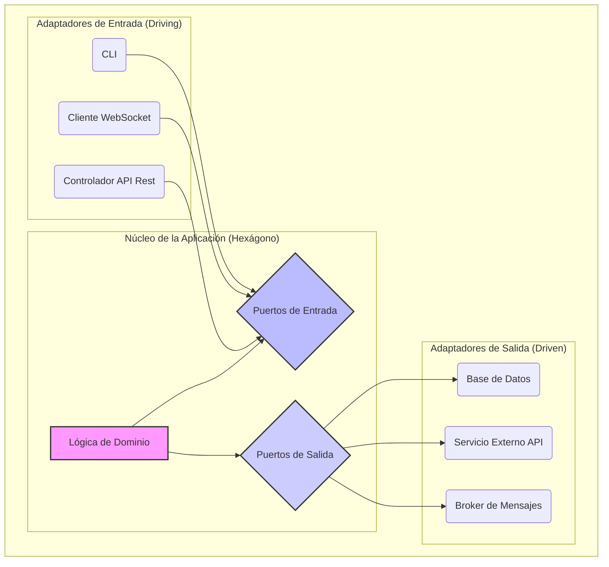

# Tema 6. Arquitectura Hexagonal y Aplicación de DDD
  
  - [Ojetivos](#objetivos)  
  - [6.1 Comprender el patrón de puertos y adaptadores](#61-comprender-el-patrón-de-puertos-y-adaptadores)
  - [6.2 Identificar las capas: dominio, aplicación, infraestructura, interfaces](#62-identificar-las-capas-dominio-aplicación-infraestructura-interfaces)
  - [6.3 Diseñar interfaces para cada puerto (entrada y salida)](#63-diseñar-interfaces-para-cada-puerto-entrada-y-salida)
  - [6.4 Implementar adaptadores HTTP como controladores REST o WebSocket](#64-implementar-adaptadores-http-como-controladores-rest-o-websocket)
  - [6.5 Separar repositorios del dominio usando interfaces](#65-separar-repositorios-del-dominio-usando-interfaces)
  - [6.6 Diseñar pruebas para el núcleo sin depender de infraestructuras](#66-diseñar-pruebas-para-el-núcleo-sin-depender-de-infraestructuras)
  - [6.7 Integrar eventos de dominio desde la capa interna](#67-integrar-eventos-de-dominio-desde-la-capa-interna)
  - [6.8 Implementar casos de uso en la capa de aplicación](#68-implementar-casos-de-uso-en-la-capa-de-aplicación)   
  - [6.9 Configurar inyecciones de dependencia de adaptadores externos](#69-configurar-inyecciones-de-dependencia-de-adaptadores-externos)
  - [6.10 Ejemplo de microservicio hexagonal completo con FastAPI](#610-ejemplo-de-microservicio-hexagonal-completo-con-fastapi)
  - [Referencias bibliográficas](#referencias-bibliográficas)

---
## Objetivos 

* **Comprender** el concepto fundamental de la Arquitectura Hexagonal (Puertos y Adaptadores) y su objetivo principal: proteger la lógica de negocio de los detalles tecnológicos.
*  **Identificar** los componentes clave de esta arquitectura: el dominio, los servicios de aplicación (casos de uso), los puertos (interfaces) y los adaptadores (implementaciones).
*  **Entender** cómo los principios de Domain-Driven Design (DDD) se alinean con la Arquitectura Hexagonal para centrar el desarrollo en el modelo de negocio.
*  **Visualizar** a través de ejemplos cómo se pueden implementar los puertos y adaptadores en una aplicación con FastAPI, especialmente para las interacciones HTTP y la persistencia de datos.
*  **Apreciar** los beneficios de esta arquitectura, como la mejora en la organización del código, la testeabilidad y la flexibilidad para cambiar tecnologías.

---

## 6.1 Comprender el patrón de puertos y adaptadores

---

## Referencias bibliográficas

1.  **Cockburn, Alistair. *Hexagonal Architecture*.** (Artículos y discusiones en su sitio web y otras compilaciones, más que un libro único dedicado).
2.  **Evans, Eric. (2003). *Domain-Driven Design: Tackling Complexity in the Heart of Software*. Addison-Wesley Professional.**
3.  **Vernon, Vaughn. (2013). *Implementing Domain-Driven Design*. Addison-Wesley Professional.**
4.  **Percival, Harry J.W. & Gregory, Bob. (2020). *Cosmic Python: Effective Python with Test-Driven Development and Domain-Driven Design*. O'Reilly Media.** (Sucesor espiritual y más enfocado que "Architecture Patterns with Python", muy práctico para Python).
5.  **Brandolini, Alberto. (2021). *EventStorming: Discovering the Big Picture*. Leanpub.**
6.  **Sitio Web de Alistair Cockburn sobre Hexagonal Architecture:**
    `https://alistair.cockburn.us/hexagonal-architecture/`
7.  **Comunidad DDD (DDD Community):**
    `https://dddcommunity.org/` (y recursos asociados como `https://github.com/ddd-cqrs-es/` para ejemplos).
8.  **Sitio Web de Martin Fowler (Artículos sobre Arquitectura):**
    `https://martinfowler.com/` (Buscar artículos específicos como "PortsAndAdaptersArchitecture", "DomainDrivenDesign").
9.  **InfoQ - Sección de Domain-Driven Design:**
    `https://www.infoq.com/domaindrivendesign/`
10. **Herbert Graca - Guía sobre Arquitecturas (DDD, Hexagonal, Clean, etc.):**
    `https://herbertograca.com/2017/11/16/explicit-architecture-01-ddd-hexagonal-onion-clean-cqrs-how-i-put-it-all-together/`
