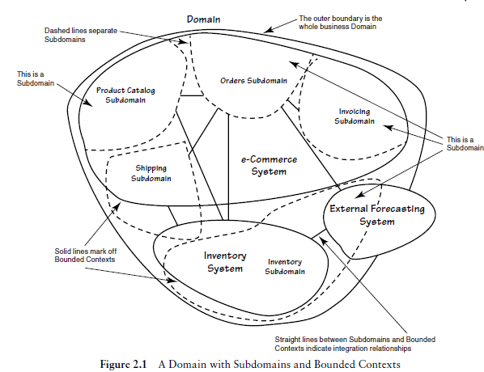
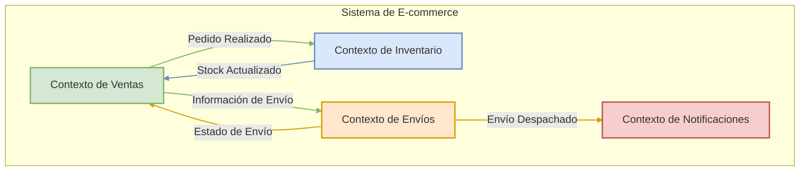

# Tema 7. Introducción a Domain-Driven Design (DDD)

  * [Ojetivos]()
  * [7.1 Bloques tácticos y estratégicos del DDD](Tema7.md#71-bloques-tácticos-y-estratégicos-del-ddd)
  * [7.2 Rol de Aggregates, Entities y Value Objects](Tema7.md#72-rol-de-aggregates-entities-y-value-objects)
  * [7.3 Definición de Bounded Contexts y sus fronteras](Tema7.md#73-definición-de-bounded-contexts-y-sus-fronteras)
  * [7.4 Diseño de Domain Services](Tema7.md#74-diseño-de-domain-services)
  * [7.5 Repositorios como abstracción de persistencia](Tema7.md#75-repositorios-como-abstracción-de-persistencia)
  * [7.6 Integración de DDD con FastAPI y Pydantic](Tema7.md#76-integración-de-ddd-con-fastapi-y-pydantic)
  * [7.7 Creación de factories para entidades complejas](Tema7.md#77-creación-de-factories-para-entidades-complejas)
  * [7.8 Desarrollo de Ubiquitous Language](Tema7.md#78-desarrollo-de-ubiquitous-language)
  * [7.9 Capa de aplicación sobre la lógica de dominio](Tema7.md#79-capa-de-aplicación-sobre-la-lógica-de-dominio)
  * [7.10 Refactorización de dominio en capas desacopladas](Tema7.md#710-refactorización-de-dominio-en-capas-desacopladas)
  * [Bibliografía](#referencias-bibliográficas)

---

## Objetivos
* Comprender qué es Domain-Driven Design (DDD) y su importancia para desarrollar software centrado en la lógica de negocio.
* Diferenciar entre los conceptos de diseño estratégico (como Contextos Delimitados y Lenguaje Ubicuo) y diseño táctico (como Entidades, Objetos de Valor y Agregados) en DDD.
* Identificar el rol fundamental de los principales bloques de construcción tácticos de DDD: Entidades, Objetos de Valor y Agregados.
* Reconocer la importancia de desarrollar un Lenguaje Ubicuo y definir Contextos Delimitados claros para un modelado efectivo del dominio.
* Visualizar cómo los principios de DDD pueden aplicarse en la práctica para estructurar aplicaciones, incluyendo su posible integración con frameworks como FastAPI.
---

## 7.1 Bloques tácticos y estratégicos del DDD

Domain-Driven Design (DDD) es una metodología para el desarrollo de software que se enfoca en modelar el software para que coincida con un dominio o negocio complejo. Para abordar esta complejidad, DDD se divide en dos conjuntos principales de patrones o "bloques": **Estratégicos** y **Tácticos**.

Comprender ambos es fundamental para aplicar DDD eficazmente, ya que los patrones estratégicos nos ayudan a definir el panorama general y los límites, mientras que los patrones tácticos nos guían en la construcción de los modelos dentro de esos límites.

#### **A. Diseño Estratégico (Strategic Design)**

El Diseño Estratégico se centra en la **visión macro del sistema**. Su objetivo principal es descomponer sistemas grandes y complejos en partes más manejables, definiendo límites claros y las relaciones entre ellas. Es el primer paso y el más crucial para evitar el "Big Ball of Mud" (Gran Bola de Lodo), donde todo está interconectado sin una estructura clara.



Los pilares fundamentales del Diseño Estratégico son:

1. **Bounded Context (Contexto Delimitado):**
   * **Concepto:** Es el núcleo del diseño estratégico. Un Bounded Context define una frontera explícita (lógica o física) dentro de la cual un modelo de dominio particular es consistente y aplicable. Dentro de este contexto, cada término, concepto y regla de negocio tiene un significado único y bien definido.
   * **Importancia:** Permite que diferentes partes del sistema tengan sus propios modelos especializados sin interferencias. Por ejemplo, el concepto de "Cliente" puede tener diferentes atributos y comportamientos en un contexto de "Ventas" versus un contexto de "Soporte Técnico".
   * **Resultado:** Claridad, autonomía de los equipos y reducción de la complejidad cognitiva.
2. **Ubiquitous Language (Lenguaje Ubicuo):**
   * **Concepto:** Un lenguaje común, riguroso y compartido desarrollado por el equipo (desarrolladores, expertos del dominio, stakeholders) _dentro de un Bounded Context específico_. Este lenguaje se utiliza en todas las comunicaciones, discusiones, documentos y, crucialmente, en el código.
   * **Importancia:** Elimina ambigüedades y malentendidos. Si el negocio habla de un "Prospecto" y el código implementa un `Lead`, hay una desconexión. El Lenguaje Ubicuo asegura que el modelo de software refleje fielmente el modelo de negocio.
   * **Resultado:** Comunicación fluida, código más expresivo y alineación entre el negocio y la tecnología.
3. **Context Map (Mapa de Contextos):**
   * **Concepto:** Una representación visual y documental de los diferentes Bounded Contexts y las relaciones entre ellos. Muestra cómo interactúan, se integran y qué tipo de dependencias existen (por ejemplo, Cliente-Proveedor, Shared Kernel, Anticorruption Layer).
   * **Importancia:** Proporciona una visión global de la arquitectura del sistema y ayuda a tomar decisiones informadas sobre la integración y la evolución de los contextos.
   * **Resultado:** Visibilidad de las interdependencias, facilitación de la planificación estratégica y gestión de la integración.

A continuación, un diagrama que ilustra un Mapa de Contextos simplificado:



_Este diagrama muestra cuatro Bounded Contexts (Ventas, Inventario, Envíos y Notificaciones) y las interacciones principales entre ellos, representando un Mapa de Contextos básico._

#### **B. Diseño Táctico (Tactical Design)**

Una vez que los Bounded Contexts están definidos estratégicamente, el Diseño Táctico se enfoca en **cómo construir un modelo de dominio rico y expresivo&#x20;**_**dentro**_**&#x20;de cada uno de ellos**. Proporciona un conjunto de bloques de construcción (building blocks) para diseñar objetos de dominio que sean robustos, flexibles y que reflejen fielmente el Lenguaje Ubicuo.

Los elementos clave del Diseño Táctico son:

1. **Entities (Entidades):**
   * **Concepto:** Objetos que no se definen fundamentalmente por sus atributos, sino por un hilo de continuidad e identidad. Tienen un identificador único que perdura a lo largo del tiempo, incluso si sus otros atributos cambian.
   * **Ejemplo:** Un `Usuario` (identificado por `user_id`), un `Pedido` (identificado por `order_id`).
2. **Value Objects (Objetos de Valor):**
   * **Concepto:** Objetos que describen características de un dominio. No tienen una identidad conceptual propia; se definen por sus atributos. Son inmutables y pueden ser compartidos. Dos Value Objects son iguales si todos sus atributos son iguales.
   * **Ejemplo:** Una `Dirección` (compuesta por calle, ciudad, código postal), un `RangoDeFechas`, una `Moneda`.
3. **Aggregates (Agregados):**
   * **Concepto:** Un clúster de Entidades y Value Objects asociados que se tratan como una única unidad para los cambios de datos. Cada Agregado tiene una raíz, conocida como **Aggregate Root**, que es una Entidad específica.
   * **Regla:** El Aggregate Root es el único punto de entrada para cualquier modificación dentro del Agregado. Las referencias externas solo pueden apuntar al Aggregate Root. Esto garantiza la consistencia de las reglas de negocio dentro del Agregado.
   * **Ejemplo:** Un `Pedido` (Aggregate Root) podría contener `LineasDePedido` (Entidades) y una `DireccionDeEnvio` (Value Object). Solo se puede acceder o modificar las `LineasDePedido` a través del `Pedido`.
4. **Domain Services (Servicios de Dominio):**
   * **Concepto:** Operaciones o lógica de negocio significativa que no encajan naturalmente en una Entidad o Value Object. A menudo coordinan la actividad entre múltiples objetos de dominio.
   * **Importancia:** Evitan "anemizar" los objetos de dominio (es decir, convertirlos en meros contenedores de datos sin comportamiento) al extraer lógica que no es responsabilidad de un único objeto.
   * **Ejemplo:** Un servicio para transferir fondos entre dos `CuentasBancarias` (Entidades), que implica reglas de negocio complejas y coordinación.
5. **Repositories (Repositorios):**
   * **Concepto:** Abstracciones que median entre el dominio y las capas de mapeo de datos (persistencia). Proporcionan una interfaz similar a una colección para acceder a los Aggregate Roots.
   * **Importancia:** Desacoplan el modelo de dominio de las preocupaciones de infraestructura (cómo se almacenan y recuperan los datos). Permiten que el dominio ignore los detalles de la base de datos.
   * **Ejemplo:** `PedidoRepository` con métodos como `findById(id)`, `save(pedido)`.
6. **Factories (Fábricas):**
   * **Concepto:** Encapsulan la lógica de creación de objetos complejos (especialmente Aggregates y Entidades) cuando esta creación es en sí misma una operación significativa o cuando se quiere asegurar que el objeto se crea en un estado válido.
   * **Importancia:** Simplifican el cliente que necesita crear el objeto y centralizan la lógica de construcción, asegurando la validez e invarianza del objeto creado.
   * **Ejemplo:** Una `PedidoFactory` que toma información del cliente y productos para construir un nuevo `Pedido` asegurando que todas las reglas de negocio iniciales se cumplan.
7. **Domain Events (Eventos de Dominio):**
   * **Concepto:** Objetos que representan algo significativo que ha ocurrido en el dominio. Son hechos pasados e inmutables.
   * **Importancia:** Permiten comunicar cambios entre diferentes partes del dominio (o incluso diferentes Bounded Contexts de forma asíncrona) de manera desacoplada. Son fundamentales para arquitecturas reactivas y CQRS.
   * **Ejemplo:** `PedidoRealizadoEvent`, `InventarioActualizadoEvent`.


#### **Relación entre Diseño Estratégico y Táctico**

!!! Note Es crucial entender que el Diseño Táctico se aplica _dentro_ de los límites definidos por el Diseño Estratégico. No se puede empezar a modelar Entidades y Value Objects sin antes haber delimitado los Bounded Contexts y entendido el Lenguaje Ubicuo específico de cada uno.

* El **Diseño Estratégico** define el "dónde" y el "por qué" de un modelo de dominio.
* El **Diseño Táctico** define el "cómo" se construye ese modelo dentro de esos límites.

Al dominar ambos conjuntos de patrones, los desarrolladores pueden construir sistemas que no solo son técnicamente sólidos, sino que también están profundamente alineados con las necesidades y la lógica del negocio, lo que resulta en software más mantenible, escalable y valioso. En un entorno de microservicios, cada microservicio a menudo se alinea con un Bounded Context, y dentro de él, se aplican los patrones tácticos para construir su lógica de dominio.

***

## 7.2 Rol de Aggregates, Entities y Value Objects


Estos tres patrones tácticos son los **bloques de construcción fundamentales (el "ADN")** de nuestro modelo de dominio. Entender su propósito y sus diferencias es crucial para escribir un código limpio, robusto y que refleje fielmente las reglas de negocio. Pensemos en ellos como piezas de LEGO® con distintas formas y funciones que usamos para construir nuestro modelo.


#### **Entities (Entidades): Los Objetos con Historia**

Una entidad es un objeto cuya característica principal no son sus atributos, sino su **identidad única y su continuidad a lo-largo-del-tiempo**. Es algo que nos importa rastrear de forma individual a lo largo de su ciclo de vida.

* **Característica Clave:** Tiene un identificador (`ID`) que no cambia.
* **Ciclo de Vida:** Las entidades se crean, se modifican y, a veces, se eliminan. Su historia es importante.
* **Mutabilidad:** Sus atributos (que no son el ID) pueden cambiar. Un cliente puede cambiar de email, pero sigue siendo el mismo cliente.

**Ejemplo Práctico: Un `Usuario`**

Imagina un `Usuario` en nuestro sistema. Su email, contraseña o nombre pueden cambiar, pero su `ID` de usuario permanece constante. Es este `ID` el que nos permite identificarlo sin lugar a dudas.

En el código, la lógica de negocio que modifica el estado del `Usuario` (sus atributos) debe estar dentro de la propia clase. Esto se llama **"modelo de dominio rico"**.

```python
import uuid
from typing import NewType

# Usamos NewType para crear tipos más explícitos y seguros
UsuarioId = NewType('UsuarioId', uuid.UUID)

class Usuario:
    """
    Esta es una ENTIDAD. Su identidad está definida por `id`.
    """
    def __init__(self, id: UsuarioId, nombre: str, email: str, activo: bool = True):
        self.id = id
        self.nombre = nombre
        self.email = email
        self.activo = activo
        # ... otros atributos

    def desactivar_cuenta(self):
        """
        Método que encapsula una regla de negocio.
        La lógica de cambio de estado pertenece a la propia entidad.
        """
        if not self.activo:
            raise ValueError("La cuenta ya está desactivada.")
        self.activo = False
        # Aquí podríamos generar un evento de dominio como "UsuarioDesactivado"

    def cambiar_email(self, nuevo_email: str):
        """Otro método de negocio."""
        if not self.activo:
            raise ValueError("No se puede cambiar el email de una cuenta inactiva.")
        # Aquí irían validaciones del formato del email, etc.
        self.email = nuevo_email

    # La igualdad se basa EXCLUSIVAMENTE en el ID
    def __eq__(self, other):
        if not isinstance(other, Usuario):
            return NotImplemented
        return self.id == other.id

    def __hash__(self):
        return hash(self.id)

```


---

#### **Value Objects (Objetos de Valor): Los Atributos que Describen**

Un objeto de valor es un objeto definido **por la combinación de sus atributos**. No tiene una identidad conceptual propia. Si uno de sus atributos cambia, se convierte en un objeto de valor completamente diferente.

* **Característica Clave:** No tienen un ID. Su "identidad" son sus valores.
* **Inmutabilidad:** Son inmutables. Una vez creados, no pueden ser modificados. Para realizar un cambio, se crea una nueva instancia.
* **Igualdad:** Dos objetos de valor son iguales si todos sus atributos son idénticos.
* **Propósito:** Aportan significado, contexto y validaciones a lo que de otro modo serían tipos primitivos (strings, números). Por ejemplo, en lugar de un `float` para el precio, creamos un `Value Object` `Dinero` que incluye la cantidad y la divisa, y que puede contener lógica para evitar precios negativos.

**Ejemplo Práctico: `Dinero`**

Manejar dinero usando solo números (`float`) es una fuente común de errores (problemas de redondeo, olvido de la divisa). Un `Value Object` `Dinero` soluciona esto.

```python
from pydantic import BaseModel, Field

class Dinero(BaseModel):
    """
    Este es un VALUE OBJECT. Es inmutable y se define por sus atributos.
    Dos objetos Dinero(100, "EUR") son intercambiables e idénticos.
    """
    cantidad: float = Field(..., gt=0, description="La cantidad debe ser positiva")
    divisa: str = Field(..., min_length=3, max_length=3)

    class Config:
        frozen = True # ¡Clave! Pydantic garantiza la inmutabilidad.

    def __add__(self, other):
        if not isinstance(other, Dinero):
            raise TypeError("Solo se puede sumar un objeto Dinero con otro.")
        if self.divisa != other.divisa:
            raise ValueError("No se pueden sumar cantidades de diferentes divisas.")
        
        nueva_cantidad = self.cantidad + other.cantidad
        return Dinero(cantidad=nueva_cantidad, divisa=self.divisa)

# Uso:
precio_base = Dinero(cantidad=99.99, divisa="EUR")
gastos_envio = Dinero(cantidad=5.00, divisa="EUR")

# precio_base.cantidad = 120.00 # ¡Error! Pydantic lo impide por 'frozen=True'

precio_total = precio_base + gastos_envio # Crea una NUEVA instancia de Dinero
print(precio_total) #> cantidad=104.99 divisa='EUR'
```
Usar `Dinero` en lugar de `float` hace el código más seguro, expresivo y menos propenso a errores.

---

#### **Aggregates (Agregados): La Cápsula de Consistencia**

Un agregado es un **grupo o clúster de entidades y objetos de valor relacionados que se tratan como una única unidad** para el propósito de los cambios de datos. El objetivo principal de un agregado es **garantizar la consistencia de las reglas de negocio complejas**.

* **Aggregate Root (Raíz del Agregado):** Es una entidad específica dentro del agregado que actúa como el **único punto de entrada** para todas las modificaciones dentro del agregado. Es la "guardiana" de la consistencia del grupo.
* **Frontera de Consistencia:** Define los límites de una transacción. Cualquier operación debe dejar al agregado completo en un estado válido.

**Reglas de Oro de los Agregados:**

1.  **Acceso a través de la Raíz:** El código externo solo puede hacer referencia y llamar a métodos de la raíz del agregado. Nunca debe modificar directamente las entidades internas.
2.  **Una Transacción, un Agregado:** Una única transacción de la base de datos solo debe crear o modificar un único agregado. Esto simplifica el manejo de la concurrencia y garantiza la consistencia.

**Ejemplo Práctico: La `OrdenDeCompra`**

Una `OrdenDeCompra` es un ejemplo clásico de agregado. No es solo una tabla; es un concepto de negocio complejo.

* **Aggregate Root:** `OrdenDeCompra` (la entidad principal).
* **Entidades Hijas:** `LineaDeOrden` (cada producto en el carrito tiene su propia identidad dentro de la orden).
* **Value Objects:** `Dinero` (para precios), `Direccion` (para el envío).


```python
import uuid
from .value_objects import Dinero # Usamos nuestro VO
from .entities import UsuarioId

class LineaDeOrden: # Entidad hija, solo tiene sentido DENTRO de una Orden
    def __init__(self, id_linea: uuid.UUID, producto_id: uuid.UUID, precio: Dinero, cantidad: int):
        self.id_linea = id_linea
        self.producto_id = producto_id
        self.precio_unitario = precio
        self.cantidad = cantidad

    @property
    def subtotal(self) -> Dinero:
        # La lógica se mantiene encapsulada
        return Dinero(cantidad=self.precio_unitario.cantidad * self.cantidad, divisa=self.precio_unitario.divisa)

class OrdenDeCompra: # ¡AGGREGATE ROOT!
    def __init__(self, id: uuid.UUID, id_cliente: UsuarioId):
        self.id = id
        self.id_cliente = id_cliente
        self._lineas: list[LineaDeOrden] = []
        self.status = "PENDIENTE"

    def agregar_linea(self, producto_id: uuid.UUID, precio: Dinero, cantidad: int):
        """
        La raíz controla cómo se añaden líneas, aplicando reglas de negocio.
        """
        if self.status != "PENDIENTE":
            raise ValueError("No se puede modificar una orden que no está pendiente.")
        if any(linea.producto_id == producto_id for linea in self._lineas):
            raise ValueError("El producto ya está en la orden. Use 'modificar_cantidad'.")
        
        nueva_linea = LineaDeOrden(id_linea=uuid.uuid4(), producto_id=producto_id, precio=precio, cantidad=cantidad)
        self._lineas.append(nueva_linea)

    def calcular_total(self) -> Dinero:
        """
        La raíz orquesta cálculos sobre sus componentes internos.
        """
        if not self._lineas:
            return Dinero(cantidad=0, divisa="EUR") # Asumiendo EUR por defecto
        
        # Usamos la operación '+' que definimos en el Value Object Dinero
        total = sum((linea.subtotal for linea in self._lineas), start=Dinero(cantidad=0, divisa=self._lineas[0].precio_unitario.divisa))
        return total

    @property
    def lineas(self):
        # Exponemos una copia inmutable para que nadie pueda modificar la lista desde fuera.
        return tuple(self._lineas)

```

Aquí tienes el desarrollo detallado y práctico del punto 7.3 sobre Bounded Contexts, enfocado en un curso de arquitectura de microservicios.

---

## 7.3 Definición de Bounded Contexts y sus fronteras 

Si los agregados, entidades y VOs son el "ADN" de nuestro dominio, el **Bounded Context (Contexto Delimitado)** es el "cuerpo" donde ese ADN vive y tiene sentido. Es uno de los patrones estratégicos más importantes de DDD y es la guía fundamental para decidir **cómo dividir un sistema grande en microservicios manejables**.

---

#### **¿Qué es un Bounded Context?**

Un Bounded Context es una **frontera explícita** (lingüística y técnica) dentro de la cual un modelo de dominio específico es **consistente y válido**. Dentro de esa frontera, cada término del **Lenguaje Ubicuo** tiene un significado único y sin ambigüedad.

Piénsalo como diferentes departamentos en una empresa: Ventas, Almacén y Soporte Técnico. Todos hablan de "Clientes", pero para cada departamento, un "Cliente" tiene atributos y connotaciones diferentes:

* Para **Ventas**, un cliente es una `Oportunidad de Venta` con un `Valor Potencial`.
* Para **Almacén**, un cliente es una `Dirección de Envío` a la que se le mandan `Paquetes`.
* Para **Soporte Técnico**, un cliente es un `Usuario` con un historial de `Tickets de Soporte`.

Intentar crear una única clase `Cliente` que contenga todos estos atributos sería un desastre. Se volvería enorme, confusa y llena de campos que solo son relevantes en ciertas situaciones. El Bounded Context nos dice: "Está bien que 'Cliente' signifique cosas diferentes, siempre y cuando definamos claramente las fronteras de cada contexto".

**Regla de Oro:** En una arquitectura de microservicios, **un microservicio (o un pequeño grupo de servicios cohesivos) implementa exactamente un Bounded Context**. Esta es la guía principal para definir el tamaño y la responsabilidad de tus servicios.


---

#### **Ejemplo Práctico: El Viaje de un "Producto" en un E-commerce**

Veamos cómo el concepto de "Producto" evoluciona a través de diferentes Bounded Contexts en una aplicación de e-commerce. Cada contexto se convertirá en nuestro microservicio.

##### **1. Contexto de Catálogo (`catalog-service`)**

* **Propósito:** Presentar productos a los clientes para que los compren. La prioridad es la riqueza descriptiva y el marketing.
* **Lenguaje Ubicuo:** `Producto`, `Descripción Detallada`, `Imágenes de Alta Resolución`, `Precio de Lista`, `Atributos SEO`, `Categoría`.
* **Modelo de Dominio (simplificado):** El `Producto` es el Aggregate Root.

```python
# Dentro del microservicio 'catalog-service'

class Producto:  # Aggregate Root en el contexto de Catálogo
    def __init__(self, id: uuid.UUID, sku: str, nombre: str, descripcion: str, precio: Dinero):
        self.id = id
        self.sku = sku
        self.nombre = nombre
        self.descripcion = descripcion
        self.precio_lista = precio
        self.imagenes: list[str] = []
        self.publicado = False

    def anadir_imagen(self, url_imagen: str):
        # Lógica para añadir y validar imágenes
        self.imagenes.append(url_imagen)

    def publicar(self):
        # Un producto no puede publicarse sin descripción y precio
        if not self.descripcion or not self.precio_lista:
            raise ValueError("El producto debe tener descripción y precio para ser publicado.")
        self.publicado = True
```

##### **2. Contexto de Inventario (`inventory-service`)**

* **Propósito:** Gestionar el stock físico de los productos en el almacén. La prioridad es la precisión, la ubicación y la cantidad.
* **Lenguaje Ubicuo:** `ItemDeStock`, `SKU`, `CantidadDisponible`, `UbicaciónEnAlmacén`, `NivelDeReorden`. Aquí, el término "Producto" es menos importante que el `ItemDeStock` tangible.
* **Modelo de Dominio (simplificado):**

```python
# Dentro del microservicio 'inventory-service'

class ItemDeStock: # Aggregate Root en el contexto de Inventario
    def __init__(self, producto_id: uuid.UUID, sku: str, cantidad: int):
        self.producto_id = producto_id # Solo una referencia por ID al producto del catálogo
        self.sku = sku
        self.cantidad_disponible = cantidad
        self.ubicacion = "ESTANTE_A-1"

    def descontar_stock(self, cantidad_a_descontar: int):
        if self.cantidad_disponible < cantidad_a_descontar:
            raise ValueError("Stock insuficiente.")
        self.cantidad_disponible -= cantidad_a_descontar

    def reponer_stock(self, cantidad_a_reponer: int):
        self.cantidad_disponible += cantidad_a_reponer
```

##### **3. Contexto de Ventas (`sales-service`)**

* **Propósito:** Gestionar el proceso de compra del cliente. La prioridad es registrar qué se vendió, a quién y por cuánto.
* **Lenguaje Ubicuo:** `Orden`, `LineaDeOrden`, `ID de Producto`, `PrecioPagado`. Aquí, el producto es solo una línea dentro de una orden. No necesitamos su descripción ni su ubicación en el almacén.
* **Modelo de Dominio (simplificado):** El `Producto` es solo un Value Object o una Entidad muy simple dentro del agregado `Orden`.

```python
# Dentro del microservicio 'sales-service'

class ProductoVendido(BaseModel): # Value Object dentro del Agregado Orden
    producto_id: uuid.UUID
    precio_pagado: Dinero
    cantidad: int
    
    class Config:
        frozen = True

class Orden: # Aggregate Root en el contexto de Ventas
    def __init__(self, id: uuid.UUID, cliente_id: uuid.UUID):
        self.id = id
        self.cliente_id = cliente_id
        self._productos_vendidos: list[ProductoVendido] = []

    def agregar_producto(self, producto_id: uuid.UUID, precio_actual: Dinero, cantidad: int):
        # Lógica de la orden...
        item = ProductoVendido(
            producto_id=producto_id,
            precio_pagado=precio_actual, # El precio se "congela" en el momento de la venta
            cantidad=cantidad
        )
        self._productos_vendidos.append(item)

```

---

#### **Definiendo las Fronteras: Mapas de Contexto y Comunicación**

Una vez que tienes tus Bounded Contexts (tus microservicios), necesitas que se comuniquen. Las fronteras no son muros impenetrables, son zonas de traducción controlada. Esto se gestiona a través de **Mapas de Contexto (Context Maps)**.

##### **Patrones de Integración:**

1.  **Llamadas API (Request/Response):**
    * **Cuándo usarlo:** Cuando un contexto necesita información de otro *en ese preciso instante* para completar una operación.
    * **Ejemplo:** Para agregar un producto a la orden, el `sales-service` podría hacer una llamada a la API del `catalog-service` para obtener el precio actual del producto.
    * **Riesgo:** Crea un **acoplamiento temporal**. Si el `catalog-service` está caído, el `sales-service` no puede crear órdenes.

2.  **Comunicación por Eventos (Asíncrona):**
    * **Cuándo usarlo:** Para notificar a otros contextos que "algo ha sucedido" en tu dominio, permitiéndoles reaccionar cuando puedan. Es el patrón más resiliente y desacoplado.
    * **Ejemplo:**
        1.  Cuando se completa una orden en `sales-service`, publica un evento: `OrdenConfirmada { orden_id, items: [{producto_id, cantidad}] }`.
        2.  El `inventory-service` está suscrito a ese evento. Cuando lo recibe, ejecuta el comando `descontar_stock` en su propio `ItemDeStock`.
    * **Ventaja:** Si `inventory-service` está caído, el evento permanece en la cola (ej. RabbitMQ, Kafka) y se procesará cuando el servicio se recupere. Los servicios son independientes.

3.  **Capa Anti-Corrupción (Anti-Corruption Layer - ACL):**
    * Es un patrón defensivo que se usa dentro de un Bounded Context para comunicarse con otro. Consiste en crear una capa de traducción que convierte el modelo del contexto externo al modelo del contexto propio.
    * **Ejemplo:** El `sales-service` no quiere trabajar con el objeto `Producto` completo del `catalog-service`. En su lugar, cuando recibe un evento o una respuesta de la API, su ACL lo traduce a un `ProductoVendido` simple, que es lo único que le interesa. Esto protege al modelo de `Ventas` de cambios irrelevantes en el modelo de `Catálogo`.

---
Aquí tienes el desarrollo detallado del punto 7.4 sobre el diseño de Domain Services, siguiendo el enfoque práctico del curso.

---

### 7.4 Diseño de Domain Services (Servicios de Dominio) 

A veces, una operación o un proceso de negocio importante no parece encajar de forma natural en ninguna entidad o `Value Object`. Si intentas forzar esta lógica dentro de una entidad, la clase puede empezar a tener responsabilidades que no le corresponden, volviéndose poco cohesiva.

Aquí es donde entran los **Domain Services**. Son un patrón táctico de DDD para encapsular lógica de dominio que no tiene un hogar claro.

---

#### **¿Cuándo necesitas un Domain Service?**

La pregunta clave es: **"¿A quién pertenece esta lógica?"**. Si la respuesta no es una entidad o `Value Object` obvio, probablemente necesites un servicio de dominio.

Usa un `Domain Service` cuando una operación:

1.  **Realiza una tarea de negocio significativa:** No es una simple operación CRUD, sino que representa un concepto del Lenguaje Ubicuo.
2.  **Es "apátrida" (stateless):** No tiene estado propio. Su trabajo consiste en recibir objetos de dominio, operar con ellos y devolver un resultado. No almacena información entre llamadas.
3.  **Involucra a múltiples objetos de dominio:** A menudo, la lógica de un `Domain Service` coordina o calcula algo basándose en varias entidades o agregados. Por ejemplo, transferir dinero entre dos cuentas (`Cuenta` es un agregado) o comprobar si un nuevo `Usuario` puede registrarse con un email que ya existe (involucra una consulta sobre todos los demás `Usuarios`).

**Distinción Crucial: Domain Service vs. Application Service**

Es vital no confundirlos, aunque ambos se llamen "servicios".

* **Domain Service (Servicio de Dominio):**
    * **Contiene lógica de negocio pura.**
    * Habla el **Lenguaje Ubicuo**. Sus parámetros y valores de retorno son objetos del dominio (entidades, VOs).
    * **Vive en la capa de Dominio.** No sabe nada de bases de datos, APIs HTTP, etc.
* **Application Service (Servicio de Aplicación):**
    * **Orquesta los casos de uso.** No contiene lógica de negocio.
    * Actúa como intermediario entre la API y el dominio.
    * Recibe DTOs, llama a los repositorios para obtener agregados, invoca a los `Domain Services` o a los métodos de los agregados y devuelve DTOs.
    * **Vive en la capa de Aplicación.**


---

#### **Ejemplo Práctico: Asignación de un Gestor de Cuentas a un Nuevo Cliente**

Imaginemos una regla de negocio en un banco: "Cuando se crea un nuevo `Cliente` 'Premium', se le debe asignar el `GestorDeCuentas` que tenga menos clientes asignados en ese momento para balancear la carga de trabajo".

Esta lógica no pertenece a `Cliente` (un cliente no debería saber sobre todos los gestores) ni a `GestorDeCuentas` (un gestor no debería estar a cargo de crear clientes). Es una operación de coordinación que encaja perfectamente en un `Domain Service`.

**Paso 1: Definir los Agregados (Capa de Dominio)**

```python
# dominio/agregados.py
import uuid

class Cliente: # Aggregate Root
    def __init__(self, id: uuid.UUID, nombre: str, tipo: str):
        self.id = id
        self.nombre = nombre
        self.tipo = tipo # "Normal", "Premium"
        self.gestor_id: uuid.UUID | None = None

    def asignar_gestor(self, gestor_id: uuid.UUID):
        if self.tipo != "Premium":
            raise ValueError("Solo los clientes Premium pueden tener un gestor asignado.")
        self.gestor_id = gestor_id

class GestorDeCuentas: # Otro Aggregate Root
    def __init__(self, id: uuid.UUID, nombre: str, num_clientes_asignados: int):
        self.id = id
        self.nombre = nombre
        self.num_clientes_asignados = num_clientes_asignados
```

**Paso 2: Definir la Interfaz del Repositorio (Capa de Dominio)**

Necesitamos una forma de encontrar al gestor con menos clientes.

```python
# dominio/repositorios.py
import abc
from .agregados import GestorDeCuentas

class RepositorioGestores(abc.ABC):
    @abc.abstractmethod
    def encontrar_gestor_con_menor_carga(self) -> GestorDeCuentas | None:
        raise NotImplementedError
```

**Paso 3: Crear el Domain Service (Capa de Dominio)**

Aquí está la pieza central. El servicio es stateless y recibe los repositorios que necesita para operar.

```python
# dominio/servicios.py
from .agregados import Cliente
from .repositorios import RepositorioGestores

class ServicioAsignacionGestor:
    """
    Este es un DOMAIN SERVICE. Es stateless y encapsula una regla de negocio
    que coordina diferentes conceptos del dominio.
    """
    def __init__(self, repo_gestores: RepositorioGestores):
        self.repo_gestores = repo_gestores

    def asignar_gestor_a_nuevo_cliente(self, nuevo_cliente: Cliente):
        # La lógica solo se aplica a clientes Premium
        if nuevo_cliente.tipo != "Premium":
            return # No hace nada, lo cual es una regla de negocio válida.

        # Pide al repositorio (la abstracción) que encuentre al gestor adecuado
        gestor_optimo = self.repo_gestores.encontrar_gestor_con_menor_carga()

        if not gestor_optimo:
            # Podríamos lanzar una excepción, o registrar un evento de "Alerta: No hay gestores disponibles"
            raise RuntimeError("No se encontraron gestores de cuentas disponibles.")

        # Modifica el estado del agregado `Cliente` a través de su propio método público
        nuevo_cliente.asignar_gestor(gestor_optimo.id)

        # Devuelve el gestor para que el servicio de aplicación pueda, por ejemplo, actualizarlo.
        return gestor_optimo
```

**Paso 4: Usar el Domain Service desde un Application Service (Capa de Aplicación)**

El `Application Service` orquesta todo el caso de uso "Crear Cliente".

```python
# aplicacion/servicios.py
from dominio.agregados import Cliente
from dominio.repositorios import RepositorioClientes, RepositorioGestores
from dominio.servicios import ServicioAsignacionGestor

class ServicioClientes: # Este es un APPLICATION SERVICE
    def __init__(
        self,
        repo_clientes: RepositorioClientes,
        repo_gestores: RepositorioGestores,
        servicio_asignacion: ServicioAsignacionGestor,
    ):
        self.repo_clientes = repo_clientes
        self.repo_gestores = repo_gestores # Puede necesitarlo para actualizar la cuenta del gestor
        self.servicio_asignacion = servicio_asignacion

    def crear_cliente(self, nombre: str, tipo: str) -> Cliente:
        # 1. Orquestación: Crear la entidad Cliente
        nuevo_cliente = Cliente(id=uuid.uuid4(), nombre=nombre, tipo=tipo)

        # 2. Orquestación: Usar el Domain Service para aplicar la lógica de asignación
        gestor_asignado = self.servicio_asignacion.asignar_gestor_a_nuevo_cliente(nuevo_cliente)

        # 3. Orquestación: Persistir los cambios en los agregados
        self.repo_clientes.guardar(nuevo_cliente)
        if gestor_asignado:
            # Aquí actualizaríamos la cuenta de clientes del gestor
            gestor_asignado.num_clientes_asignados += 1
            self.repo_gestores.actualizar(gestor_asignado)

        return nuevo_cliente
```
Este diseño mantiene cada pieza en su lugar: FastAPI habla con el `ServicioClientes`, que usa el `ServicioAsignacionGestor` para la lógica de negocio compleja, y los repositorios para la persistencia. Todo está limpio y desacoplado.

Aquí tienes el desarrollo detallado del punto 7.5 sobre Repositorios, un pilar fundamental para conectar tu lógica de dominio con el mundo real de la persistencia de datos.

---

## 7.5 Repositorios como Abstracción de Persistencia 

Tu modelo de dominio, con sus agregados y entidades, es el corazón de tu aplicación. Debe ser puro y centrado en las reglas de negocio. Lo último que quieres es "contaminar" tu entidad `Orden` con código para escribir en una base de datos PostgreSQL o MongoDB.

El **Patrón Repositorio** es un mecanismo de DDD que resuelve este problema actuando como un intermediario, una capa de abstracción entre tu modelo de dominio y la tecnología de persistencia de datos.

---

#### **¿Qué es un Repositorio?**

Un repositorio emula la idea de una **colección de objetos en memoria**. Proporciona una interfaz simple para que el resto de tu aplicación pueda obtener, guardar y eliminar agregados sin saber *cómo* o *dónde* se están guardando realmente.

Piensa en ello como un bibliotecario experto:

* **Tú (el servicio de aplicación):** "Por favor, deme el libro (agregado) con el ISBN (ID) '123-456'".
* **El Repositorio (el bibliotecario):** Va a las estanterías (la base de datos SQL), busca en el sistema de fichas (el índice), encuentra el libro, y te lo entrega.
* **Tú:** "Por favor, guarde este nuevo manuscrito (agregado)".
* **El Repositorio:** Sabe exactamente en qué estantería, sección y orden debe colocarlo.

A ti no te importan los detalles de la organización de la biblioteca; solo quieres obtener y guardar libros. El repositorio oculta esa complejidad.

**El Principio Clave: La Inversión de Dependencias**

Para que esto funcione, aplicamos la **Inversión de Dependencias** (la "D" en SOLID) a través de la arquitectura de "Puertos y Adaptadores" (Hexagonal):

1.  **El Puerto (El Contrato):** La **capa de Dominio** define la *interfaz* del repositorio. Es un contrato abstracto (`abc.ABC` en Python) que dice: "Cualquiera que quiera ser un repositorio de órdenes *debe* tener estos métodos: `guardar`, `obtener_por_id`, etc.".
2.  **El Adaptador (La Implementación):** La **capa de Infraestructura** proporciona la *implementación* concreta de esa interfaz. Aquí es donde se escribe el código específico de SQLAlchemy, pymongo, o cualquier otra tecnología.

El resultado es que la **infraestructura depende del dominio, y no al revés**. Tu lógica de negocio no depende de la base de datos; la base de datos se "conecta" a tu lógica de negocio.


---

#### **Ejemplo Práctico: Repositorio para el Agregado `OrdenDeCompra`**

Vamos a construir un repositorio para nuestro agregado `OrdenDeCompra`.

**Paso 1: Definir la Interfaz (El Puerto) en la Capa de Dominio**

Este fichero no debe importar *nada* relacionado con infraestructura (ni `sqlalchemy`, ni `fastapi`, etc.).

```python
# mi_proyecto/dominio/repositorios.py
import abc
import uuid
from .agregados import OrdenDeCompra

class RepositorioOrdenes(abc.ABC):
    """
    Esta es la interfaz (el puerto) que el dominio define.
    Habla el lenguaje del dominio, usando el agregado `OrdenDeCompra`.
    """
    
    @abc.abstractmethod
    def guardar(self, orden: OrdenDeCompra) -> None:
        """Guarda un agregado de orden. Puede ser una creación o una actualización."""
        raise NotImplementedError

    @abc.abstractmethod
    def obtener_por_id(self, orden_id: uuid.UUID) -> OrdenDeCompra | None:
        """Obtiene un agregado de orden por su ID."""
        raise NotImplementedError

    @abc.abstractmethod
    def listar_todas(self) -> list[OrdenDeCompra]:
        """Obtiene una lista de todas las órdenes."""
        raise NotImplementedError
```

**Paso 2: Crear las Implementaciones (Los Adaptadores) en la Capa de Infraestructura**

Ahora creamos las implementaciones concretas. Podemos tener varias, lo cual es increíblemente útil.

**Adaptador 1: Implementación en Memoria (Ideal para testing)**

Este adaptador es rapidísimo y no requiere una base de datos, perfecto para pruebas unitarias y de integración de tus servicios de aplicación.

```python
# mi_proyecto/infraestructura/persistencia/repos_en_memoria.py
import uuid
from dominio.agregados import OrdenDeCompra
from dominio.repositorios import RepositorioOrdenes

class RepositorioOrdenesEnMemoria(RepositorioOrdenes):
    """
    Esta es una implementación concreta (un adaptador) para pruebas.
    Implementa la interfaz definida en el dominio.
    """
    def __init__(self):
        self._ordenes: dict[uuid.UUID, OrdenDeCompra] = {}

    def guardar(self, orden: OrdenDeCompra) -> None:
        print(f"Guardando orden {orden.id} en memoria.")
        self._ordenes[orden.id] = orden

    def obtener_por_id(self, orden_id: uuid.UUID) -> OrdenDeCompra | None:
        print(f"Buscando orden {orden_id} en memoria.")
        return self._ordenes.get(orden_id)

    def listar_todas(self) -> list[OrdenDeCompra]:
        return list(self._ordenes.values())
```

**Adaptador 2: Implementación con SQLAlchemy (Para producción)**

Aquí es donde reside la complejidad real. Este adaptador se encarga de traducir (mapear) entre el agregado `OrdenDeCompra` y las tablas de la base de datos.

```python
# mi_proyecto/infraestructura/persistencia/repos_sqlalchemy.py
import uuid
from sqlalchemy.orm import Session
from dominio.agregados import OrdenDeCompra
from dominio.repositorios import RepositorioOrdenes
from .mapeadores import MapeadorOrdenes # Un componente que traduce entre dominio y BBDD

class RepositorioOrdenesSQLAlchemy(RepositorioOrdenes):
    """
    Implementación concreta para una base de datos SQL usando SQLAlchemy.
    """
    def __init__(self, session: Session):
        self.session = session
        self.mapeador = MapeadorOrdenes()

    def guardar(self, orden: OrdenDeCompra) -> None:
        # El mapeador convierte el agregado de dominio en un modelo de BBDD
        modelo_db = self.mapeador.dominio_a_db(orden)
        self.session.merge(modelo_db)
        # La gestión del commit/rollback la haría el Application Service a través de una Unit of Work.

    def obtener_por_id(self, orden_id: uuid.UUID) -> OrdenDeCompra | None:
        # Se importa el modelo de la BBDD aquí, no en el dominio
        from .modelos_db import OrdenDB 
        
        modelo_db = self.session.query(OrdenDB).filter_by(id=orden_id).first()
        if not modelo_db:
            return None
        
        # El mapeador convierte el modelo de BBDD de vuelta a un agregado de dominio
        return self.mapeador.db_a_dominio(modelo_db)

    def listar_todas(self) -> list[OrdenDeCompra]:
        # ... lógica similar para listar ...
        pass
```

**Paso 3: Usarlo en la Capa de Aplicación**

El servicio de aplicación recibe una *instancia* de la implementación del repositorio gracias a la inyección de dependencias, pero su código solo depende de la *interfaz*.

```python
# aplicacion/servicios.py
from dominio.repositorios import RepositorioOrdenes # <-- Depende de la abstracción!

class ServicioOrdenes:
    def __init__(self, repo_ordenes: RepositorioOrdenes):
        self.repo_ordenes = repo_ordenes

    def obtener_detalle_orden(self, orden_id: uuid.UUID):
        # El servicio no sabe si está usando la implementación en memoria o la de SQL
        orden = self.repo_ordenes.obtener_por_id(orden_id)
        if not orden:
            raise ValueError("Orden no encontrada")
        # ... Lógica para convertir la orden a un DTO y devolverla
        return orden
```
---


## 7.6 Integración de DDD con FastAPI y Pydantic 🤝

Hemos diseñado un dominio robusto, pero ¿cómo lo exponemos al mundo exterior de forma segura y eficiente? Aquí es donde FastAPI y Pydantic se convierten en nuestros mejores aliados, actuando como la **capa de interfaz** de nuestra arquitectura hexagonal.

* **DDD** nos da la estructura interna (la lógica de negocio).
* **FastAPI** nos da el **servidor web** para recibir peticiones HTTP.
* **Pydantic** nos da los **contratos de datos** para validar y dar forma a la información que entra y sale.

La clave del éxito es mantener una **separación estricta entre los modelos del dominio y los modelos de la API**.

---

#### **El Principio: Modelos de Dominio vs. DTOs de API**

Nunca, bajo ninguna circunstancia, debes exponer tus agregados o entidades del dominio directamente en tus endpoints de FastAPI.

* **Modelos de Dominio (Agregados, Entidades):**
    * Son "ricos", contienen datos y **lógica de negocio**.
    * Tienen métodos que garantizan su consistencia (`orden.agregar_linea()`, `cliente.desactivar_cuenta()`).
    * Su objetivo es representar fielmente el negocio.
    * Viven en la **capa de Dominio**.

* **Modelos de API (DTOs - Data Transfer Objects):**
    * Son "pobres", solo contienen **datos**.
    * Su objetivo es describir la estructura de los datos que se envían y reciben a través de la red (JSON).
    * Son definidos con **Pydantic** y usados por FastAPI para validación, serialización y documentación automática (en Swagger/OpenAPI).
    * Viven en la **capa de Aplicación** o en una capa de interfaz dedicada.

Exponer un modelo de dominio en una API crearía un **acoplamiento fuerte**. Un cambio en tu lógica interna (por ejemplo, renombrar un atributo en tu agregado `Orden`) rompería el contrato con los clientes de tu API. Los DTOs actúan como una **capa de protección y traducción**.


---

#### **Flujo de una Petición: El Caso de "Crear una Orden"**

Veamos el ciclo de vida completo de una petición `POST /ordenes` para ilustrar cómo colaboran todas las piezas.

##### **Paso 1: Definir los DTOs con Pydantic**

Creamos modelos Pydantic para la petición (request) y la respuesta (response).

```python
# mi_proyecto/aplicacion/dtos.py
import uuid
from pydantic import BaseModel, Field

# DTO para los datos que llegan en la petición POST
class LineaOrdenRequest(BaseModel):
    producto_id: uuid.UUID
    cantidad: int = Field(..., gt=0) # Validación: la cantidad debe ser positiva

class CrearOrdenRequest(BaseModel):
    cliente_id: uuid.UUID
    direccion_calle: str
    direccion_ciudad: str
    lineas: list[LineaOrdenRequest]

# DTO para los datos que devolvemos en la respuesta
class OrdenResponse(BaseModel):
    orden_id: uuid.UUID
    status: str
    total_calculado: float

    class Config:
        from_attributes = True # Permite mapear desde objetos que no son dicts
```

##### **Paso 2: Crear el Endpoint con FastAPI**

El endpoint en la capa de infraestructura define las "rutas" y usa los DTOs. FastAPI se encarga de la magia.

```python
# mi_proyecto/infraestructura/api/endpoints_ordenes.py
from fastapi import FastAPI, Depends, HTTPException
from aplicacion.dtos import CrearOrdenRequest, OrdenResponse
from aplicacion.servicios import ServicioOrdenes # El Application Service
from .dependencias import obtener_servicio_ordenes # Gestor de inyección de dependencias

router = APIRouter()

@router.post("/ordenes", response_model=OrdenResponse, status_code=201)
def crear_una_orden(
    # 1. FastAPI valida el JSON entrante contra `CrearOrdenRequest`
    request_dto: CrearOrdenRequest,
    # 2. FastAPI inyecta la dependencia del servicio de aplicación
    servicio: ServicioOrdenes = Depends(obtener_servicio_ordenes)
):
    try:
        # 3. Pasa el DTO validado al servicio de aplicación
        orden_dto_respuesta = servicio.crear_nueva_orden(request_dto)
        # 7. FastAPI serializa el DTO de respuesta a JSON y lo envía
        return orden_dto_respuesta
    except Exception as e:
        # Manejo de errores específicos del dominio
        raise HTTPException(status_code=400, detail=str(e))
```

##### **Paso 3: Orquestar en el Servicio de Aplicación**

El `Application Service` recibe el DTO, coordina la lógica de dominio y devuelve otro DTO.

```python
# mi_proyecto/aplicacion/servicios.py
from .dtos import CrearOrdenRequest, OrdenResponse
from dominio.agregados import OrdenDeCompra
from dominio.value_objects import Direccion, Dinero
from dominio.repositorios import RepositorioOrdenes
# ... otras importaciones

class ServicioOrdenes:
    def __init__(self, repo_ordenes: RepositorioOrdenes):
        self.repo_ordenes = repo_ordenes

    def crear_nueva_orden(self, dto: CrearOrdenRequest) -> OrdenResponse:
        # 4. TRADUCCIÓN: Mapea del DTO al Modelo de Dominio
        # Aquí podríamos usar una Factory si la creación es compleja
        nueva_orden = OrdenDeCompra(
            id=uuid.uuid4(),
            cliente_id=dto.cliente_id,
            direccion_envio=Direccion(calle=dto.direccion_calle, ciudad=dto.direccion_ciudad)
        )
        
        for linea_dto in dto.lineas:
            # En un caso real, buscaríamos el precio en otro servicio/repo
            precio_actual = Dinero(cantidad=10.0, divisa="EUR") 
            nueva_orden.agregar_linea(
                producto_id=linea_dto.producto_id,
                precio=precio_actual,
                cantidad=linea_dto.cantidad
            )

        # 5. EJECUCIÓN: Usa el repositorio para persistir el agregado
        self.repo_ordenes.guardar(nueva_orden)

        # 6. TRADUCCIÓN: Mapea el resultado del Dominio de vuelta a un DTO de respuesta
        return OrdenResponse(
            orden_id=nueva_orden.id,
            status=nueva_orden.status,
            total_calculado=nueva_orden.calcular_total().cantidad
        )
```
Este flujo garantiza que cada capa tenga una única responsabilidad:

* **FastAPI/Infraestructura:** Gestiona el HTTP, la serialización y el routing.
* **Pydantic/DTOs:** Definen los contratos de datos de la API.
* **Servicio de Aplicación:** Orquesta el caso de uso, traduciendo entre DTOs y el dominio.
* **Dominio:** Ejecuta la lógica de negocio real, completamente ajeno a que está siendo llamado desde una API web.

---


## 7.7 Creación de Factories para Entidades Complejas 🏭

A veces, la creación de un agregado o una entidad no es tan simple como llamar a su constructor (`__init__`). El proceso de creación puede ser complejo y tener sus propias reglas de negocio o dependencias. Intentar meter toda esa lógica en el constructor o en un servicio de aplicación puede ensuciar el código y violar el Principio de Responsabilidad Única.

Aquí es donde entra el patrón **Factory (Fábrica)**. Una Factory es un objeto o método cuyo único propósito es **encapsular la lógica de creación de otros objetos**, asegurando que nazcan en un estado válido y consistente.

---

#### **¿Cuándo necesitas una Factory?**

Considera usar una Factory cuando la creación de un objeto implica:

1.  **Validaciones Complejas:** La creación requiere verificar varias precondiciones antes de que el objeto pueda existir.
2.  **Dependencias Externas:** Para crear el objeto, necesitas consultar un repositorio (ej: para asegurar que un email sea único) o llamar a otro servicio (ej: para obtener datos de una API externa).
3.  **Construcción a partir de Diferentes Representaciones:** Necesitas crear tu agregado a partir de un DTO, un diccionario de un evento, o datos de diferentes fuentes.
4.  **Lógica de Creación Condicional:** La clase concreta del objeto a crear depende de ciertos parámetros de entrada.
5.  **Ocultar la Complejidad del Constructor:** El constructor del agregado podría tener muchos parámetros, y la Factory puede simplificar su creación proveyendo una interfaz más clara.

Piensa en una Factory como el **jefe de la línea de ensamblaje** de tus objetos. El constructor (`__init__`) es solo el último paso que une las piezas; la Factory se encarga de que todas las piezas correctas estén disponibles, validadas y listas para el ensamblaje.


---

#### **Ejemplo Práctico: Registrar un Nuevo `Curso` en una Plataforma Educativa**

Imaginemos que para crear un nuevo `Curso` en nuestra plataforma, se deben cumplir las siguientes reglas:

* El `título` del curso debe ser único en todo el sistema.
* Se debe generar un `slug` (una URL amigable, ej: `introduccion-a-ddd`) a partir del título.
* A todo nuevo curso se le debe asignar un `Tutor` por defecto, que será el que tenga menos cursos asignados actualmente.

Esta lógica es demasiado compleja para el constructor de `Curso` y no debería saturar el servicio de aplicación. Es un trabajo perfecto para una `Factory`.

**Paso 1: Definir el Agregado y las Interfaces de Repositorio (Dominio)**

```python
# dominio/agregados.py
class Curso:
    def __init__(self, id: uuid.UUID, titulo: str, slug: str, tutor_id: uuid.UUID):
        self.id = id
        self.titulo = titulo
        self.slug = slug
        self.tutor_id = tutor_id
        self.publicado = False
        # ...

# dominio/repositorios.py
class RepositorioCursos(abc.ABC):
    @abc.abstractmethod
    def existe_con_titulo(self, titulo: str) -> bool:
        raise NotImplementedError
    # ...

class RepositorioTutores(abc.ABC):
    @abc.abstractmethod
    def encontrar_tutor_con_menor_carga(self) -> Tutor | None:
        raise NotImplementedError
    # ...
```

**Paso 2: Crear la Factory en la Capa de Dominio**

La Factory vivirá en el dominio y dependerá de las **abstracciones** (interfaces) de los repositorios, no de sus implementaciones.

```python
# dominio/factories.py
import uuid
from slugify import slugify # Una librería externa para generar slugs
from .agregados import Curso
from .repositorios import RepositorioCursos, RepositorioTutores

class TituloDeCursoYaExisteError(Exception):
    pass

class FactoryCurso:
    """
    Esta es la FACTORY. Encapsula toda la lógica de creación de un Curso.
    """
    def __init__(self, repo_cursos: RepositorioCursos, repo_tutores: RepositorioTutores):
        self.repo_cursos = repo_cursos
        self.repo_tutores = repo_tutores

    def crear_curso(self, titulo: str) -> Curso:
        # 1. Validación de negocio que depende de un repositorio
        if self.repo_cursos.existe_con_titulo(titulo):
            raise TituloDeCursoYaExisteError(f"El curso con título '{titulo}' ya existe.")

        # 2. Lógica de creación (generación de slug)
        slug_generado = slugify(titulo)

        # 3. Lógica que depende de otro repositorio
        tutor_disponible = self.repo_tutores.encontrar_tutor_con_menor_carga()
        if not tutor_disponible:
            raise RuntimeError("No hay tutores disponibles para asignar al nuevo curso.")

        # 4. Creación final del agregado, ahora que todos los datos son válidos
        nuevo_curso = Curso(
            id=uuid.uuid4(),
            titulo=titulo,
            slug=slug_generado,
            tutor_id=tutor_disponible.id
        )

        return nuevo_curso
```

**Paso 3: Usar la Factory en el Servicio de Aplicación**

Ahora, el servicio de aplicación se vuelve increíblemente simple. Su trabajo es solo orquestar: llamar a la factory y luego al repositorio para guardar.

**Antes (Lógica en el Servicio de Aplicación - Mal)**
```python
# aplicacion/servicios.py (versión desordenada)
class ServicioCursos:
    def crear_curso(self, titulo: str):
        # ¡Toda la lógica de la factory estaría aquí, ensuciando el servicio!
        # if self.repo_cursos.existe_con_titulo...
        # slug = slugify(titulo)...
        # tutor = self.repo_tutores.encontrar...
        # ... es un lío.
        pass
```

**Después (Usando la Factory - Bien)**
```python
# aplicacion/servicios.py (versión limpia)
from dominio.factories import FactoryCurso, TituloDeCursoYaExisteError
from dominio.repositorios import RepositorioCursos
from .dtos import CrearCursoRequest, CursoResponse

class ServicioCursos:
    def __init__(self, repo_cursos: RepositorioCursos, factory_curso: FactoryCurso):
        self.repo_cursos = repo_cursos
        self.factory_curso = factory_curso

    def crear_nuevo_curso(self, dto: CrearCursoRequest) -> CursoResponse:
        try:
            # 1. DELEGA la creación compleja a la factory
            nuevo_curso = self.factory_curso.crear_curso(titulo=dto.titulo)

            # 2. PERSISTE el agregado ya creado y validado
            self.repo_cursos.guardar(nuevo_curso)

            # 3. MAPEA a un DTO de respuesta
            return CursoResponse.from_orm(nuevo_curso) # Suponiendo mapeo con Pydantic

        except TituloDeCursoYaExisteError as e:
            # Maneja excepciones específicas de la creación
            raise # O la convierte en una excepción de la capa de aplicación
```

Al usar una Factory, has aislado y hecho explícita la política de creación de tus objetos. Tu código es más limpio, más cohesivo y mucho más fácil de probar y mantener.

## 7.8 Desarrollo de Ubiquitous Language (Lenguaje Ubicuo) 


El Lenguaje Ubicuo no es un patrón de código, sino la **piedra angular de la filosofía DDD**. Es la práctica de construir un **lenguaje común, riguroso y compartido** entre los desarrolladores, los expertos del dominio (los que conocen el negocio), los diseñadores de UX, y cualquier otra persona involucrada en el proyecto.

El objetivo es simple pero poderoso: **eliminar la ambigüedad y la "traducción" mental** que constantemente ocurre entre lo que el negocio quiere y lo que el software hace. Cuando el equipo de negocio dice "Cliente Preferente" y los desarrolladores codifican una clase llamada `TopTierUser`, se crea una fisura. El Lenguaje Ubicuo cierra esa fisura.

---

#### **¿Por qué es tan importante?**

Imagina un proyecto donde el equipo de negocio habla de "Pólizas", el código usa clases llamadas `InsuranceContract`, la base de datos tiene una tabla `policies_tbl`, y la API expone un endpoint `/contracts`. Es la Torre de Babel del software: todos hablan del mismo concepto, pero con palabras diferentes. Esto inevitablemente conduce a:

* **Malentendidos:** "Ah, yo pensaba que te referías a otro tipo de contrato".
* **Bugs:** La lógica implementada no coincide con la regla de negocio real.
* **Complejidad Accidental:** El equipo gasta energía mental traduciendo en lugar de resolviendo problemas.

El Lenguaje Ubicuo asegura que la palabra `Póliza` signifique exactamente lo mismo en una conversación, en un diagrama, en el nombre de una clase de Python y en el nombre de una tabla de la base de datos.


---

#### **¿Cómo se desarrolla de forma práctica?**

El Lenguaje Ubicuo no se crea en un día. Es un proceso vivo y colaborativo que evoluciona con el proyecto.

##### **Paso 1: Juntar a las Personas Correctas**

Organiza sesiones de trabajo (workshops) con todos los involucrados. Esto es no negociable. Necesitas en la misma sala (física o virtual) a:

* **Expertos del Dominio:** Las personas que entienden las reglas de negocio a fondo.
* **Desarrolladores e Ingenieros de QA:** Los que construirán y probarán el software.
* **Product Managers / Product Owners:** Los que definen la visión y los requisitos.
* **Diseñadores UX/UI:** Los que diseñan la interacción del usuario con el sistema.

##### **Paso 2: Usar Técnicas de Modelado Colaborativo**

La forma más efectiva de empezar es a través de una sesión de **Event Storming**.

1.  **Preparación:** Coge una pared muy grande o un tablero digital infinito (como Miro o Mural). Ármate con post-its de varios colores.
2.  **Identificar Eventos de Dominio (Post-its naranjas):** Pide a los expertos que describan el proceso de negocio en términos de eventos significativos que han ocurrido en el pasado. Escríbelos en post-its naranjas.
    * `Orden Creada`
    * `Pago Aceptado`
    * `Producto Añadido al Inventario`
    * `Envío Despachado`
3.  **Identificar Comandos (Post-its azules):** Por cada evento, pregunta: "¿Qué acción o comando causó este evento?". Coloca el post-it azul antes del evento.
    * `Crear Orden` -> `Orden Creada`
    * `Realizar Pago` -> `Pago Aceptado`
    * `Despachar Envío` -> `Envío Despachado`
4.  **Identificar Agregados (Post-its amarillos):** Pregunta: "¿Sobre qué 'cosa' se ejecuta este comando y genera este evento?". Estos suelen ser tus agregados.
    * El comando `Crear Orden` opera sobre el agregado `Orden`.
    * El comando `Despachar Envío` opera sobre el agregado `Envío`.
5.  **Discutir y Definir:** Durante este proceso, surgirán conversaciones naturales. "¿Es lo mismo una 'Orden' que un 'Carrito de Compra'?", "¿Qué significa exactamente que un pago sea 'Aceptado' vs. 'Confirmado'?". **Estas discusiones son oro puro.** Aquí es donde forjas el lenguaje.


##### **Paso 3: Crear y Mantener un Glosario Centralizado**

Las decisiones tomadas deben ser documentadas en un lugar accesible para todos.

* **¿Qué es?** Un simple documento o página de wiki.
* **¿Dónde vive?** En la herramienta de documentación del equipo (Confluence, Notion, etc.) o incluso como un fichero `GLOSARIO.md` en el repositorio de código.
* **¿Qué contiene?**

| Término | Definición | Ejemplo / Reglas | Sinónimos a Evitar |
| :--- | :--- | :--- | :--- |
| **Orden** | Agregado que representa la intención de compra de un Cliente. Nace en estado `PENDIENTE`. | Una Orden contiene una o más `Líneas de Orden`. | Carrito, Cesta, Pedido |
| **Cliente Premium** | Cliente que ha realizado más de 5 `Órdenes` en los últimos 6 meses. | Los Clientes Premium tienen envío gratuito. | Cliente VIP, Top User |
| **Pendiente** | Estado de una `Orden` que ha sido creada pero aún no pagada. | En este estado, se pueden añadir o quitar `Líneas de Orden`. | Abierta, No confirmada |

##### **Paso 4: Hacer que el Lenguaje sea "Ubiquo" (Omnipresente)**

Este es el paso más crucial. El glosario no sirve de nada si no se usa. El lenguaje debe impregnar **todo**.

* **Conversaciones y Reuniones:** Corríjanse amablemente. "No digas 'pedido', recuerda que acordamos llamarlo 'Orden'".
* **Código Fuente:** Es la prueba de fuego.
    * Nombres de clases y ficheros: `class OrdenDeCompra:` en `orden_de_compra.py`.
    * Nombres de métodos: `def confirmar_pago(self):`.
    * Variables: `cliente_premium_activo`.
* **API y DTOs:**
    * Endpoints: `GET /ordenes/{orden_id}`.
    * Modelos Pydantic: `class CrearOrdenRequest:`.
* **Base de Datos:**
    * Tablas: `ordenes`, `clientes`.
    * Columnas: `status`, `fecha_creacion`.
* **Tests:**
    * Nombres de los tests: `test_no_se_puede_modificar_una_orden_confirmada()`.
* **Historias de Usuario y Tareas:** "Como Cliente, quiero poder `Cancelar` mi `Orden` si está en estado `Pendiente`".

Al hacer esto, el código se convierte en un reflejo directo del modelo de negocio, y se vuelve increíblemente fácil para un nuevo desarrollador (o para el experto de negocio) leer el código y entender lo que hace.

---


## 7.9 Capa de Aplicación sobre la Lógica de Dominio 

Si la capa de Dominio es tu orquesta de músicos expertos (los agregados y entidades que saben tocar su instrumento a la perfección), la **Capa de Aplicación** es el director. El director no toca ningún instrumento, pero lee la partitura (el caso de uso) y le dice a cada músico exactamente cuándo y cómo debe tocar para que la pieza suene de forma coherente.

La Capa de Aplicación es el corazón de la **orquestación**. No contiene lógica de negocio, pero **dirige la ejecución de los casos de uso** del sistema.


#### **Responsabilidades Clave de la Capa de Aplicación**

Cada método público en un servicio de aplicación (Application Service) debe corresponderse directamente con un caso de uso del sistema. Por ejemplo: `crear_cliente`, `publicar_articulo`, `anadir_producto_a_la_orden`.

El flujo de trabajo de un método en la capa de aplicación es casi siempre el mismo:

1.  **Recibir Datos de Entrada:** Recibe datos simples, generalmente en forma de un **DTO (Data Transfer Object)**, desde la capa de interfaz (por ejemplo, un endpoint de FastAPI).
2.  **Gestionar la Transacción:** Define el inicio y el fin de una transacción de negocio. Todo el caso de uso debe ser atómico: o se completa con éxito, o no se hace ningún cambio permanente. Para esto se usa comúnmente el patrón **Unit of Work (Unidad de Trabajo)**.
3.  **Obtener los Agregados:** Usa los **repositorios** para buscar y cargar en memoria los agregados de dominio que necesita para ejecutar el caso de uso.
4.  **Delegar la Lógica de Negocio:** Llama a los métodos de los **agregados** o de los **servicios de dominio** para que ejecuten la lógica de negocio real. La capa de aplicación *nunca* implementa esta lógica por sí misma.
5.  **Persistir los Cambios:** Usa los repositorios para guardar el nuevo estado de los agregados modificados.
6.  **Devolver Datos de Salida:** Transforma el resultado (si lo hay) en otro DTO y lo devuelve a la capa de interfaz.

**Lo que la Capa de Aplicación NO hace:**

* **No contiene reglas de negocio.** (Ej: No calcula el total de una orden. Llama a `orden.calcular_total()`).
* **No sabe nada de HTTP, JSON o la web.** Recibe y devuelve objetos de Python (DTOs), no objetos de `Request` o `Response` de FastAPI.
* **No sabe nada de SQL.** Usa las interfaces de los repositorios, no sabe si la implementación es con SQLAlchemy, ficheros de texto o una API externa.


---

#### **Ejemplo Práctico: Caso de Uso "Cancelar una Orden"**

Imaginemos el caso de uso: "Un cliente puede cancelar una orden si esta se encuentra en estado 'Pendiente' o 'Pagada', pero no si ya ha sido 'Enviada'".

**Paso 1: El Dominio sabe CÓMO cancelarse**

La lógica y las reglas de negocio viven en el agregado `OrdenDeCompra`.

```python
# dominio/agregados.py

class OrdenDeCompra:
    # ... otros métodos ...

    def cancelar(self):
        """
        Este es el método de dominio que contiene la LÓGICA DE NEGOCIO.
        """
        if self.status == "ENVIADA":
            raise ValueError("No se puede cancelar una orden que ya ha sido enviada.")
        
        if self.status == "CANCELADA":
            # Es idempotente, no hacemos nada si ya está cancelada.
            return

        self.status = "CANCELADA"
        # Aquí podríamos generar un evento de dominio: OrdenCancelada(orden_id=self.id)
```

**Paso 2: La Aplicación ORQUESTA el proceso**

El `ServicioOrdenes` no sabe las reglas de cancelación, solo sabe que debe: 1) buscar la orden, 2) decirle que se cancele y 3) guardarla.

```python
# aplicacion/servicios.py
import uuid
from .dtos import OrdenResponse # Un DTO para la respuesta
from dominio.repositorios import RepositorioOrdenes
from infraestructura.persistencia.unit_of_work import UnitOfWork # Implementación de la UoW

class OrdenNotFoundError(Exception):
    pass

class ServicioOrdenes:
    def __init__(self, repo_ordenes: RepositorioOrdenes, uow: UnitOfWork):
        self.repo_ordenes = repo_ordenes
        self.uow = uow

    def cancelar_orden(self, orden_id: uuid.UUID) -> OrdenResponse:
        """
        Este es el método de aplicación que ORQUESTA el caso de uso.
        """
        # El bloque `with` inicia la transacción a través de la Unit of Work
        with self.uow:
            # 1. OBTENER el agregado
            orden = self.repo_ordenes.obtener_por_id(orden_id)
            if not orden:
                raise OrdenNotFoundError(f"Orden con id {orden_id} no encontrada.")

            # 2. DELEGAR la lógica de negocio al dominio
            orden.cancelar()

            # 3. PERSISTIR los cambios (la UoW lo hará automáticamente al salir del with)
            # La UoW llamará a self.repo_ordenes.guardar(orden) y hará commit.
            self.uow.commit()

        # 4. DEVOLVER un DTO de respuesta
        return OrdenResponse(
            orden_id=orden.id,
            status=orden.status,
            # ... otros campos del DTO
        )
```

**El Patrón Unit of Work (UoW)**

La `UnitOfWork` merece una mención especial. Es un objeto, generalmente implementado en la capa de infraestructura, que agrupa las operaciones de escritura en una única transacción de base de datos.

* `__enter__`: Al entrar en el bloque `with`, la UoW inicia una transacción.
* `commit()`: Señala que la operación fue exitosa.
* `__exit__`: Al salir del bloque, si no hubo errores y se llamó a `commit()`, la UoW confirma la transacción en la base de datos (`session.commit()`). Si hubo una excepción, la UoW revierte todos los cambios (`session.rollback()`), garantizando la atomicidad.

Este patrón mantiene la gestión de la transacción fuera del dominio y la centraliza en la capa de aplicación.

##### **Paso 3: La API expone el caso de uso**

Finalmente, el endpoint de FastAPI simplemente llama al método del servicio de aplicación.

```python
# infraestructura/api/endpoints_ordenes.py

@router.post("/ordenes/{orden_id}/cancelar", response_model=OrdenResponse)
def cancelar_una_orden(
    orden_id: uuid.UUID,
    servicio: ServicioOrdenes = Depends(obtener_servicio_ordenes)
):
    try:
        # Llama al orquestador
        response_dto = servicio.cancelar_orden(orden_id)
        return response_dto
    except OrdenNotFoundError as e:
        raise HTTPException(status_code=404, detail=str(e))
    except ValueError as e: # Captura errores de negocio del dominio
        raise HTTPException(status_code=400, detail=str(e))
```

Este diseño crea un sistema robusto, testeable y con una clara separación de responsabilidades. Puedes probar la lógica de `orden.cancelar()` de forma aislada. También puedes probar el `ServicioOrdenes` con un repositorio en memoria. Y finalmente, puedes hacer una prueba de extremo a extremo a través del endpoint HTTP.

---

#### **¿Cómo se desarrolla de forma práctica?**

El Lenguaje Ubicuo no se crea en un día. Es un proceso vivo y colaborativo que evoluciona con el proyecto.

##### **Paso 1: Juntar a las Personas Correctas**

Organiza sesiones de trabajo (workshops) con todos los involucrados. Esto es no negociable. Necesitas en la misma sala (física o virtual) a:

* **Expertos del Dominio:** Las personas que entienden las reglas de negocio a fondo.
* **Desarrolladores e Ingenieros de QA:** Los que construirán y probarán el software.
* **Product Managers / Product Owners:** Los que definen la visión y los requisitos.
* **Diseñadores UX/UI:** Los que diseñan la interacción del usuario con el sistema.

##### **Paso 2: Usar Técnicas de Modelado Colaborativo**

La forma más efectiva de empezar es a través de una sesión de **Event Storming**.

1.  **Preparación:** Coge una pared muy grande o un tablero digital infinito (como Miro o Mural). Ármate con post-its de varios colores.
2.  **Identificar Eventos de Dominio (Post-its naranjas):** Pide a los expertos que describan el proceso de negocio en términos de eventos significativos que han ocurrido en el pasado. Escríbelos en post-its naranjas.
    * `Orden Creada`
    * `Pago Aceptado`
    * `Producto Añadido al Inventario`
    * `Envío Despachado`
3.  **Identificar Comandos (Post-its azules):** Por cada evento, pregunta: "¿Qué acción o comando causó este evento?". Coloca el post-it azul antes del evento.
    * `Crear Orden` -> `Orden Creada`
    * `Realizar Pago` -> `Pago Aceptado`
    * `Despachar Envío` -> `Envío Despachado`
4.  **Identificar Agregados (Post-its amarillos):** Pregunta: "¿Sobre qué 'cosa' se ejecuta este comando y genera este evento?". Estos suelen ser tus agregados.
    * El comando `Crear Orden` opera sobre el agregado `Orden`.
    * El comando `Despachar Envío` opera sobre el agregado `Envío`.
5.  **Discutir y Definir:** Durante este proceso, surgirán conversaciones naturales. "¿Es lo mismo una 'Orden' que un 'Carrito de Compra'?", "¿Qué significa exactamente que un pago sea 'Aceptado' vs. 'Confirmado'?". **Estas discusiones son oro puro.** Aquí es donde forjas el lenguaje.


##### **Paso 3: Crear y Mantener un Glosario Centralizado**

Las decisiones tomadas deben ser documentadas en un lugar accesible para todos.

* **¿Qué es?** Un simple documento o página de wiki.
* **¿Dónde vive?** En la herramienta de documentación del equipo (Confluence, Notion, etc.) o incluso como un fichero `GLOSARIO.md` en el repositorio de código.
* **¿Qué contiene?**

| Término | Definición | Ejemplo / Reglas | Sinónimos a Evitar |
| :--- | :--- | :--- | :--- |
| **Orden** | Agregado que representa la intención de compra de un Cliente. Nace en estado `PENDIENTE`. | Una Orden contiene una o más `Líneas de Orden`. | Carrito, Cesta, Pedido |
| **Cliente Premium** | Cliente que ha realizado más de 5 `Órdenes` en los últimos 6 meses. | Los Clientes Premium tienen envío gratuito. | Cliente VIP, Top User |
| **Pendiente** | Estado de una `Orden` que ha sido creada pero aún no pagada. | En este estado, se pueden añadir o quitar `Líneas de Orden`. | Abierta, No confirmada |

##### **Paso 4: Hacer que el Lenguaje sea "Ubiquo" (Omnipresente)**

Este es el paso más crucial. El glosario no sirve de nada si no se usa. El lenguaje debe impregnar **todo**.

* **Conversaciones y Reuniones:** Corríjanse amablemente. "No digas 'pedido', recuerda que acordamos llamarlo 'Orden'".
* **Código Fuente:** Es la prueba de fuego.
    * Nombres de clases y ficheros: `class OrdenDeCompra:` en `orden_de_compra.py`.
    * Nombres de métodos: `def confirmar_pago(self):`.
    * Variables: `cliente_premium_activo`.
* **API y DTOs:**
    * Endpoints: `GET /ordenes/{orden_id}`.
    * Modelos Pydantic: `class CrearOrdenRequest:`.
* **Base de Datos:**
    * Tablas: `ordenes`, `clientes`.
    * Columnas: `status`, `fecha_creacion`.
* **Tests:**
    * Nombres de los tests: `test_no_se_puede_modificar_una_orden_confirmada()`.
* **Historias de Usuario y Tareas:** "Como Cliente, quiero poder `Cancelar` mi `Orden` si está en estado `Pendiente`".

Al hacer esto, el código se convierte en un reflejo directo del modelo de negocio, y se vuelve increíblemente fácil para un nuevo desarrollador (o para el experto de negocio) leer el código y entender lo que hace.


---

## 7.10 Refactorización de Dominio en Capas Desacopladas  táchira

Un buen diseño de dominio no sirve de mucho si está enredado con la lógica de la base de datos, las llamadas a la API y el código del framework. El objetivo final es llegar a una **Arquitectura Hexagonal** (también conocida como **Puertos y Adaptadores**), que protege tu valiosa lógica de negocio de los detalles del mundo exterior.

El principio es simple: tu lógica de **Dominio** y **Aplicación** forman el **núcleo (el hexágono)**. Todo lo demás (FastAPI, SQLAlchemy, APIs externas) son **adaptadores** que se "enchufan" en los **puertos** definidos por el núcleo.


---

#### **El Problema: El "Gran Ovillo de Lodo" (Big Ball of Mud)**

Muchos proyectos comienzan mezclando responsabilidades, lo que conduce a un código frágil y difícil de mantener.

**El estado "Antes" (Código Acoplado):**

Imagina un único fichero `main.py` donde todo está mezclado.

```python
# main_acoplado.py (¡NO HACER ESTO!)
from fastapi import FastAPI, Depends, HTTPException
from sqlalchemy import create_engine, Column, String, Integer
from sqlalchemy.orm import sessionmaker, Session
from sqlalchemy.ext.declardeclarative_base import declarative_base

app = FastAPI()

# --- Lógica de Base de Datos mezclada ---
DATABASE_URL = "sqlite:///./test.db"
engine = create_engine(DATABASE_URL)
SessionLocal = sessionmaker(autocommit=False, autoflush=False, bind=engine)
Base = declarative_base()

class OrdenDB(Base):
    __tablename__ = "ordenes"
    id = Column(Integer, primary_key=True, index=True)
    cliente_nombre = Column(String)
    total = Column(Integer)

Base.metadata.create_all(bind=engine)

def get_db():
    db = SessionLocal()
    try:
        yield db
    finally:
        db.close()

# --- Lógica de Negocio y API mezclada ---
@app.post("/ordenes/")
def crear_orden(cliente_nombre: str, total: int, db: Session = Depends(get_db)):
    # Lógica de negocio (validación) aquí mismo
    if total <= 0:
        raise HTTPException(status_code=400, detail="El total debe ser positivo.")
    
    # Lógica de persistencia aquí mismo
    db_orden = OrdenDB(cliente_nombre=cliente_nombre, total=total)
    db.add(db_orden)
    db.commit()
    db.refresh(db_orden)
    return db_orden
```
Este código es un desastre de mantener. Cambiar la base de datos implica modificar el endpoint. Probar la lógica de negocio (`total > 0`) requiere levantar un servidor web y una base de datos.

---

#### **El Proceso de Refactorización Paso a Paso**

Refactorizar es el proceso de reestructurar este código en capas limpias y desacopladas.

##### **Paso 1: Aislar el Núcleo del Dominio (Crear el Hexágono)**

El dominio no debe saber nada del mundo exterior.

* **Acción:** Crea un directorio `dominio`.
* **Contenido:**
    1.  **Agregados y VOs (`dominio/agregados.py`):** Define tus clases de dominio como objetos Python puros (POPOs). Sin decoradores de SQLAlchemy, sin lógica de Pydantic.
    2.  **Puertos (`dominio/repositorios.py`):** Define las **interfaces** (contratos) para la persistencia usando `abc.ABC`. Estos son los "puertos" de tu hexágono.

```python
# dominio/agregados.py
class Orden:
    def __init__(self, id: int, cliente_nombre: str, total: int):
        if total <= 0: # ¡La lógica de negocio vive aquí!
            raise ValueError("El total debe ser positivo.")
        self.id = id
        self.cliente_nombre = cliente_nombre
        self.total = total

# dominio/repositorios.py
import abc
from .agregados import Orden

class RepositorioOrdenes(abc.ABC):
    @abc.abstractmethod
    def guardar(self, orden: Orden):
        raise NotImplementedError
```
**Resultado:** Una carpeta `dominio` autosuficiente que no importa FastAPI, SQLAlchemy ni nada externo.

---

##### **Paso 2: Crear la Capa de Aplicación (El Orquestador)**

Esta capa utiliza el dominio para ejecutar casos de uso.

* **Acción:** Crea un directorio `aplicacion`.
* **Contenido:**
    1.  **DTOs (`aplicacion/dtos.py`):** Define los modelos Pydantic para la entrada y salida de la API.
    2.  **Servicios de Aplicación (`aplicacion/servicios.py`):** Crea el orquestador. Depende de las **interfaces** del dominio, no de las implementaciones.

```python
# aplicacion/dtos.py
from pydantic import BaseModel

class CrearOrdenRequest(BaseModel):
    cliente_nombre: str
    total: int

class OrdenResponse(BaseModel):
    id: int
    cliente_nombre: str

# aplicacion/servicios.py
from dominio.repositorios import RepositorioOrdenes
from dominio.agregados import Orden
from .dtos import CrearOrdenRequest, OrdenResponse

class ServicioOrdenes:
    def __init__(self, repo_ordenes: RepositorioOrdenes):
        self.repo_ordenes = repo_ordenes

    def crear_nueva_orden(self, dto: CrearOrdenRequest) -> OrdenResponse:
        # Orquesta: crea el agregado y deja que valide su propia lógica
        nueva_orden = Orden(id=None, cliente_nombre=dto.cliente_nombre, total=dto.total)
        
        # Orquesta: usa el repositorio para guardar
        self.repo_ordenes.guardar(nueva_orden)
        
        # Orquesta: mapea a DTO de respuesta
        return OrdenResponse(id=nueva_orden.id, cliente_nombre=nueva_orden.cliente_nombre)
```
**Resultado:** Una carpeta `aplicacion` que depende de `dominio`, pero sigue sin saber nada de la web o la base de datos concreta.

---

##### **Paso 3: Construir la Infraestructura (Los Adaptadores)**

Aquí es donde vive el código "sucio" y específico de la tecnología.

* **Acción:** Crea un directorio `infraestructura`.
* **Contenido:**
    1.  **Adaptador de Persistencia (`infraestructura/persistencia.py`):** Implementa la interfaz del repositorio. Este es el "adaptador" que se enchufa en el "puerto".
    2.  **Adaptador de API (`infraestructura/api.py`):** Define los endpoints de FastAPI y gestiona la inyección de dependencias.

```python
# infraestructura/persistencia.py
from sqlalchemy.orm import Session
from dominio.repositorios import RepositorioOrdenes
from dominio.agregados import Orden
# ... importaciones de modelos de BBDD ...

class RepositorioOrdenesSQL(RepositorioOrdenes): # ¡Implementa la interfaz!
    def __init__(self, session: Session):
        self.session = session
    
    def guardar(self, orden: Orden):
        # Lógica de mapeo de Dominio -> DB y guardado
        db_orden = OrdenDB(cliente_nombre=orden.cliente_nombre, total=orden.total)
        self.session.add(db_orden)
        self.session.commit()
        self.session.refresh(db_orden)
        orden.id = db_orden.id # Asigna el ID generado por la BBDD

# infraestructura/api.py
from fastapi import FastAPI, Depends
from aplicacion.servicios import ServicioOrdenes
from aplicacion.dtos import CrearOrdenRequest, OrdenResponse
from .persistencia import RepositorioOrdenesSQL, get_db

# --- Inyección de Dependencias ---
def obtener_servicio_ordenes(db: Session = Depends(get_db)) -> ServicioOrdenes:
    repo = RepositorioOrdenesSQL(db)
    return ServicioOrdenes(repo)

# --- Endpoint ---
app = FastAPI()
@app.post("/ordenes/", response_model=OrdenResponse)
def crear_orden(
    request: CrearOrdenRequest,
    servicio: ServicioOrdenes = Depends(obtener_servicio_ordenes)
):
    try:
        return servicio.crear_nueva_orden(request)
    except ValueError as e: # Captura excepciones de negocio del dominio
        raise HTTPException(status_code=400, detail=str(e))
```

#### **El Resultado Final: Código Limpio y Desacoplado**

Ahora tienes una estructura clara donde cada capa tiene una única responsabilidad.

* **Dominio:** Lógica de negocio pura.
* **Aplicación:** Orquestación de casos de uso.
* **Infraestructura:** Detalles técnicos (web, BBDD).

Este desacoplamiento te da superpoderes:
* **Testabilidad:** Puedes probar tu dominio y tu aplicación con repositorios en memoria, sin necesidad de BBDD.
* **Flexibilidad:** ¿Quieres cambiar de PostgreSQL a MongoDB? Solo tienes que escribir un nuevo adaptador de repositorio. El dominio y la aplicación no se enteran.
* **Mantenibilidad:** El código es más fácil de entender, modificar y extender.
---

## Referencias Bibliográficas

### Libros Fundamentales y de Referencia

1. **Evans, Eric.** _Domain-Driven Design: Tackling Complexity in the Heart of Software_. Addison-Wesley Professional, 2003.
   * Este es el libro fundacional de DDD. Aunque denso, es la fuente principal para entender en profundidad los conceptos estratégicos (Ubiquitous Language, Bounded Contexts, Context Maps) y tácticos (Entities, Value Objects, Aggregates, Repositories, Domain Services, Factories). Cubre prácticamente todos los puntos del temario, excepto la integración específica con FastAPI y Pydantic.
2. **Vernon, Vaughn.** _Implementing Domain-Driven Design_. Addison-Wesley Professional, 2013.
   * Un complemento muy práctico al libro de Evans. Ofrece una guía más concreta sobre cómo implementar los patrones de DDD, con ejemplos y discusiones sobre la arquitectura. Es excelente para entender los bloques tácticos (7.1, 7.2, 7.4, 7.5, 7.7) y estratégicos (7.3, 7.8), así como la capa de aplicación (7.9) y la refactorización (7.10).
3. **Vernon, Vaughn.** _Domain-Driven Design Distilled_. Addison-Wesley Professional, 2016.
   * Una versión más concisa y accesible de DDD, ideal como introducción rápida o resumen de los conceptos clave. Muy útil para tener una visión general antes de profundizar con los libros anteriores.
4. **Khononov, Vlad.** _Learning Domain-Driven Design: Aligning Software Architecture and Business Strategy_. O'Reilly Media, 2021.
   * Un libro más moderno que presenta DDD de una manera muy clara, conectando el diseño del software con la estrategia de negocio. Es muy bueno para entender los patrones estratégicos y tácticos en contextos actuales.

***

### Recursos Adicionales y Específicos

* **Para Patrones Tácticos (7.1, 7.2, 7.4, 7.5, 7.7):**
  * Además de los libros de Evans y Vernon, muchos blogs y artículos online profundizan en Aggregates, Entities, Value Objects, Domain Services y Repositories. Busca en comunidades como DDDCommunity.org o artículos de Martin Fowler.
* **Para Bounded Contexts y Ubiquitous Language (7.3, 7.8):**
  * Los capítulos dedicados en los libros de Evans y Vernon son cruciales. Artículos de autores como Alberto Brandolini sobre EventStorming también pueden ser muy útiles para descubrir y definir Bounded Contexts y el Ubiquitous Language.
* **Para la Integración de DDD con FastAPI y Pydantic (7.6):**
  * Este es un tema más específico y moderno. No encontrarás libros dedicados exclusivamente a esto, pero sí muchos recursos online (artículos de blog, repositorios de GitHub, tutoriales en vídeo).
  * **Búsquedas recomendadas:** "Domain-Driven Design FastAPI", "DDD patterns Python Pydantic", "FastAPI hexagonal architecture DDD".
  * **Conceptos clave a buscar en este contexto:** Arquitectura Hexagonal (Ports and Adapters), Clean Architecture, cómo estructurar los modelos de Pydantic como Value Objects o para representar Entities, cómo usar los repositorios con un ORM como SQLAlchemy junto a FastAPI.
  * Un buen punto de partida podría ser la documentación y ejemplos de proyectos que sigan estos principios en GitHub.
* **Para la Capa de Aplicación y Refactorización (7.9, 7.10):**
  * Los libros de Vernon (_Implementing DDD_) y Khononov (_Learning DDD_) tratan bien estos temas. También los principios de Clean Architecture y Hexagonal Architecture son fundamentales aquí, y hay mucha literatura al respecto (por ejemplo, los escritos de Robert C. Martin - "Uncle Bob").

***

### Comunidades y Sitios Web

* **DDD Community:** [dddcommunity.org](https://dddcommunity.org/) - Un buen lugar para encontrar artículos, discusiones y recursos.
* **Martin Fowler's Blog:** [martinfowler.com](https://martinfowler.com/) - Contiene muchos artículos influyentes sobre diseño de software, patrones arquitectónicos y conceptos relacionados con DDD.
* **InfoQ:** Suele tener presentaciones y artículos sobre DDD y arquitecturas de software.

***
