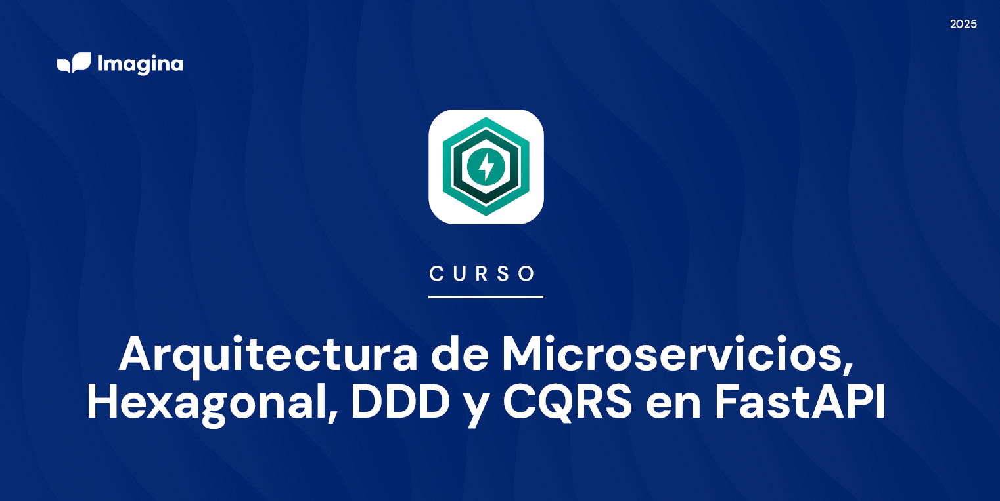

# CURSO: Arquitectura de Microservicios, Hexagonal, DDD y CQRS en FastAPI  

## Impartido por : Iván J.U.

# Introducción

Domina la arquitectura de microservicios con FastAPI, aprendiendo a diseñarAPIs REST eficientes, implementar DDD y CQRS, gestionar comunicaciónsíncrona y asíncrona con RabbitMQ y Kafka, aplicar seguridad con OAuth2 yJWT, y desplegar microservicios con Docker, Kubernetes y CI/CD. Un cursopráctico para desarrolladores backend que buscan construir sistemasescalables y resilientes.

# ¿A quién va dirigido?

Desarrolladores backend con experiencia en Python que quieran especializarseen microservicios escalables con FastAPI, aplicando DDD, CQRS y comunicación distribuida.

# Objetivos

- Desarrollar microservicios escalables con FastAPI, aplicando arquitecturahexagonal, DDD y CQRS.
- Implementar APIs REST y WebSockets eficientes, con autenticación seguramediante OAuth2 y JWT.
- Gestionar comunicación entre microservicios con RabbitMQ, Kafka yPub/Sub para sistemas distribuidos.
- Optimizar el rendimiento y la escalabilidad, utilizando caching, balanceo decarga y transacciones distribuidas.
- Automatizar despliegues en Docker y Kubernetes, asegurando CI/CD,monitoreo con Prometheus y logs centralizados.

# Requisitos

- Experiencia previa desarrollando con Python (v3 o superior) y Web Apiscon FastAPI.
- Instalados y configurados: Visual Studio Code, Python (v3.11+), GIT, DockerDesktop, Redis 7.0+ o Memcached, Graphviz, Pormetheus, Grafana yPostman. Además de acceso a un clúster Kubernetes o MiniKube.
- Tener RabbitMQ, Kafka, PostgreSQL y Mongo instalados en contenedorDocker.
- Tener permisos de instalación, conexión estable a Internet, mínimo 16GB deRAM, 60GB de espacio libre en disco, procesador Intel Core (i5 o superior)o AMD Ryzen 5 y Unidad SSD.
- Tener Zoom Desktop instalado y configurados: auriculares, micrófono,cámara y 2 pantallas para seguir las sesiones en directo.

# Tabla de Contenidos

- [1. Introducción a la Arquitectura de Microservicios](./T1/Tema1.md)
- [2. FastAPI como Framework para Microservicios](./T2/Tema2.md)
- [3. Introducción a la Comunicación entre Microservicios Síncrona y Asíncrona](./T3/Tema3.md)
- [4. Manejo de Errores y Circuit Breakers en Microservicios](./T4/Tema4.md)
- [5. Seguridad y Buenas Prácticas en Microservicios](./T5/Tema5.md)
- [6. Arquitectura Hexagonal y Aplicación de DDD](./T6/Tema6.md)
- [7. Introducción a Domain-Driven Design (DDD)](./T7/Tema7.md)
- [8. Patrón CQRS en Microservicios](./T8/Tema8.md)
- [9. Introducción a la Mensajería con Kafka, RabbitMQ](./T9/Tema9.md)
- [10. Introducción a los WebSockets y Pub/Sub en Sistemas Distribuidos](./T10/Tema10.md)
- [11. Diseño de APIs REST y WebSockets en FastAPI](./T11/Tema11.md)
- [12. Escalabilidad y Optimización de Microservicios](./T12/Tema12.md)
- [13. Persistencia de Datos en Microservicios](./T13/Tema13.md)
- [14. Breve Introducción al Testing con Pytest](./T14/Tema14.md)
- [15. Buenas Prácticas y Automatización de Despliegues](./T15/Tema15.md)
- [16. Proyecto Final: Aplicación Completa Basada en Microservicios con FastAPI](./T16/Tema16.md)

# Sesiones

🔧 **Reorganización de Bloques**

---

🔹 **Bloque 1: Fundamentos de Microservicios y DDD (Sesión 1)** 
**Duración:**  3 horas
**Contenidos:** 
 
- Evolución del monolito a microservicios
 
- Principios y patrones clave (API Gateway, Service Discovery)
 
- Bounded Contexts y diseño orientado a dominio
 
- Comparativa con SOA
 
- Introducción a DDD (estratégico y táctico)
 
- Relación entre DDD y microservicios
 
- Organización de equipos y ciclo de vida

---

🔹 **Bloque 2: FastAPI y Arquitectura Base Hexagonal (Sesión 2)** 
**Duración:**  4 horas
**Contenidos:** 
 
- FastAPI como framework para microservicios
 
- Tipado, validación, configuración, documentación con OpenAPI
 
- Puertos y adaptadores: arquitectura hexagonal en la práctica
 
- Separación por capas: dominio, aplicación, infraestructura
 
- Middlewares, dependencias, entornos, excepciones

---

🔹 **Bloque 3: Diseño de APIs REST, WebSockets y Seguridad (Sesión 3)** 
**Duración:**  4 horas
**Contenidos:** 
 
- Diseño de APIs RESTful: versiones, CORS, respuestas, validaciones
 
- Autenticación y autorización con JWT, OAuth2
 
- WebSockets con FastAPI: casos de uso, handlers, salas, seguridad
 
- Buenas prácticas de seguridad en microservicios (OWASP, HTTPS, Vault)

---

🔹 **Bloque 4: DDD Aplicado + CQRS (Sesión 4)** 
**Duración:**  4 horas
**Contenidos:** 
 
- Implementación de Aggregates, Entities, Value Objects
 
- Domain Services, Repositorios, Factories, Ubiquitous Language
 
- Separación de comandos y queries (CQRS)
 
- Command/Query Handlers, validación
 
- Event sourcing básico, patrón outbox
 
- Casos de uso y capa de aplicación

---

🔹 **Bloque 5: Comunicación entre microservicios + Event-Driven (Sesión 5)** 
**Duración:**  4 horas
**Contenidos:** 
 
- Comunicación síncrona (REST, gRPC)
 
- Comunicación asíncrona (RabbitMQ, Kafka, Redis Pub/Sub)
 
- Tiempos, retries, versionado de contratos
 
- Patrones: Event Notification, Event Carried State Transfer
 
- Integración con FastAPI en arquitectura hexagonal

---

🔹 **Bloque 6: Infraestructura, Pruebas y CI/CD (Sesión 6)** 
**Duración:**  3 horas
**Contenidos:** 
 
- Testing con Pytest: unitarios, integración, E2E
 
- Simulación de colas, base de datos temporal
 
- Docker y Docker Compose para desarrollo local
 
- CI/CD con GitHub Actions, despliegue en Kubernetes
 
- Observabilidad: logs, métricas, Prometheus, Grafana, ELK

---

🔹 **Bloque 7: Proyecto Final Guiado (Sesiones 7 y 8)** 
**Duración:**  4 horas + 4 horas
**Contenidos:** 
 
- Definición del dominio y los microservicios (bounded contexts)
 
- Arquitectura hexagonal + DDD + CQRS
 
- Contratos REST, eventos y gRPC
 
- Seguridad, pruebas, WebSockets
 
- Despliegue completo y documentación
 
- Revisión y evaluación por pares

---

🗓 **Distribución por Sesiones** 
| Sesión | Duración | Contenido | 
| --- | --- | --- | 
| 1 | 3h | Fundamentos de Microservicios y DDD | 
| 2 | 4h | FastAPI y Arquitectura Base Hexagonal | 
| 3 | 4h | APIs REST, WebSockets y Seguridad | 
| 4 | 4h | DDD Aplicado + CQRS | 
| 5 | 4h | Comunicación entre microservicios + Event-Driven | 
| 6 | 3h | Testing, CI/CD, Docker y observabilidad | 
| 7 | 4h | Proyecto Final: diseño, implementación parcial y pruebas | 
| 8 | 4h | Proyecto Final: integración, despliegue, revisión y conclusiones | 

---