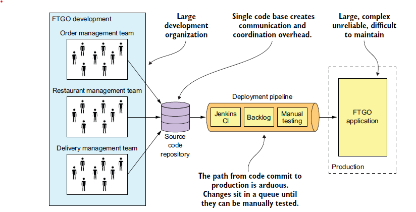
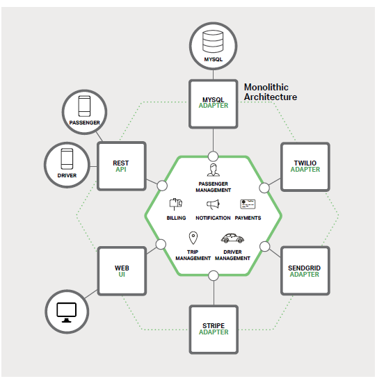
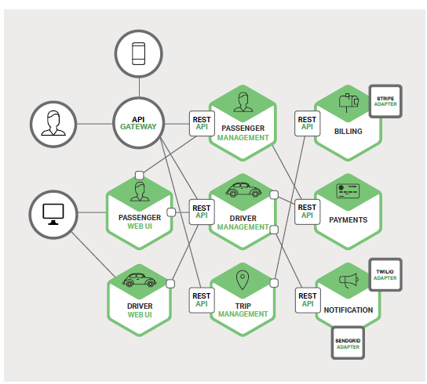
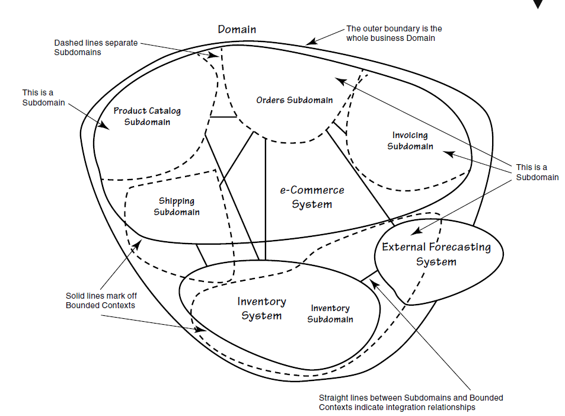
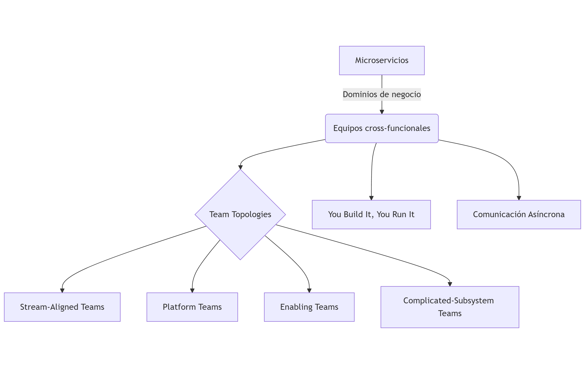
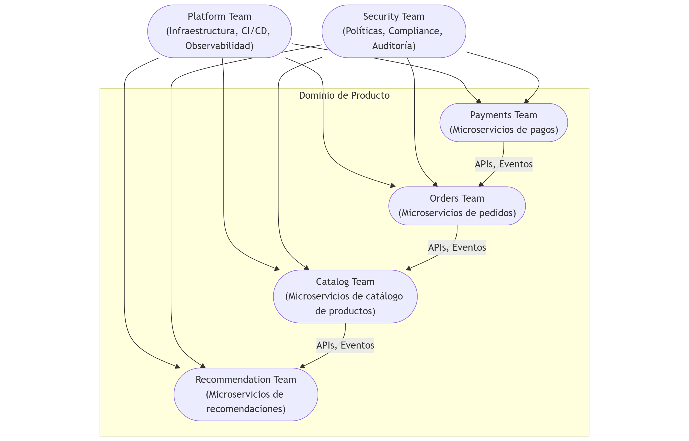
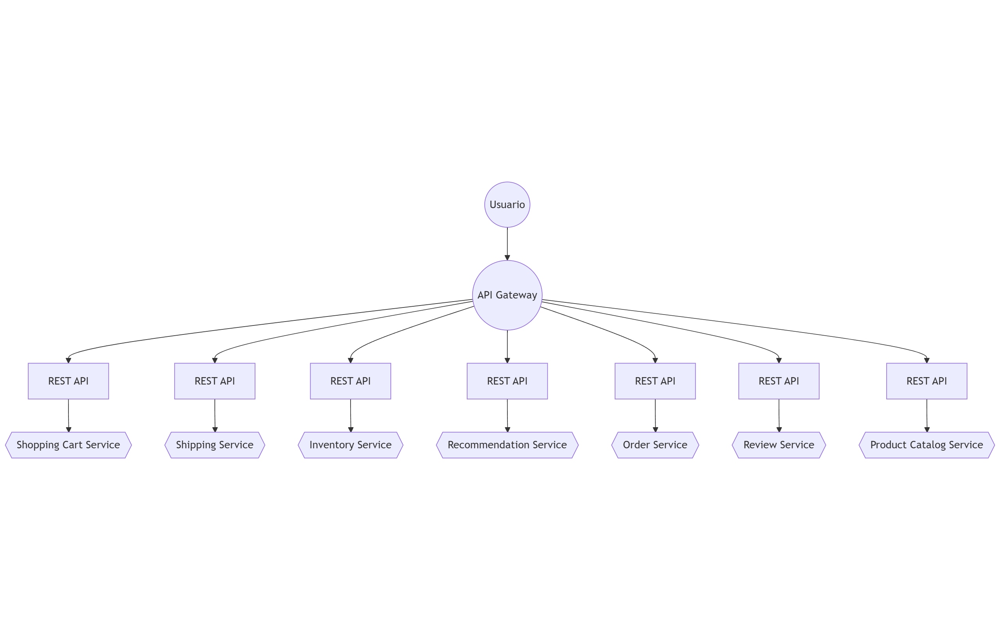
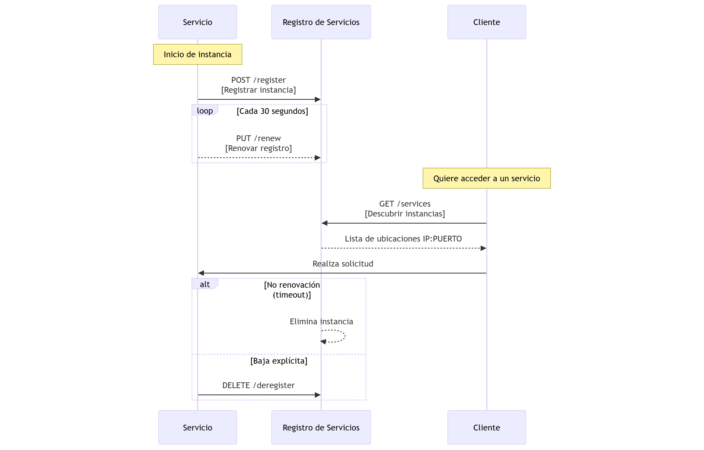
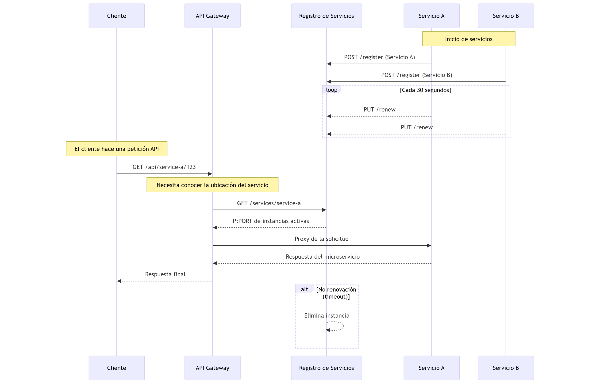

# TEMA 1. INTRODUCCIÓN A LA ARQUITECTURA DE MICROSERVICIOS

- [TEMA 1. INTRODUCCIÓN A LA ARQUITECTURA DE MICROSERVICIOS](#tema-1-introducción-a-la-arquitectura-de-microservicios)
  - [Objetivos](#objetivos)
  - [1.0 Conceptos Previos](#10-conceptos-previos)
  - [1.1 Evolución de la arquitectura monolítica hacia los microservicios](#11-evolución-de-la-arquitectura-monolítica-hacia-los-microservicios)
  - [1.2 Ventajas y desventajas clave de los microservicios](#12-ventajas-y-desventajas-clave-de-los-microservicios)
  - [1.3 Principios fundamentales de la arquitectura de microservicios](#13-principios-fundamentales-de-la-arquitectura-de-microservicios)
  - [1.4 Casos de uso reales donde los microservicios aportan valor](#14-casos-de-uso-reales-donde-los-microservicios-aportan-valor)
  - [1.5 Distinción entre microservicios y SOA (Service-Oriented Architecture)](#15-distinción-entre-microservicios-y-soa-service-oriented-architecture)
  - [1.6 La importancia del diseño orientado a dominio (DDD) en este contexto](#16-la-importancia-del-diseño-orientado-a-dominio-ddd-en-este-contexto)
  - [1.7 Bounded context y separación de responsabilidades](#17-bounded-context-y-separación-de-responsabilidades)
  - [1.8 Distribución de los equipos en torno a microservicios](#18-distribución-de-los-equipos-en-torno-a-microservicios)
  - [1.9 Evaluación del impacto de los microservicios en la gestión del ciclo de vida del software](#19-evaluación-del-impacto-de-los-microservicios-en-la-gestión-del-ciclo-de-vida-del-software)
  - [1.10 Herramientas modernas para la gestión de arquitecturas distribuidas](#110-herramientas-modernas-para-la-gestión-de-arquitecturas-distribuidas)
  - [1.11 Introducción a patrones como API Gateway, Service Discovery, y Service Registry](#111-introducción-a-patrones-como-api-gateway-service-discovery-y-service-registry)
    - [API Gateway](#api-gateway)
    - [Service Discovery y Service Registry](#service-discovery-y-service-registry)
  - [Referencias](#referencias)

---

## Objetivos

- Entender la evolución de la arquitectura monolítica hacia los microservicios
- Identificar las ventajas y desventajas clave de los microservicios
- Describir los principios fundamentales de la arquitectura de microservicios
- Analizar casos de uso reales donde los microservicios aportan valor
- Distinguir entre microservicios y SOA (Service-Oriented Architecture)
- Comprender la importancia del diseño orientado a dominio en este contexto
- Introducir los conceptos de bounded context y separación de responsabilidades
- Explorar cómo se distribuyen los equipos en torno a microservicios
- Evaluar el impacto de los microservicios en la gestión del ciclo de vida del software
- Conocer herramientas modernas para la gestión de arquitecturas distribuidas
- Introducción a patrones como API Gateway, Service Discovery, y Service Registry

---

## 1.0 Conceptos Previos

**Arquitectura de Software** 

> **Definición:** 

La arquitectura de software es "la estructura o estructuras del sistema, que comprenden componentes de software, las propiedades externas visibles de esos componentes y las relaciones entre ellos". [<a href="#ref1">1</a>]

Es decir, la arquitectura define **cómo**  se organiza un sistema software: qué partes tiene, cómo interactúan, qué restricciones existen y qué principios guían sus decisiones. No se trata solo del diseño técnico, sino también de cuestiones como escalabilidad, mantenibilidad, rendimiento o seguridad. [<a href="#ref2">2</a>]

---

**Patrón de Software** 

> **Definición:** 

Un patrón de software es "una solución reutilizable a un problema recurrente dentro de un contexto determinado en el diseño de software".

— *Gamma, Helm, Johnson y Vlissides. "Design Patterns: Elements of Reusable Object-Oriented Software" (1994)*

Es decir, un patrón **no es código** , sino una descripción general de cómo resolver un tipo de problema que aparece una y otra vez en la construcción de sistemas de software. Ejemplos famosos de patrones son **Singleton** , **Observer**  o **Factory** .
**Referencia principal:** 
 
- Gamma, E., Helm, R., Johnson, R., & Vlissides, J. (1994). *Design Patterns: Elements of Reusable Object-Oriented Software*. Addison-Wesley.

---

**Patrón de Arquitectura** 

> **Definición:** 

Un **patrón de arquitectura**  es una **solución general, reutilizable y probada**  para un problema recurrente en la organización de sistemas de software a gran escala. Define **cómo estructurar**  y **coordinar**  componentes principales de una aplicación.

— *Bass, Clements y Kazman. "Software Architecture in Practice", 3rd ed. (2012)*

En otras palabras:

Mientras un patrón de diseño (como Singleton) soluciona **detalles de clases y objetos** , un **patrón de arquitectura**  ofrece una **estructura global** : cómo dividir el sistema, cómo se comunican las partes, cómo fluye la información.
**Ejemplos de patrones de arquitectura:** 
 
- **Modelo-Vista-Controlador (MVC)**  → separa datos, lógica y presentación.
 
- **Puertos-Adaptadores (Hexagonal):**  → Este patrón se centra en aislar la lógica de negocio del resto del sistema (infraestructura, interfaces de usuario, bases de datos) mediante el uso de puertos e interfaces. Los "adaptadores" se encargan de la comunicación entre la lógica de negocio y el mundo exterior a través de estos puertos. Esto promueve la testabilidad y la independencia tecnológica.
 
- **Tubería y Filtros (Pipes and Filters):** Este patrón estructura el sistema como una secuencia de componentes de procesamiento (filtros) conectados por canales de transmisión de datos (tuberías). Cada filtro realiza una transformación específica en los datos a medida que fluyen a través de la tubería. Es útil para procesar flujos de datos.

- **Agente-Mensajero (Broker)**: Se utiliza en sistemas distribuidos para estructurar aplicaciones desacopladas. Un componente central (el broker) media la comunicación entre otros componentes (agentes). Los agentes se comunican enviando mensajes al broker, quien luego los enruta a los destinatarios apropiados. Esto facilita la escalabilidad y la flexibilidad.

- **Microkernel (Plug-in Architecture):** Este patrón separa la funcionalidad central de la aplicación (el microkernel) de la funcionalidad opcional (los plug-ins o extensiones). El microkernel proporciona los servicios esenciales, mientras que los plug-ins añaden funcionalidades específicas y se integran con el microkernel a través de interfaces bien definidas. Es útil para sistemas extensibles y personalizables. 

**Referencia principal:** 
 
- Bass, L., Clements, P., & Kazman, R. (2012). *Software Architecture in Practice* (3rd ed.). Addison-Wesley.
- Avgeriou, Paris; Uwe Zdun (2005). «Architectural patterns revisited:a pattern language». 10th European Conference on Pattern Languages of Programs (EuroPlop 2005), July (Irsee, Germany).
- Bass L., Clements P., Kazman R. (2005). Software Architecture in Practice: Second Edition. Addison-Wesley.

**Metodología de Diseño (en Software)** 

> **Definición:** 

Una **metodología de diseño**  es un **conjunto organizado de principios, prácticas y procesos**  que guían cómo se **modela, organiza y estructura**  el software para resolver problemas del dominio de manera efectiva.

Se enfoca en **cómo representar el problema real**  dentro del sistema software.

**En otras palabras:** 

Una metodología de diseño **no te dice**  qué patrón de arquitectura usar, **ni cómo desplegar**  tu aplicación, sino **cómo pensar y construir**  los modelos y relaciones dentro de tu sistema, de manera coherente, sólida y alineada con el negocio.

---

**Conceptos en Arquitectura de Software**

| Concepto | Categoría | Qué define | Ejemplos | 
| --- | --- | --- | --- | 
| Arquitectura de Software | Organización global del sistema | Cómo dividir y desplegar todo el sistema a gran escala. | Monolito, Microservicios, Serverless, SOA| 
| Patrón de Arquitectura | Organización interna | Cómo estructurar el interior de cada parte del sistema (servicio, módulo). | Hexagonal, CQRS, MVC, Broker | 
| Metodología de Diseño | Estrategia de modelado | Cómo pensar y representar el problema real en el modelo de software. | Domain-Driven Design (DDD), Object-Oriented Design (OOD) | 
| Patrón de Diseño | Solución local de diseño | Cómo resolver problemas comunes en diseño de clases y objetos. | Singleton, Factory, Observer, Strategy | 

---

> En resumen: 

 
- **Microservicios**  es **Arquitectura de Software**  (macro nivel).
 
- **Hexagonal** , **CQRS** , etc., son **Patrones de Arquitectura**  (nivel interno de cada microservicio o componente).
 
- **DDD**  es una **Metodología de Diseño**  (cómo modelas el negocio dentro del sistema).
 
- **Singleton** , **Factory** , etc., son **Patrones de Diseño**  (resuelven problemas pequeños de estructura de clases/objetos).

> Resumen en una frase: 

> Microservicios **es una forma de construir el sistema completo** ,

**y los patrones de arquitectura son herramientas**  para **organizar internamente**  cada microservicio.

---

## 1.1 Evolución de la arquitectura monolítica hacia los microservicios

Lo primero que deberíamos conocer es la arquitectura monolítica o monolito y la arquitectura de micorservicios o, simplemente, microservicios.

**El Monolito**

Cuando se habla de monolito lo podemos hacer refiriéndonos a unidad de despliegue. Es decir, **toda la funcionalidad en un sistema tiene que ser desplegada conjuntamente**.

El monolito puede ser: single-process, modular, distributed.

No hay que confundir monolito con *legacy*. Una aplicación puede ser *legacy* y tener una arquitectura microservicios. Podemos hacer una aplicación en una Startup y que sea un monolito.

Los beneficios de la arquitectura monolítica:

- **Simple de desarrollar**: los IDEs y otras herramientas de desarrollo se centran en la creación de una única aplicación.
  
- **Fácil de realizar cambios radicales en la aplicación**: puedes modificar el código y el esquema de la base de datos, compilar e implementar.
  
- **Directo de probar**: los desarrolladores pueden escribir pruebas de extremo a extremo que iniciaban la aplicación, invocaban la API REST y probaban la interfaz de usuario con Selenium.
  
- **Directo de desplegar**: todo lo que un desarrollador tenía que hacer es copiar la estructura del proyecto a un servidor que tuviera un webserver instalado.
  
- **Fácil de escalar**: se ejecutan múltiples instancias de la aplicación detrás de un balanceador de carga.

Por contraparte existen limitaciones en esta arquitectura sobretodo cuando la aplicación se va haciendo cada vez más compleja -> (**Monolitic Hell**). Los problemas que nos encontraremos se pueden resumir en:

- **El desarrollo se vuelve lento por su complejidad**.
- **El despliegue también es lento y arduo:** por la complejidad del código se hace más tedioso tanto el proceso de despligue como el testeo del software.
- **El escalado se vuelve complicado:** por ejemplo se puede necesitar un tipo de sgbd relacional para cierto módulo y otro módulo necesitar un sgbd en memoria.
- **Se está atado un stack tecnológico:** se hace muy difícil adoptar nuevos frameworks y se opta por seguir con tecnologías obsoletas.

## 1.2 Ventajas y desventajas clave de los microservicios

La arquitectura de microservicios se ha convertido en una de las estrategias más populares para el desarrollo de software distribuido. Sin embargo, no es una bala de plata. Comprender sus ventajas y desventajas es esencial para decidir cuándo y cómo aplicarla correctamente (Newman, 2021; NGINX, 2023).

---

**Ventajas principales de los microservicios**

1. **Escalabilidad independiente**

   Cada microservicio se puede escalar de forma autónoma según su carga específica, optimizando recursos y rendimiento (Dragoni et al., 2017).

2. **Despliegue continuo y rápido**

   Permite realizar despliegues independientes sin afectar a otros servicios, facilitando el uso de pipelines CI/CD (Fowler, 2014; Newman, 2021).

3. **Alineación con los equipos de producto**

   Se facilita la organización de equipos autónomos en torno a dominios de negocio, siguiendo principios de DDD y Team Topologies (Skelton & Pais, 2019).

4. **Mayor tolerancia a fallos**

   Un fallo en un servicio no necesariamente impacta todo el sistema, siempre que se apliquen patrones como circuit breakers o retries (Microsoft, 2024).

5. **Flexibilidad tecnológica**

   Cada equipo puede elegir el stack tecnológico más adecuado para su servicio, manteniendo interoperabilidad mediante contratos bien definidos (Newman, 2021).

---

**Desventajas clave de los microservicios**

1. **Complejidad operativa**

   Requiere una infraestructura madura para orquestación, observabilidad, descubrimiento de servicios y despliegues automatizados (AWS, 2023).

2. **Mayor latencia y sobrecarga de red**

   La comunicación entre servicios vía HTTP o mensajería introduce latencia y puede generar cuellos de botella (Google Cloud, 2022).

3. **Pruebas más complejas**

   Las pruebas de integración y sistema se vuelven más difíciles y costosas de mantener en entornos distribuidos (ThoughtWorks, 2023).

4. **Gestión distribuida de datos**

   El patrón “base de datos por servicio” complica las transacciones, la consistencia eventual y la sincronización de datos (Vernon, 2016).

5. **Curva de aprendizaje y coste organizacional**

   Requiere conocimientos en DevOps, mensajería, observabilidad, automatización, y diseño resiliente, lo cual eleva el umbral técnico (NGINX, 2023).

## 1.3 Principios fundamentales de la arquitectura de microservicios

La arquitectura de microservicios se basa en varios principios rectores que buscan maximizar la agilidad, la resiliencia y la escalabilidad de los sistemas distribuidos. Estos principios han sido definidos a partir de la experiencia de empresas pioneras como Netflix, Amazon y Google (Newman, 2021; NGINX, 2023).

---

**Principios esenciales**

1. **Modelar alrededor de negocios y dominios**

   Los microservicios deben estructurarse en torno a los *Bounded Contexts* del dominio de negocio, siguiendo los principios de *Domain-Driven Design (DDD)* (Evans, 2003; Vernon, 2016).

   *Ejemplo:* Un servicio para gestión de pagos, otro para inventario, otro para facturación, etc.

2. **Autonomía y despliegue independiente**

   Cada microservicio debe ser **autónomo** en su ciclo de vida: desarrollo, despliegue y escalado, sin depender de la sincronización con otros servicios (Newman, 2021).

3. **Interfaces bien definidas y comunicación ligera**

   Los microservicios se comunican entre sí mediante APIs bien definidas, preferiblemente usando protocolos ligeros como HTTP/REST, gRPC o eventos asincrónicos (Google Cloud, 2022).

4. **Descentralización del almacenamiento de datos**

   Cada servicio debe tener su propia base de datos o su propio esquema de datos, para evitar dependencias directas y cuellos de botella (Fowler, 2014).

   *Patrón:* Database per Service.

5. **Despliegue y entrega continua (CI/CD)**

   La automatización de pruebas, integración y despliegue es fundamental para mantener la agilidad y calidad del software (AWS, 2023).

6. **Resiliencia y tolerancia a fallos**

   Dado que los sistemas distribuidos fallan de forma inevitable, los microservicios deben diseñarse con patrones de resiliencia como *circuit breakers*, *timeouts*, *bulkheads* y *reintentos* (Microsoft, 2024).

7. **Observabilidad desde el diseño**

   Es imprescindible integrar capacidades de logging distribuido, métricas y tracing desde el primer momento para poder monitorear y depurar sistemas de múltiples servicios (Honeycomb, 2023).

8. **Organización de equipos alineada con servicios**

   Siguiendo la *Ley de Conway*, los equipos deben organizarse en torno a los servicios que construyen y operan, no por tecnología (Skelton & Pais, 2019).

## 1.4 Casos de uso reales donde los microservicios aportan valor

Aunque los microservicios no son una solución mágica para todos los sistemas, han demostrado ser extremadamente eficaces en escenarios de alta complejidad, escalabilidad y evolución continua (Newman, 2021; AWS, 2023).

---

**Casos de uso principales y sus características**

1. **Plataformas de e-commerce a gran escala: Amazon**

   Amazon fue uno de los pioneros en reestructurar su gigantesco monolito en cientos de microservicios (Vogels, 2006).  
   
   *Características clave:*
   - Cada equipo "two-pizza" gestiona un servicio específico (ej. pagos, inventario, catálogo).
   - Independencia total para desplegar nuevas versiones de servicios sin coordinar despliegues globales.
   - Escalabilidad horizontal precisa: solo escalan los servicios que enfrentan picos de demanda (como el carrito en Black Friday).

2. **Sistemas de streaming de contenidos: Netflix**

   Netflix migró su monolito a una arquitectura de microservicios basada en la nube para soportar la transmisión global (Netflix Tech Blog, 2022).

   *Características clave:*
   - Uso extensivo de *Chaos Engineering* para probar la resiliencia de los servicios frente a fallos de red y sistemas.
   - Independencia total entre microservicios de recomendaciones, streaming, autenticación, y facturación.
   - Elasticidad automática basada en demanda utilizando infraestructura en AWS.

3. **Banca digital y fintech: Monzo y Revolut**

   En banca moderna, donde la confiabilidad y la innovación rápida son críticas, Monzo y Revolut apostaron por arquitecturas de microservicios (ThoughtWorks, 2023).

   *Características clave:*
   - Cada producto bancario (cuentas, préstamos, transferencias) es un microservicio independiente.
   - Implementación fuerte de políticas de seguridad en cada servicio.
   - Aislamiento de errores: una caída en el servicio de tarjetas no afecta a las transferencias.

4. **Aplicaciones de viajes y movilidad: Uber**

   Uber adoptó una arquitectura de microservicios para gestionar su crecimiento global y expansión en múltiples servicios (Uber Engineering, 2023).

   *Características clave:*
   - Descomposición en más de 2.200 microservicios (según reportes de 2022).
   - Balanceadores de carga y descubrimiento de servicios para dirigir peticiones eficientemente.
   - Resiliencia multi-región, con fallbacks entre zonas geográficas.

5. **SaaS multi-tenant: Shopify**

   Shopify usa microservicios para dar servicio a millones de tiendas en su plataforma (NGINX, 2023).

   *Características clave:*
   - Aislamiento lógico de datos y procesamiento para cada tienda (tenant).
   - Despliegues graduales (canary deployments) y reversión rápida en caso de fallo.
   - Elasticidad para responder a eventos como Black Friday o lanzamientos virales.

## 1.5 Distinción entre microservicios y SOA (Service-Oriented Architecture)

**Qué es SOA**

> **SOA (Service Oriented Architecture)**: es un paradigma de arquitectura de software que define un conjunto de principios para estructurar aplicaciones como un ensamblaje de servicios de negocio, autónomos, interoperables y descubribles. A

Estos servicios se comunican entre sí a través de interfaces bien definidas y, a menudo, utilizando protocolos estándar de comunicación en red. 

El objetivo principal de SOA es promover la reutilización, la flexibilidad, la escalabilidad y la agilidad en el desarrollo e integración de sistemas de información, alineando la tecnología con los procesos de negocio.

Además es un conjunto de [estándares](). 

Algunos críticos de la arquitectura de microservicios dicen que no es algo nuevo sólo un rebranding de SOA. 

La Arquitectura de MS es similar a SOA. Ambos enfoques consisten en un conjunto de servicios. 

Aunque los microservicios y la arquitectura orientada a servicios (SOA) comparten principios similares, como la separación de responsabilidades y la interoperabilidad, existen diferencias fundamentales que afectan su aplicación práctica (Newman, 2021; Richardson, 2018).

Comprender estas diferencias ayuda a seleccionar el enfoque adecuado para cada necesidad empresarial y técnica.

---

**Principales diferencias entre Microservicios y SOA**

1. **Granularidad**

   - **Microservicios:** Dividen la funcionalidad en componentes pequeños y autónomos, orientados a tareas específicas de negocio (Newman, 2021).
   - **SOA:** Agrupa funcionalidades en servicios más grandes y complejos que abarcan múltiples funcionalidades relacionadas (Erl, 2005).

2. **Comunicación**

   - **Microservicios:** Prefieren protocolos ligeros como HTTP/REST, gRPC o mensajería asincrónica (Kafka, RabbitMQ) (Google Cloud, 2022).
   - **SOA:** Utiliza estándares más pesados como SOAP, WS-* y Enterprise Service Bus (ESB) para la comunicación y orquestación (NGINX, 2023).

3. **Orquestación vs. Coreografía**

   - **SOA:** Suele centrarse en orquestación centralizada mediante un ESB (Enterprise Service Bus) (Erl, 2005).
   - **Microservicios:** Favorecen la coreografía descentralizada, donde los servicios interactúan directamente usando eventos o APIs (Richardson, 2018).

4. **Autonomía de despliegue**

   - **Microservicios:** Cada servicio puede ser desarrollado, desplegado y escalado de manera independiente (Newman, 2021).
   - **SOA:** Los servicios tienden a depender de infraestructuras compartidas, lo que puede dificultar despliegues independientes.

5. **Gestión de datos**

   - **Microservicios:** Aplican el principio "Database per Service" para maximizar la independencia (Fowler, 2014).
   - **SOA:** Es más habitual que los servicios compartan bases de datos centrales, aumentando el acoplamiento.

6. **Objetivo principal**

   - **SOA:** Buscaba integrar sistemas monolíticos ya existentes (legacy integration).
   - **Microservicios:** Se diseñan típicamente para crear nuevas aplicaciones nativas en la nube (*cloud-native*) (AWS, 2023).

---

**Tabla resumen de diferencias**

| Aspecto                  | Microservicios                         | SOA                                   |
|---------------------------|----------------------------------------|---------------------------------------|
| Granularidad              | Muy fina (servicios pequeños)          | Más gruesa (servicios grandes)        |
| Comunicación              | Protocolos ligeros (REST, gRPC)        | Protocolos pesados (SOAP, WS-*)       |
| Coordinación              | Coreografía descentralizada            | Orquestación centralizada (ESB)       |
| Despliegue                | Independiente por servicio             | Generalmente coordinado              |
| Bases de datos            | Base de datos por servicio             | Bases de datos compartidas           |
| Objetivo principal        | Cloud-native, agilidad                 | Integración de sistemas existentes   |

---

## 1.6 La importancia del diseño orientado a dominio (DDD) en este contexto

**Límites de los Microservicios y Diseño Guiado por el Dominio**

**Descomposición de Sistemas en Microservicios**

Cuando las empresas adoptan el enfoque de microservicios, comienzan a **descomponer los componentes existentes en partes más pequeñas**, con el objetivo de **mejorar la calidad del servicio** de forma más rápida, **sin sacrificar la fiabilidad**.

**Patrones de Descomposición (Decomposition Pattern)**

Existen varias formas de descomponer un sistema grande en subsistemas más pequeños.  
Una tentación común es **basar la descomposición en la tecnología de implementación**.

**Ejemplos de descomposición por tecnología:**
* **Servicios de alto procesamiento**: desarrollados en C, Rust o Go (elige el lenguaje más adecuado). Forman un subsistema independiente.
* **Servicios intensivos en I/O**: desarrollados en Node.js, aprovechando su I/O no bloqueante. Forman un subsistema separado.

**Descomposición por Ubicación Geográfica**

Otra forma de dividir un sistema es según la ubicación de los equipos:

* Un subsistema puede ser desarrollado en Estados Unidos.
* Otros subsistemas pueden ser desarrollados en África, Asia, Australia, Europa o Sudamérica.

**Ventajas:**
* Tener a un solo equipo trabajando en un subsistema completo dentro de la misma región mejora la eficiencia.
* Los equipos locales **comprenden mejor** los requisitos **legales, comerciales y culturales** de su mercado.

**Ejemplo práctico:**
* No es lo mismo diseñar un software contable para El Cairo que para Nueva York; un equipo local sabrá captar mejor las necesidades específicas.

**El Enfoque de Domain-Driven Design (DDD)**

En su libro *Domain-Driven Design*, **Eric Evans** propone otra forma de definir los límites de los subsistemas:

* **Basarse en modelos**, no solo en tecnologías ni ubicaciones.
* Los modelos permiten **representar el sistema de forma más clara**, enfocándose en lo que realmente importa.
* **Los modelos resaltan los aspectos críticos** que necesitamos entender o construir.

**Modelos Múltiples en Sistemas Grandes**

> En su libro, Evans señala que la mayoría de los sistemas grandes **no tienen un único modelo**.

* El modelo general de un sistema complejo está formado por **muchos modelos más pequeños** que se entrelazan.
* Estos modelos **son representaciones orgánicas** de distintos contextos de negocio.
* Cada modelo **tiene sentido dentro de su propio contexto** y es **intuitivo para los expertos** de ese ámbito específico.

Es importante señalar que el *Domain-Driven Design* (DDD) de Evans fue introducido **más de una década antes** de que el término “microservicio” se popularizara.  

Aun así, la cita anterior refleja una observación clave sobre la **naturaleza del modelado**: cuando se intenta depender de un único modelo (por ejemplo, un modelo canónico), **el sistema se vuelve difícil de entender**.

El enfoque de microservicios busca **dividir grandes componentes (modelos) en unidades más pequeñas**, con el objetivo de **reducir la confusión** y **aportar mayor claridad** a cada parte del sistema.

Por lo tanto, la **arquitectura de microservicios** es un **estilo arquitectónico altamente compatible con el enfoque de modelado de DDD**.

## 1.7 Bounded context y separación de responsabilidades

Para facilitar la creación de componentes más pequeños y coherentes, **Evans introdujo el concepto de _Bounded Contexts_ (Contextos Delimitados)**:

- Cada componente del sistema vive **dentro de su propio contexto delimitado**.
- **El modelo de cada componente** y **los modelos de su contexto** **solo se utilizan dentro de su límite**.
- **No se comparten modelos entre diferentes contextos delimitados**.

> **Nota:** Separar correctamente los contextos ayuda a mantener la claridad y la autonomía de cada microservicio en sistemas grandes y complejos.

**Bounded Contexts y Límites de Microservicios**

Se reconoce ampliamente que **identificar correctamente los *bounded contexts*** (contextos delimitados) en un sistema, usando técnicas de *Domain-Driven Design* (DDD), y **dividir el sistema a lo largo de esos límites** es una estrategia eficaz para definir los límites de microservicios.

Sam Newman [<a href="#ref1">3</a>]  afirma:

> *"Si los límites de nuestros servicios están alineados con los bounded contexts de nuestro dominio, y nuestros microservicios representan esos contextos, estamos comenzando de manera excelente para garantizar que los microservicios estén débilmente acoplados y sean altamente cohesivos."*

**Puntos clave**

- Los *bounded contexts* representan **dominios de negocio autónomos**, es decir, **capacidades bien definidas**.
- Son el **punto de partida adecuado** para identificar los límites entre microservicios.
- Si se usan correctamente, **reducen la necesidad de compartir modelos y datos** entre servicios.
- Esto permite que cada microservicio sea **una unidad desplegable de forma independiente**.
- **El despliegue independiente** permite aumentar la velocidad de entrega **sin perder estabilidad**.

**Un detalle importante**

Aunque el uso de DDD y bounded contexts es muy útil, **no garantiza por sí solo componentes pequeños**.  

Es posible diseñar bounded contexts demasiado grandes.

> En microservicios, no buscamos lo grande:  
> **lo micro es lo que realmente importa**.

📌 **Principio esencial:**  **Más pequeño es mejor.**

## 1.8 Distribución de los equipos en torno a microservicios

**¿Cómo se organizan los equipos en una arquitectura de microservicios?**

En arquitecturas de microservicios, **la estructura organizativa es un factor crítico** para el éxito técnico. No basta con dividir el software: **los equipos deben alinearse al diseño del software y a los objetivos de negocio**.  
Este enfoque sigue principios fundamentados en la literatura actual *(Newman, 2021)*.

---

**1. Equipos Autónomos y Cross-funcionales**

Cada equipo debe tener **todas las habilidades necesarias** para diseñar, desarrollar, probar, desplegar y operar sus propios servicios *(Skelton & Pais, 2019)*:

- Backend
- Frontend (si aplica)
- DevOps / SRE
- QA / Testing
- Data / Analytics (si es necesario)

*Objetivo:* reducir dependencias entre equipos y minimizar cuellos de botella.

---

**2. "You Build It, You Run It"**

El principio de **"You Build It, You Run It"**, popularizado por *Werner Vogels* (CTO de Amazon), establece que:

> *Los mismos equipos que construyen los servicios son los que los operan en producción* *(Vogels, 2006)*.

Esto genera:
- Alto sentido de **propiedad**.
- Mayor **calidad** de software.
- **Responsabilidad** directa en operaciones.

---

**3. Alineación a Dominios de Negocio (DDD + Bounded Contexts)**

Los equipos deben alinearse a **dominios de negocio** y no a tecnologías específicas *(Vernon, 2016)*.

- Cada equipo maneja **su propio modelo de datos** y **su propia lógica**.
- Se utilizan **APIs** o **eventos** para la integración entre equipos.

*Ejemplo:*  
"Equipo de pagos", "Equipo de pedidos", "Equipo de catálogo".

---

**4. Tamaño de Equipos: "Two-Pizza Rule"**

Siguiendo la filosofía de Amazon:

- **Equipos pequeños**: idealmente entre **2 y 9 personas** *(Newman, 2021)*.
- Si un equipo crece demasiado, se divide.

Ventajas:
- Comunicación fluida
- Agilidad
- Decisiones rápidas

---

**5. Organización según "Team Topologies"**

*Team Topologies* *(Skelton & Pais, 2019)* propone cuatro tipos de equipos:

| Tipo de Equipo                | Función Principal |
|--------------------------------|-------------------|
| **Stream-aligned Team**         | Alineado a un flujo de valor de negocio. |
| **Complicated Subsystem Team** | Encargado de subsistemas de alta complejidad técnica. |
| **Enabling Team**              | Facilita habilidades y conocimiento a otros equipos. |
| **Platform Team**              | Proporciona plataformas de soporte para acelerar a los equipos de producto. |

Los equipos deben ser **autónomos** pero cooperar mediante **interfaces bien definidas**.

---

**6. Equipos de Plataforma (Internal Developer Platforms)**

Para escalar una organización de microservicios, se requieren **equipos de plataforma** *(Hewitt, 2020)*:

- Automatización de **CI/CD**.
- Observabilidad (**logs, métricas, tracing distribuido**).
- Seguridad de base (**IAM, auditoría, escaneo de vulnerabilidades**).
- Gestión de infraestructura (**Kubernetes, cloud providers**).

*Así los equipos de producto se enfocan en la lógica de negocio y no en infraestructura.*

---

**7. Comunicación Asíncrona**

En microservicios:

- Se prioriza la **comunicación asíncrona** (Slack, PRs, documentación) sobre reuniones constantes.
- La colaboración se basa en **contratos de API**, **eventos** y **Service Level Objectives (SLOs)**.

*Esto disminuye la fricción organizacional.*

 
## 1.9 Evaluación del impacto de los microservicios en la gestión del ciclo de vida del software

La adopción de microservicios transforma profundamente la forma en que las organizaciones gestionan el ciclo de vida del software (SDLC: *Software Development Life Cycle*). Estos cambios afectan desde la planificación hasta el mantenimiento, ofreciendo tanto oportunidades como desafíos (Newman, 2021; AWS, 2023).

---

**Impactos clave de los microservicios en el ciclo de vida del software**

1. **Planificación y diseño**

   La planificación de sistemas basados en microservicios requiere pensar en términos de *dominios de negocio*, *Bounded Contexts* y *responsabilidad única* (Evans, 2003; Vernon, 2016).

   *Características:*
   - Diseño modular basado en contextos específicos.
   - Definición clara de contratos de servicio (API First).
   - Decisiones anticipadas sobre tecnologías heterogéneas.

2. **Desarrollo**

   La implementación de microservicios fomenta equipos pequeños y autónomos, cada uno responsable de uno o varios servicios (Skelton & Pais, 2019).

   *Características:*
   - Independencia en el stack tecnológico.
   - Desarrollos concurrentes en paralelo.
   - Necesidad de respetar acuerdos de integración (contratos de API, eventos).

3. **Testing**

   Las pruebas en entornos de microservicios se vuelven más complejas (ThoughtWorks, 2023).

   *Características:*
   - Importancia del testing de contratos (contract testing).
   - Incremento del testing de integración distribuida.
   - Necesidad de entornos de staging que emulen múltiples servicios.

4. **Integración y despliegue**

   Los microservicios demandan pipelines CI/CD altamente automatizados para construir, probar y desplegar servicios de manera independiente (AWS, 2023).

   *Características:*
   - Versionado independiente por servicio.
   - Deploys canary, blue/green o rolling updates frecuentes.
   - Observabilidad integrada en el proceso de despliegue.

5. **Operaciones y monitoreo**

   Operar un sistema basado en microservicios implica adoptar prácticas modernas de observabilidad y resiliencia (Honeycomb, 2023; Microsoft, 2024).

   *Características:*
   - Logging, métricas y tracing distribuido en todos los servicios.
   - Monitoreo de interacciones entre servicios (mallas de servicios como Istio).
   - Implementación de patrones de resiliencia (*circuit breakers*, *bulkheads*).

6. **Mantenimiento y evolución**

   Los microservicios facilitan la evolución incremental del sistema: se pueden reemplazar, reescribir o mejorar servicios individuales sin impactar todo el sistema (Newman, 2021).

   *Características:*
   - Facilita refactorizaciones sin despliegues masivos.
   - Permite probar nuevas tecnologías en servicios aislados (*tech spikes*).
   - Minimiza los riesgos de migraciones tecnológicas.
 
## 1.10 Herramientas modernas para la gestión de arquitecturas distribuidas
La gestión de arquitecturas distribuidas basadas en microservicios necesita un conjunto especializado de herramientas modernas para orquestación, observabilidad, mensajería, seguridad y APIs (Newman, 2021; AWS Builders' Library, 2023).

---

**1. Orquestación y despliegue**

La gestión de cientos de contenedores sería inviable manualmente, por eso usamos plataformas de orquestación (CNCF, 2023).

- **[Kubernetes](https://kubernetes.io/):** Orquestador de contenedores que automatiza despliegues, escalado y recuperación.
- **[Argo CD](https://argo-cd.readthedocs.io/en/stable/):** Despliegue GitOps de aplicaciones en Kubernetes.
- **[Helm](https://helm.sh/):** Gestor de paquetes que facilita instalar y actualizar aplicaciones Kubernetes.

*Referencias: Newman, 2021; CNCF, 2023.*

---

**2. Observabilidad (logs, métricas, tracing distribuido)**

La observabilidad es esencial para diagnosticar problemas en sistemas distribuidos (Prometheus Project, 2023; OpenTelemetry, 2023).

- **[Prometheus](https://prometheus.io/)** + **[Grafana](https://grafana.com/):** Stack de métricas y visualización.
- **[OpenTelemetry](https://opentelemetry.io/):** Estándar de recolección de logs, métricas y trazas.
- **[Jaeger](https://www.jaegertracing.io/):** Sistema de tracing distribuido.

*Referencias: Prometheus Project, 2023; OpenTelemetry, 2023.*

---

**3. Service Mesh**

Gestionar la comunicación segura y resiliente entre servicios es tarea de un service mesh (Istio Project, 2024).

- **[Istio](https://istio.io/):** Control de tráfico, resiliencia, mTLS automático.
- **[Linkerd](https://linkerd.io/):** Alternativa ligera a Istio enfocada en simplicidad.

*Referencias: Istio Project, 2024; Linkerd Project, 2024.*

---

**4. Mensajería y comunicación asíncrona**

Mensajería desacoplada aumenta la resiliencia y la escalabilidad (Confluent, 2023).

- **[Apache Kafka](https://kafka.apache.org/):** Streaming distribuido para eventos en tiempo real.
- **[RabbitMQ](https://www.rabbitmq.com/):** Sistema de colas de mensajes tradicional.

*Referencias: Confluent, 2023; RabbitMQ, 2024.*

---

**5. Seguridad y gestión de secretos**

La gestión segura de secretos y políticas de acceso es crítica en entornos distribuidos (HashiCorp, 2024; OPA Project, 2023).

- **[Vault](https://developer.hashicorp.com/vault):** Gestión de secretos, cifrado y autenticación dinámica.
- **[OPA (Open Policy Agent)](https://www.openpolicyagent.org/):** Motor de políticas para control de acceso.

*Referencias: HashiCorp, 2024; OPA Project, 2023.*

---

**6. Gestión de APIs**

El control y exposición de APIs debe hacerse de forma segura y eficiente (Kong Inc., 2023; Google Cloud, 2023).

- **[Kong](https://konghq.com/):** API Gateway de código abierto.
- **[Apigee](https://cloud.google.com/apigee):** Plataforma empresarial de gestión de APIs.

*Referencias: Kong Inc., 2023; Google Cloud, 2023.*

---

**Tabla comparativa de herramientas**

| Categoría              | Herramienta        | Propósito                              | Ventajas principales                  | Cuándo usar |
|-------------------------|--------------------|----------------------------------------|----------------------------------------|-------------|
| Orquestación            | [Kubernetes](https://kubernetes.io/) | Orquestar contenedores                 | Escalabilidad automática, recuperación ante fallos | Desde que tienes múltiples servicios |
|                         | [Argo CD](https://argo-cd.readthedocs.io/en/stable/) | GitOps para Kubernetes                | Automatización de despliegues declarativos | Entornos con despliegues continuos |
|                         | [Helm](https://helm.sh/) | Gestión de paquetes en Kubernetes      | Instalación y upgrades simples         | Aplicaciones complejas en Kubernetes |
| Observabilidad          | [Prometheus](https://prometheus.io/), [Grafana](https://grafana.com/) | Métricas y visualización               | Monitorización en tiempo real         | Desde el inicio de producción |
|                         | [OpenTelemetry](https://opentelemetry.io/) | Recolección de logs, métricas, trazas  | Estándar abierto, multilinguaje         | Instrumentar nuevos servicios |
|                         | [Jaeger](https://www.jaegertracing.io/) | Tracing distribuido                   | Análisis de latencia y dependencias    | Sistemas con muchas interacciones |
| Service Mesh            | [Istio](https://istio.io/) | Control de tráfico, seguridad         | Seguridad automática, control granular | Sistemas medianos/grandes |
|                         | [Linkerd](https://linkerd.io/) | Service Mesh ligero                   | Instalación fácil, bajo consumo        | Proyectos más pequeños o simples |
| Mensajería              | [Kafka](https://kafka.apache.org/) | Event streaming                       | Alta capacidad, tolerancia a fallos     | Procesamiento de eventos masivos |
|                         | [RabbitMQ](https://www.rabbitmq.com/) | Colas de mensajes                     | Simple, flexible                       | Comunicación asíncrona simple |
| Seguridad y secretos    | [Vault](https://developer.hashicorp.com/vault) | Gestión de secretos                  | Seguridad dinámica de credenciales     | Sistemas sensibles o multiusuario |
|                         | [OPA](https://www.openpolicyagent.org/) | Políticas de autorización             | Integración flexible, estándares abiertos | Controlar acceso en APIs y servicios |
| Gestión de APIs         | [Kong](https://konghq.com/) | API Gateway                           | Código abierto, extensible             | Exposición y control de APIs internas o públicas |
|                         | [Apigee](https://cloud.google.com/apigee) | Gestión de ciclo de vida de APIs       | Alta escalabilidad, analíticas avanzadas | Grandes plataformas B2B o B2C |

---
 
## 1.11 Introducción a patrones como API Gateway, Service Discovery, y Service Registry

### API Gateway

* Cuando eliges construir un conjunto de microservicios necesitas decidir cómo quieres que tus aplicaciones interactúen con los microservicios.
* En una arquitectura de microserivcios, cada servicio se expone como un conjunto de endpoints.

Imaginemos que desarrollamos una cliente móvil nativo para una aplicación de compras. Es muy probable que tengas una vista detalle de cada uno de los productos.

Y, aunque sea un móvil, seguramente habrá un montón de detalles que mostrarán mucha información. No sólo habrá nombre de producto, descripción, precio, etc.

Sino que habrá una serie de items como:

1. Número de productos en el carrito de compras
2. Opiniones de clientes
3. Opciones de compra
4. Recomendaciones de otros productos
5. Varias opciones de compra.
6. ...

En arquitectura monolítica, el cliente móvil trae los datos con una simple llamada REST como:

`GET api.company.com/productdetails/productId`

El balanceador de carga enruta la petición hacia varias instancias idénticas. Entonces se hacen varias *queries* a la base de datos y se retorna la información.

Pero, cuando usas **arquitectura de microservicios** los datos del detalle de los productos son mostrados a través de múltiples microservicios.

Necesitamos saber cómo el cliente accede a esos servicios. Existen dos patrones:

* **Direct Client-to-Microservice Communication**: cada microservicio tendrá un endpoint público.
  * Esto puede representar un problema porque en este ejemplo haríamos 7 llamadas. Pues por ejemplo, con Amazon, hay cientos de microservicios involucrados en renderiza la página de un producto.
  * Dificultad al refactorizar microservicios. Por ejemplo, habrá servicios que habrá que dividir.
* La otra forma será usando un **API Gateway**: es un servidor que tiene un único punto de entrada al sistema. El AG encapsula la arquitectura interna y encauza todas las peticiones a los endpoints para cada microservicio. Tiene otras características como autenticación, monitorización, balanceador de carga, etc.

El **API Gateway** es responsable del **enrutamiento de solicitudes**, la **composición** y la **traducción de protocolos**.

Todas las peticiones de los clientes pasan primero por el API Gateway, que luego las enruta al **microservicio apropiado**.

A menudo, el API Gateway maneja una solicitud **invocando múltiples microservicios** y **agregando los resultados**.  
También puede traducir entre **protocolos web** como `HTTP` y `WebSocket`, y protocolos **no orientados a la web** que se usan internamente.

El API Gateway también puede proporcionar a cada cliente una **API personalizada**.  
Normalmente expone una **API de alto nivel** (*coarse-grained*) para clientes móviles.

Por ejemplo, en el caso de mostrar los detalles de un producto, el API Gateway puede ofrecer un **endpoint**: `(/productdetails?productid=xxx)`
que permita a un cliente móvil obtener todos los detalles del producto con una sola solicitud.

El API Gateway maneja esta petición invocando diversos servicios —**información del producto**, **recomendaciones**, **reseñas**, etc.— y **combinando los resultados**.

Un gran ejemplo de API Gateway es [Netflix API Gateway](https://medium.com/@pablo.matteo/did-you-know-that-netflixs-api-gateway-handles-over-700-000-requests-per-second-9a97bf5dc71b)

### Service Discovery y Service Registry

El **API Gateway** necesita conocer la ubicación (dirección IP y puerto) de cada microservicio con el que se comunica.

En una aplicación tradicional, probablemente podrías codificar estas ubicaciones de forma estática.  
Pero en una aplicación moderna de microservicios basada en la nube, encontrar las ubicaciones necesarias **no es un problema trivial**.

Los **servicios de infraestructura**, como un **broker de mensajería**, suelen tener una ubicación estática, que puede especificarse mediante **variables de entorno** del sistema operativo.

Sin embargo, **determinar la ubicación de un servicio de aplicación** no es tan sencillo.

Los servicios de aplicación tienen ubicaciones **asignadas dinámicamente**.

Además, el conjunto de instancias de un servicio cambia dinámicamente debido a **escalado automático** y **actualizaciones**.

Como resultado, el API Gateway —igual que cualquier otro cliente de servicios en el sistema— necesita utilizar el **mecanismo de descubrimiento de servicios** del sistema, ya sea:

* **Descubrimiento del lado del servidor** (*server-side discovery*), o
* **Descubrimiento del lado del cliente** (*client-side discovery*).

Por ahora, es importante señalar que si el sistema utiliza **descubrimiento del lado del cliente**, entonces el API Gateway debe ser capaz de **consultar el registro de servicios**, que es una base de datos con todas las instancias de microservicios y sus ubicaciones.

El **registro de servicios** es una parte clave del **descubrimiento de servicios**.

Se trata de una **base de datos que contiene las ubicaciones en red de las instancias de servicio**.

Un registro de servicios debe ser **altamente disponible** y estar **actualizado en todo momento**.  
Los clientes pueden almacenar en caché las ubicaciones obtenidas del registro, pero esa información **acaba desactualizándose**, y los clientes podrían dejar de poder descubrir nuevas instancias.

Por tanto, un registro de servicios está compuesto por un **clúster de servidores** que utilizan un **protocolo de replicación** para mantener la consistencia de los datos.

Como se mencionó anteriormente, **Netflix Eureka** es un buen ejemplo de registro de servicios.  
Proporciona una **API REST** para registrar y consultar instancias de servicio.

* Una instancia de servicio **registra su ubicación de red** mediante una petición `POST`.
* Cada **30 segundos**, debe **renovar su registro** con una petición `PUT`.
* Un registro puede eliminarse usando una petición `DELETE` o por **timeout** si no se renueva a tiempo.
* Como es de esperar, un cliente puede obtener las instancias registradas mediante una petición `GET`.

También podemos ver el diagrama junto al AG:

---

## Referencias

* [1] Bass, L., Clements, P., & Kazman, R. (2012). Software Architecture in Practice (3rd ed.). Addison-Wesley.
* [2] Bass, Clements y Kazman. "Software Architecture in Practice", 3rd ed. (2012)*
* [3] Sam Newman. "Building Microservices", 3rd ed. (2012)*
* [4]  Skelton, M., & Pais, M. (2019). Team Topologies: Organizing Business and Technology Teams for Fast Flow. IT Revolution Press.
* [5]  Vernon, V. (2016). Domain-Driven Design Distilled. Addison-Wesley Professional.
* [6]  Hewitt, E. (2020). Architecting for Scale (2nd Edition). O'Reilly Media.
* [7] Vogels, W. (2006). You Build It, You Run It. Public talks and blog posts.