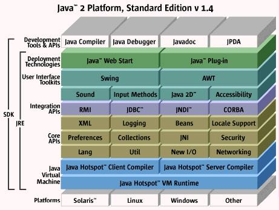

# TEMA 1. INTRODUCCIÓN A LA ARQUITECTURA DE MICROSERVICIOS

- [TEMA 1. INTRODUCCIÓN A LA ARQUITECTURA DE MICROSERVICIOS](#tema-1-introducción-a-la-arquitectura-de-microservicios)
  - [Objetivos](#objetivos)
  - [1.0 Conceptos Previos](#10-conceptos-previos)
  - [1.1 Evolución de la arquitectura monolítica hacia los microservicios](#11-evolución-de-la-arquitectura-monolítica-hacia-los-microservicios)
  - [1.2 Ventajas y desventajas clave de los microservicios](#12-ventajas-y-desventajas-clave-de-los-microservicios)
  - [1.3 Principios fundamentales de la arquitectura de microservicios](#13-principios-fundamentales-de-la-arquitectura-de-microservicios)
  - [1.4 Casos de uso reales donde los microservicios aportan valor](#14-casos-de-uso-reales-donde-los-microservicios-aportan-valor)
  - [1.5 Distinción entre microservicios y SOA (Service-Oriented Architecture)](#15-distinción-entre-microservicios-y-soa-service-oriented-architecture)
  - [1.6 La importancia del diseño orientado a dominio (DDD) en este contexto](#16-la-importancia-del-diseño-orientado-a-dominio-ddd-en-este-contexto)
  - [1.7 Bounded context y separación de responsabilidades](#17-bounded-context-y-separación-de-responsabilidades)
  - [1.8 Distribución de los equipos en torno a microservicios](#18-distribución-de-los-equipos-en-torno-a-microservicios)
  - [1.9 Evaluación del impacto de los microservicios en la gestión del ciclo de vida del software](#19-evaluación-del-impacto-de-los-microservicios-en-la-gestión-del-ciclo-de-vida-del-software)
  - [1.10 Herramientas modernas para la gestión de arquitecturas distribuidas](#110-herramientas-modernas-para-la-gestión-de-arquitecturas-distribuidas)
  - [1.11 Introducción a patrones como API Gateway, Service Discovery, y Service Registry](#111-introducción-a-patrones-como-api-gateway-service-discovery-y-service-registry)
  - [Referencias](#referencias)

---

## Objetivos

- Entender la evolución de la arquitectura monolítica hacia los microservicios
- Identificar las ventajas y desventajas clave de los microservicios
- Describir los principios fundamentales de la arquitectura de microservicios
- Analizar casos de uso reales donde los microservicios aportan valor
- Distinguir entre microservicios y SOA (Service-Oriented Architecture)
- Comprender la importancia del diseño orientado a dominio en este contexto
- Introducir los conceptos de bounded context y separación de responsabilidades
- Explorar cómo se distribuyen los equipos en torno a microservicios
- Evaluar el impacto de los microservicios en la gestión del ciclo de vida del software
- Conocer herramientas modernas para la gestión de arquitecturas distribuidas
- Introducción a patrones como API Gateway, Service Discovery, y Service Registry

---

## 1.0 Conceptos Previos

**Arquitectura de Software** 

> **Definición:** 

La arquitectura de software es "la estructura o estructuras del sistema, que comprenden componentes de software, las propiedades externas visibles de esos componentes y las relaciones entre ellos". [<a href="#ref1">1</a>]

Es decir, la arquitectura define **cómo**  se organiza un sistema software: qué partes tiene, cómo interactúan, qué restricciones existen y qué principios guían sus decisiones. No se trata solo del diseño técnico, sino también de cuestiones como escalabilidad, mantenibilidad, rendimiento o seguridad. [<a href="#ref2">2</a>]

---

**Patrón de Software** 

> **Definición:** 

Un patrón de software es "una solución reutilizable a un problema recurrente dentro de un contexto determinado en el diseño de software".

— *Gamma, Helm, Johnson y Vlissides. "Design Patterns: Elements of Reusable Object-Oriented Software" (1994)*

Es decir, un patrón **no es código** , sino una descripción general de cómo resolver un tipo de problema que aparece una y otra vez en la construcción de sistemas de software. Ejemplos famosos de patrones son **Singleton** , **Observer**  o **Factory** .
**Referencia principal:** 
 
- Gamma, E., Helm, R., Johnson, R., & Vlissides, J. (1994). *Design Patterns: Elements of Reusable Object-Oriented Software*. Addison-Wesley.

---

**Patrón de Arquitectura** 

> **Definición:** 

Un **patrón de arquitectura**  es una **solución general, reutilizable y probada**  para un problema recurrente en la organización de sistemas de software a gran escala. Define **cómo estructurar**  y **coordinar**  componentes principales de una aplicación.

— *Bass, Clements y Kazman. "Software Architecture in Practice", 3rd ed. (2012)*

En otras palabras:

Mientras un patrón de diseño (como Singleton) soluciona **detalles de clases y objetos** , un **patrón de arquitectura**  ofrece una **estructura global** : cómo dividir el sistema, cómo se comunican las partes, cómo fluye la información.
**Ejemplos de patrones de arquitectura:** 
 
- **Modelo-Vista-Controlador (MVC)**  → separa datos, lógica y presentación.
 
- **Arquitectura en Capas**  → organiza el sistema en capas jerárquicas (por ejemplo, presentación, lógica de negocio, datos).
 
- **Microservicios**  → divide el sistema en pequeños servicios independientes que se comunican.
 
- **Event-Driven Architecture (EDA)**  → estructura el sistema alrededor de eventos y respuestas.

**Referencia principal:** 
 
- Bass, L., Clements, P., & Kazman, R. (2012). *Software Architecture in Practice* (3rd ed.). Addison-Wesley.

**Metodología de Diseño (en Software)** 

> **Definición:** 

Una **metodología de diseño**  es un **conjunto organizado de principios, prácticas y procesos**  que guían cómo se **modela, organiza y estructura**  el software para resolver problemas del dominio de manera efectiva.

Se enfoca en **cómo representar el problema real**  dentro del sistema software.

**En otras palabras:** 

Una metodología de diseño **no te dice**  qué patrón de arquitectura usar, **ni cómo desplegar**  tu aplicación, sino **cómo pensar y construir**  los modelos y relaciones dentro de tu sistema, de manera coherente, sólida y alineada con el negocio.

---

**Conceptos en Arquitectura de Software**

| Concepto | Categoría | Qué define | Ejemplos | 
| --- | --- | --- | --- | 
| Arquitectura de Software | Organización global del sistema | Cómo dividir y desplegar todo el sistema a gran escala. | Monolito, Microservicios, Serverless, SOA| 
| Patrón de Arquitectura | Organización interna | Cómo estructurar el interior de cada parte del sistema (servicio, módulo). | Hexagonal, CQRS, MVC, Event-Driven, Clean Architecture | 
| Metodología de Diseño | Estrategia de modelado | Cómo pensar y representar el problema real en el modelo de software. | Domain-Driven Design (DDD), Object-Oriented Design (OOD) | 
| Patrón de Diseño | Solución local de diseño | Cómo resolver problemas comunes en diseño de clases y objetos. | Singleton, Factory, Observer, Strategy | 

---

> En resumen: 

 
- **Microservicios**  es **Arquitectura de Software**  (macro nivel).
 
- **Hexagonal** , **CQRS** , etc., son **Patrones de Arquitectura**  (nivel interno de cada microservicio o componente).
 
- **DDD**  es una **Metodología de Diseño**  (cómo modelas el negocio dentro del sistema).
 
- **Singleton** , **Factory** , etc., son **Patrones de Diseño**  (resuelven problemas pequeños de estructura de clases/objetos).

> Resumen en una frase: 

> Microservicios **es una forma de construir el sistema completo** ,

**y los patrones de arquitectura son herramientas**  para **organizar internamente**  cada microservicio.

---

## 1.1 Evolución de la arquitectura monolítica hacia los microservicios

Lo primero que deberíamos conocer es la arquitectura monolítica o monolito y la arquitectura de micorservicios o, simplemente, microservicios.

**El Monolito**

Cuando se habla de monolito lo podemos hacer refiriéndonos a unidad de despliegue. Es decir, **toda la funcionalidad en un sistema tiene que ser desplegada conjuntamente**.

El monolito puede ser: single-process, modular, distributed.

No hay que confundir monolito con *legacy*. Una aplicación puede ser *legacy* y tener una arquitectura microservicios. Podemos hacer una aplicación en una Startup y que sea un monolito.

Los beneficios de la arquitectura monolítica:

- Desarrollo simple: IDEs y otras herramientas se enfocan en construir una única aplicación.

- Facilidad para realizar cambios grandes: se puede cambiar el código, el esquema de datos, se hace build y se despliega.

## 1.2 Ventajas y desventajas clave de los microservicios

## 1.3 Principios fundamentales de la arquitectura de microservicios

## 1.4 Casos de uso reales donde los microservicios aportan valor

## 1.5 Distinción entre microservicios y SOA (Service-Oriented Architecture)

**Qué es SOA**

> **SOA (Service Oriented Architecture)**: es un paradigma de arquitectura de software que define un conjunto de principios para estructurar aplicaciones como un ensamblaje de servicios de negocio, autónomos, interoperables y descubribles. A

Estos servicios se comunican entre sí a través de interfaces bien definidas y, a menudo, utilizando protocolos estándar de comunicación en red. 

El objetivo principal de SOA es promover la reutilización, la flexibilidad, la escalabilidad y la agilidad en el desarrollo e integración de sistemas de información, alineando la tecnología con los procesos de negocio.

Además es un conjunto de [estándares](). 

Algunos críticos de la arquitectura de microservicios dicen que no es algo nuevo sólo un rebranding de SOA. 

La Arquitectura de MS es similar a SOA. Ambos enfoques consisten en un conjunto de servicios. 

## 1.6 La importancia del diseño orientado a dominio (DDD) en este contexto

**Límites de los Microservicios y Diseño Guiado por el Dominio**

**Descomposición de Sistemas en Microservicios**

Cuando las empresas adoptan el enfoque de microservicios, comienzan a **descomponer los componentes existentes en partes más pequeñas**, con el objetivo de **mejorar la calidad del servicio** de forma más rápida, **sin sacrificar la fiabilidad**.

**Patrones de Descomposición (Decomposition Pattern)**

Existen varias formas de descomponer un sistema grande en subsistemas más pequeños.  
Una tentación común es **basar la descomposición en la tecnología de implementación**.

**Ejemplos de descomposición por tecnología:**
* **Servicios de alto procesamiento**: desarrollados en C, Rust o Go (elige el lenguaje más adecuado). Forman un subsistema independiente.
* **Servicios intensivos en I/O**: desarrollados en Node.js, aprovechando su I/O no bloqueante. Forman un subsistema separado.

**Descomposición por Ubicación Geográfica**

Otra forma de dividir un sistema es según la ubicación de los equipos:

* Un subsistema puede ser desarrollado en Estados Unidos.
* Otros subsistemas pueden ser desarrollados en África, Asia, Australia, Europa o Sudamérica.

**Ventajas:**
* Tener a un solo equipo trabajando en un subsistema completo dentro de la misma región mejora la eficiencia.
* Los equipos locales **comprenden mejor** los requisitos **legales, comerciales y culturales** de su mercado.

**Ejemplo práctico:**
* No es lo mismo diseñar un software contable para El Cairo que para Nueva York; un equipo local sabrá captar mejor las necesidades específicas.

**El Enfoque de Domain-Driven Design (DDD)**

En su libro *Domain-Driven Design*, **Eric Evans** propone otra forma de definir los límites de los subsistemas:

* **Basarse en modelos**, no solo en tecnologías ni ubicaciones.
* Los modelos permiten **representar el sistema de forma más clara**, enfocándose en lo que realmente importa.
* **Los modelos resaltan los aspectos críticos** que necesitamos entender o construir.

**Modelos Múltiples en Sistemas Grandes**

> En su libro, Evans señala que la mayoría de los sistemas grandes **no tienen un único modelo**.

* El modelo general de un sistema complejo está formado por **muchos modelos más pequeños** que se entrelazan.
* Estos modelos **son representaciones orgánicas** de distintos contextos de negocio.
* Cada modelo **tiene sentido dentro de su propio contexto** y es **intuitivo para los expertos** de ese ámbito específico.

Es importante señalar que el *Domain-Driven Design* (DDD) de Evans fue introducido **más de una década antes** de que el término “microservicio” se popularizara.  

Aun así, la cita anterior refleja una observación clave sobre la **naturaleza del modelado**: cuando se intenta depender de un único modelo (por ejemplo, un modelo canónico), **el sistema se vuelve difícil de entender**.

El enfoque de microservicios busca **dividir grandes componentes (modelos) en unidades más pequeñas**, con el objetivo de **reducir la confusión** y **aportar mayor claridad** a cada parte del sistema.

Por lo tanto, la **arquitectura de microservicios** es un **estilo arquitectónico altamente compatible con el enfoque de modelado de DDD**.

## 1.7 Bounded context y separación de responsabilidades

Para facilitar la creación de componentes más pequeños y coherentes, **Evans introdujo el concepto de _Bounded Contexts_ (Contextos Delimitados)**:

- Cada componente del sistema vive **dentro de su propio contexto delimitado**.
- **El modelo de cada componente** y **los modelos de su contexto** **solo se utilizan dentro de su límite**.
- **No se comparten modelos entre diferentes contextos delimitados**.

> **Nota:** Separar correctamente los contextos ayuda a mantener la claridad y la autonomía de cada microservicio en sistemas grandes y complejos.

**Bounded Contexts y Límites de Microservicios**

Se reconoce ampliamente que **identificar correctamente los *bounded contexts*** (contextos delimitados) en un sistema, usando técnicas de *Domain-Driven Design* (DDD), y **dividir el sistema a lo largo de esos límites** es una estrategia eficaz para definir los límites de microservicios.

Sam Newman [<a href="#ref1">3</a>]  afirma:

> *"Si los límites de nuestros servicios están alineados con los bounded contexts de nuestro dominio, y nuestros microservicios representan esos contextos, estamos comenzando de manera excelente para garantizar que los microservicios estén débilmente acoplados y sean altamente cohesivos."*

**Puntos clave**

- Los *bounded contexts* representan **dominios de negocio autónomos**, es decir, **capacidades bien definidas**.
- Son el **punto de partida adecuado** para identificar los límites entre microservicios.
- Si se usan correctamente, **reducen la necesidad de compartir modelos y datos** entre servicios.
- Esto permite que cada microservicio sea **una unidad desplegable de forma independiente**.
- **El despliegue independiente** permite aumentar la velocidad de entrega **sin perder estabilidad**.

**Un detalle importante**

Aunque el uso de DDD y bounded contexts es muy útil, **no garantiza por sí solo componentes pequeños**.  

Es posible diseñar bounded contexts demasiado grandes.

> En microservicios, no buscamos lo grande:  
> **lo micro es lo que realmente importa**.

📌 **Principio esencial:**  **Más pequeño es mejor.**

## 1.8 Distribución de los equipos en torno a microservicios
 
## 1.9 Evaluación del impacto de los microservicios en la gestión del ciclo de vida del software
 
## 1.10 Herramientas modernas para la gestión de arquitecturas distribuidas
 
## 1.11 Introducción a patrones como API Gateway, Service Discovery, y Service Registry

---

## Referencias

* [1] Bass, L., Clements, P., & Kazman, R. (2012). Software Architecture in Practice (3rd ed.). Addison-Wesley.
* [2] Bass, Clements y Kazman. "Software Architecture in Practice", 3rd ed. (2012)*
* [3] Sam Newman. "Building Microservices", 3rd ed. (2012)*