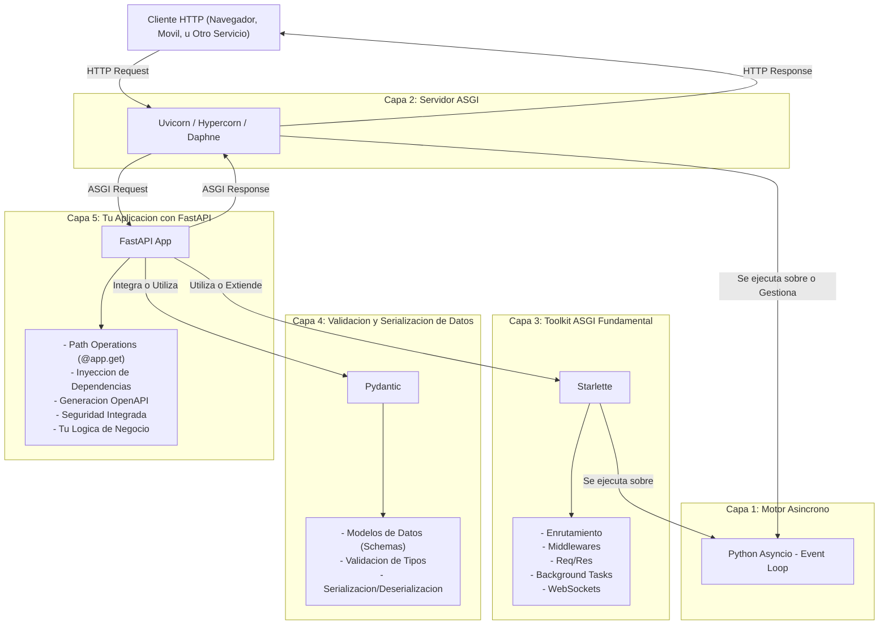
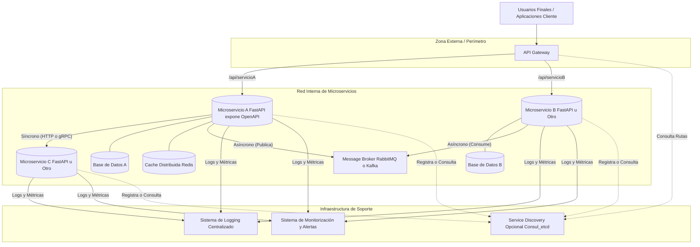

## TEMA 2. FASTAPI COMO FRAMEWORK PARA MICROSERVICIOS

## Tabla de Contenidos

- [TEMA 2. FASTAPI COMO FRAMEWORK PARA MICROSERVICIOS](#tema-2-fastapi-como-framework-para-microservicios)
- [Tabla de Contenidos](#tabla-de-contenidos)
- [Objetivos](#objetivos)
- [Contenidos](#contenidos)
- [2.1. **Presentación de FastAPI y sus ventajas**](#21-presentación-de-fastapi-y-sus-ventajas)
- [2.2. **Entendimiento del uso de Pydantic**](#22-entendimiento-del-uso-de-pydantic)
- [2.3. **Creación de una estructura base escalable**](#23-creación-de-una-estructura-base-escalable)
- [2.4. **Gestión de rutas y controladores RESTful**](#24-gestión-de-rutas-y-controladores-restful)
- [2.5. **Implementación de middlewares personalizados**](#25-implementación-de-middlewares-personalizados)
- [2.6. **Aplicación de dependencias e inyecciones**](#26-aplicación-de-dependencias-e-inyecciones)
- [2.7. **Integración automática de OpenAPI**](#27-integración-automática-de-openapi)
- [2.8. **Utilización de BackgroundTasks**](#28-utilización-de-backgroundtasks)
- [2.9. **Manejo de excepciones personalizadas**](#29-manejo-de-excepciones-personalizadas)
- [2.10. **Configuración de entornos y variables**](#210-configuración-de-entornos-y-variables)
- [2.11. **Preparación de servicios para producción**](#211-preparación-de-servicios-para-producción)
- [2.1. Presentación de FastAPI y sus ventajas (en el contexto de Microservicios)](#21-presentación-de-fastapi-y-sus-ventajas-en-el-contexto-de-microservicios)

---

## Objetivos

- Presentar FastAPI y sus ventajas frente a Flask o Django en microservicios
- Entender cómo FastAPI usa Pydantic para validación y tipado estricto
- Crear una estructura base escalable para un microservicio en FastAPI
- Gestionar rutas y controladores RESTful de manera limpia y desacoplada
- Implementar middlewares personalizados en FastAPI
- Aplicar dependencias y manejo de inyecciones con el sistema de FastAPI
- Integrar OpenAPI automáticamente para documentación de servicios
- Utilizar BackgroundTasks para tareas asincrónicas internas
- Manejar excepciones personalizadas con FastAPI
- Configurar entornos y variables con `pydantic.BaseSettings`
- Preparar servicios para producción con `uvicorn` y `gunicorn`

## Contenidos

## 2.1. **Presentación de FastAPI y sus ventajas**
## 2.2. **Entendimiento del uso de Pydantic**
## 2.3. **Creación de una estructura base escalable**
## 2.4. **Gestión de rutas y controladores RESTful**
## 2.5. **Implementación de middlewares personalizados**
## 2.6. **Aplicación de dependencias e inyecciones**
## 2.7. **Integración automática de OpenAPI**
## 2.8. **Utilización de BackgroundTasks**
## 2.9. **Manejo de excepciones personalizadas**
## 2.10. **Configuración de entornos y variables**
## 2.11. **Preparación de servicios para producción**

---

* **Código Mermaid:**
  

* **Código Mermaid (versión simplificada para compatibilidad):**

**Objetivo del Módulo:** Al finalizar este tema, los participantes serán capaces de estructurar, desarrollar e implementar microservicios robustos y escalables utilizando FastAPI, aprovechando sus características avanzadas para la gestión de configuraciones, tareas en segundo plano, manejo de errores y preparación para producción.

## 2.1. Presentación de FastAPI y sus ventajas (en el contexto de Microservicios) 

Teoría (2 min):

Recordatorio rápido: FastAPI es un framework web moderno, rápido (de alto rendimiento), para construir APIs con Python 3.7+ basado en type hints estándar de Python.
Ventajas Clave para Microservicios:
Alto Rendimiento: Crucial para microservicios que necesitan responder rápidamente y manejar múltiples peticiones. Gracias a Starlette (ASGI) y Pydantic.
Desarrollo Rápido: Menos código, menos bugs, iteraciones más veloces. Ideal para equipos ágiles trabajando en servicios independientes.
Tipado Estricto y Validación Automática: Con Pydantic, se reduce la necesidad de código de validación manual, asegurando la integridad de los datos entre servicios.
Documentación Automática (OpenAPI): Cada microservicio expone su "contrato" de forma clara, facilitando la integración y el descubrimiento por otros servicios o equipos.
Inyección de Dependencias: Simplifica la gestión de conexiones a bases de datos, autenticación, y otros componentes reusables dentro de un microservicio.
Soporte Async: Permite operaciones I/O no bloqueantes, esencial para microservicios que interactúan con otras APIs, bases de datos, o sistemas de mensajería.
Discusión (1 min):

Pregunta al grupo: ¿Qué característica de FastAPI consideran más valiosa al pensar en desarrollar un microservicio y por qué?